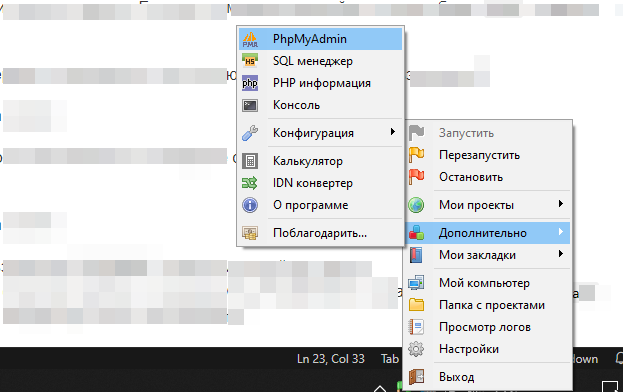
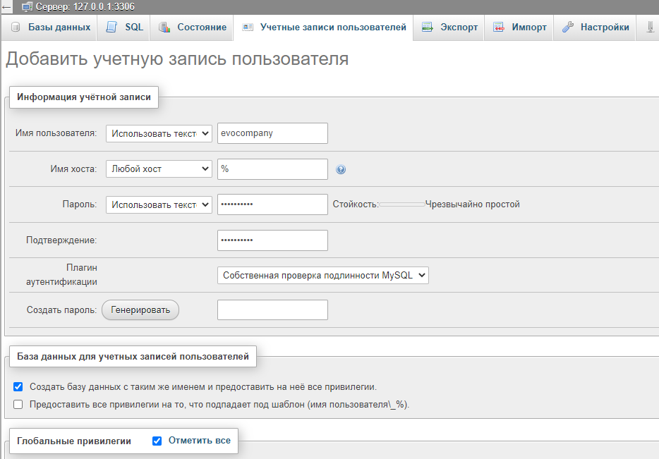
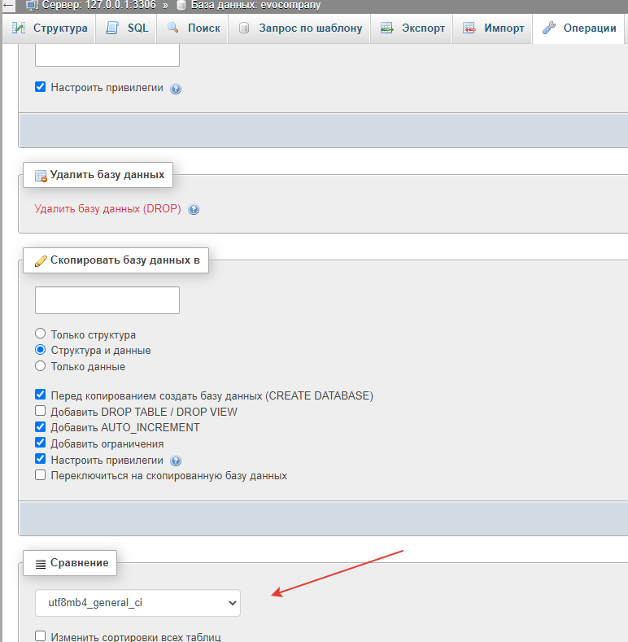
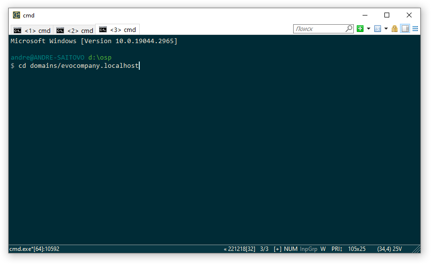
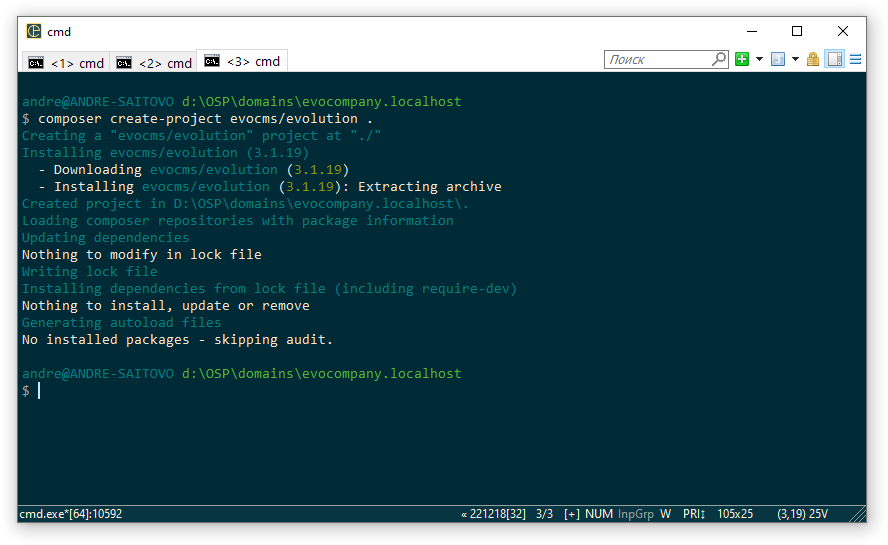
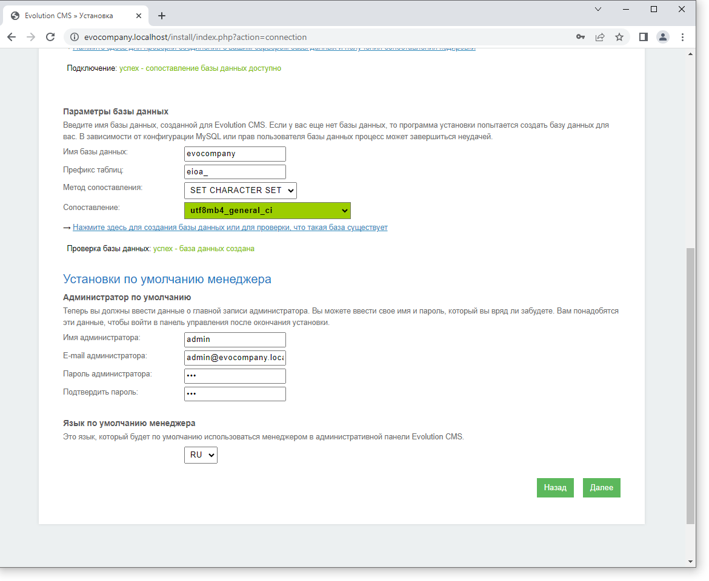
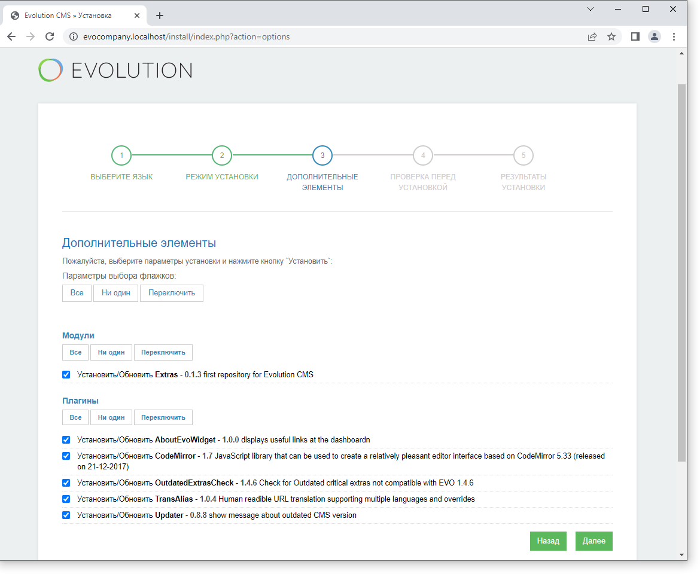
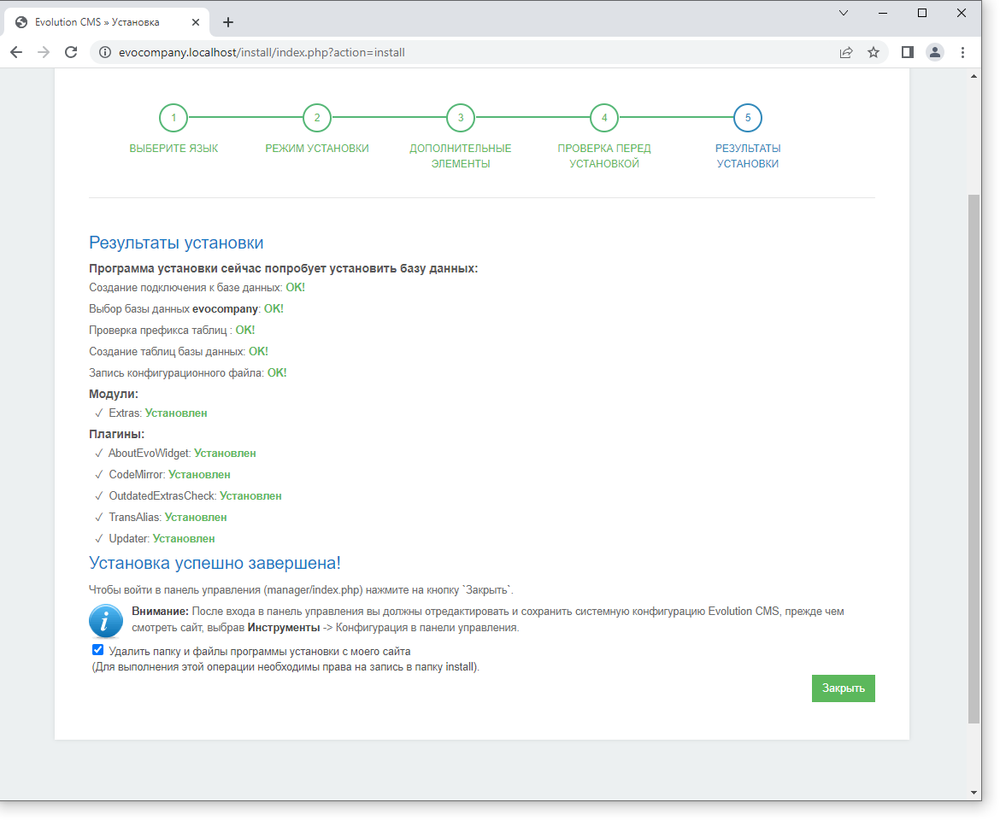
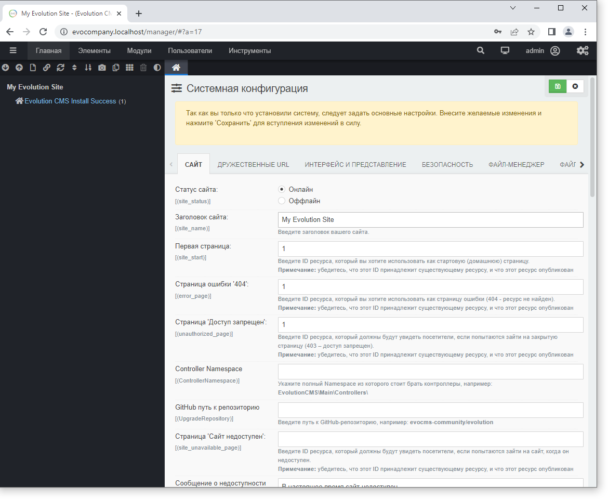
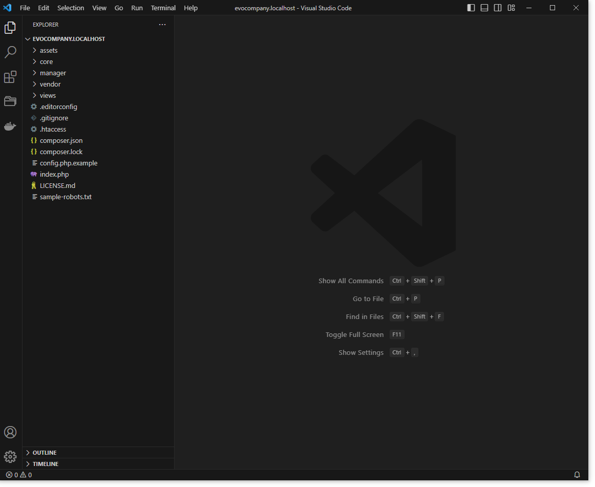

# Установка Evolution CMS

Есть несколько способов, как вы можете установить систему.
В этом уроке будем использовать composer.

**Оглавление**

1. [База данных](#part1)
2. [Установка Evolution CMS](#part2)


## Параметры базы данных <a name="part1"></a>

Давайте создадим БД и пользователя.

> Если вы работаете на удалённом сервере, эти параметры вам должен предоставить хостер. Либо же у вас будет возможность это сделать из интерфейса управления хостингом.

Откройте правой кнопкой в трее меню сервера и найдите там phpMyAdmin.



Сервер спросит логин и пароль. Если вы не меняли настройки, то логин будет `root`, а пароль пустой.

Войдите на сервер и переходите в пункт меню "Учетные записи пользователей"

Добавьте нового пользователя и не забудьте отметить чекбокс, который создаст ему базу данных.



Я создал пользователя `evocompany`, задал ему такой же пароль.
Поскольку мы отметили чекбокс с созданием бд, PhpMyAdmin создал базу данных `evocompany` и назначил её владельцем этого пользователя.

Теперь перейдите в эту базу данных, выберите меню "Операции" и проверьте, какая кодировка (сравнение) задана.



Я рекомендую задать кодировку `utf8mb4_general_ci`.


## Установка Evolution CMS <a name="part2"></a>

Откройте в трее меню "Дополнительно" - "Консоль".
По умолчанию консоль открывается в корневой папке сервера `d:\osp`. Но мы хотим поставить сайт в папку `evocompany.localhost`.

Перейдите в эту папку командой `cd` (*переводится как change dir*). Принимает аргумент - имя папки.

```
cd evocompany.localhost
```



Теперь приступим к установке. Среда OpenServer уже имеет на борту Composer, так что командуем ему создать проект:

```
composer create-project evocms/evolution .
```

Не забудьте точку - это означает, что установка будет произведена именно в корень текущей директории.



Дистрибутив скачан и развёрнут. Можно продолжить установку из консоли, но мы сделаем всё в браузере. 

Откройте страницу `http://evocompany.localhost/` и пошагово дойдите до страницы "Информация базы данных". Вводите туда логин пользователя mysql, пароль и имя бд. Напомню, что у нас это `evocompany`. Прочие поля опциональны.

После проверки придумайте почту и пароль для админа:



На странице дополнительных элементов оставьте всё, как есть


Жмите "Далее" и потом "Установить". Процесс занимает от пары секунд до минуты.

В конце вы должны увидеть нечто подобное:



Жмём "Закрыть" и вас должно перекинуть по адресу `http://evocompany.localhost/manager/`

Вводите логин и пароль, жмите "Войти".

Evolution CMS поприветствует вас просьбой сохранить конфигурацию системы. Пока что ничего не меняем, просто жмём "Сохранить" сверху справа.



**Важно:** 

После окончания установки проконтролируйте, что папка `/install/` удалена из корневой директории сайта.

Теперь перейдите по адресу http://evocompany.localhost/ - вы должны видеть страницу с сообщением "Install Successful!".

А если открыть VSCode, то папка сайта будет вот такой



## Итог

- У вас должен быть работающий пустой сайт по адресу `evocompany.localhost`
- Вы должны без проблем заходить в админ-панель этого сайта по адресу `http://evocompany.localhost/manager`.

---

Если всё хорошо, переходите к [первоначальным настройкам](/003_%D0%9F%D0%B5%D1%80%D0%B2%D0%BE%D0%BD%D0%B0%D1%87%D0%B0%D0%BB%D1%8C%D0%BD%D1%8B%D0%B5%20%D0%BD%D0%B0%D1%81%D1%82%D1%80%D0%BE%D0%B9%D0%BA%D0%B8.md).
