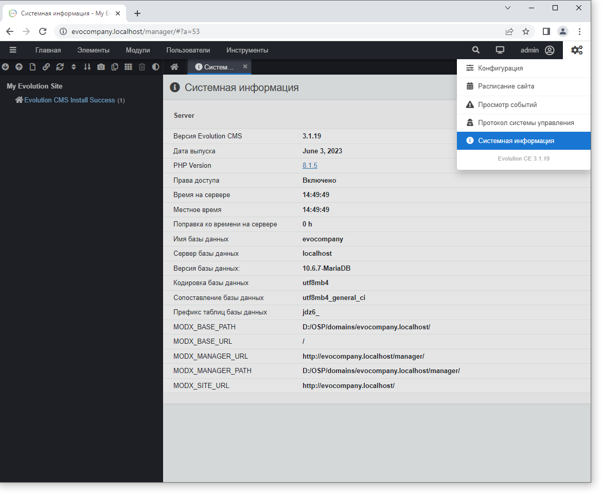
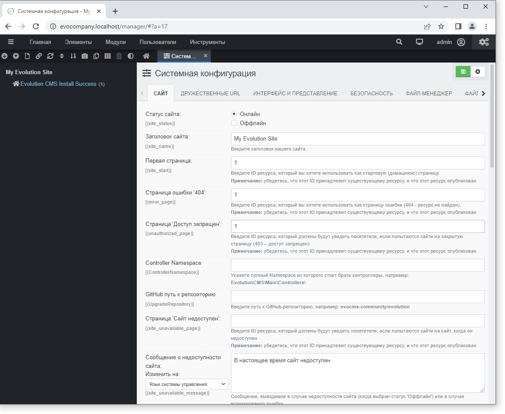
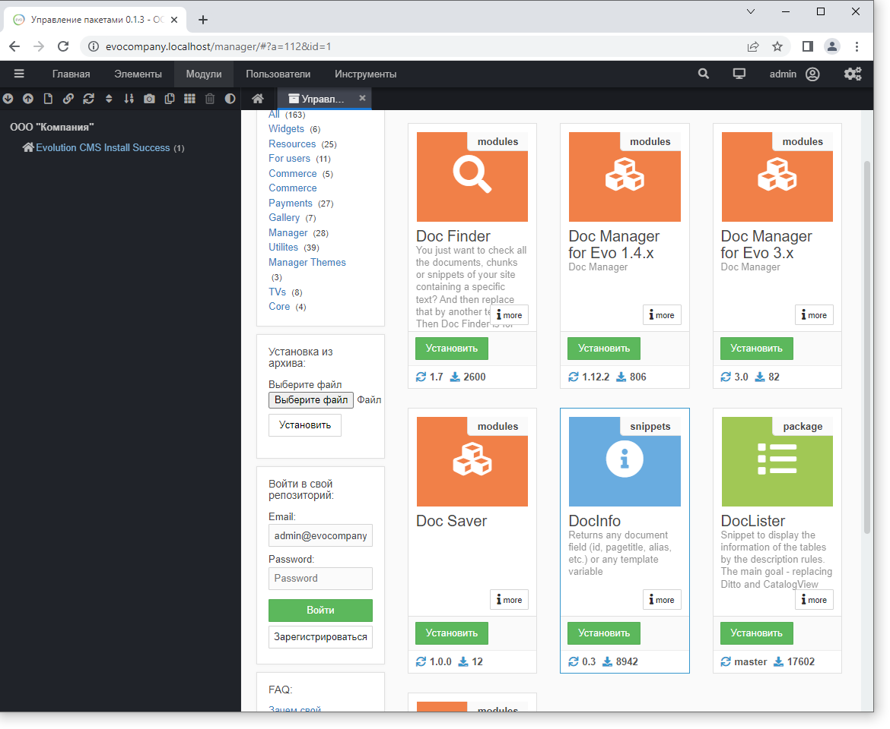

# Первоначальные настройки

Давайте настроим нужные параметры и установим дополнения.

Здесь и в дальнейшем я пишу пути к файлам от **корня** сайта без указания полного пути с диском и папкой.

> Т.е. если написано
> `core\custom\.env.example` - это файл `D:\OSP\domains\evocompany.localhost\core\custom\.env.example`

В уроке много кода - это лишь примеры и они очень просты. Не стоит сразу ужасаться и, с криком "я не програмист" закрывать документ. Просто внимательно прочитайте текст и вы всё поймёте.

## Оглавление

1. [Конфигурация](#part1)
2. [Настройки сайта](#part2)
3. [Ставим дополнения](#part3)

## Конфигурация <a name="part1"></a>

### Конфигурация по-умолчанию

Сразу после установки Evolution CMS создаётся файл `core\config\database\connections\default.php`, где сохраняются настройки подключения к базе данных.

Откройте его и изучите - там указываются те данные, которые мы вводили на этапе установки.

```php
<?php
return [
    'driver' => env('DB_TYPE', 'mysql'), // тип БД
    'host' => env('DB_HOST', 'localhost'), // сервер
    'port' => env('DB_PORT', '3306'), // порт
    'database' => env('DB_DATABASE', 'evocompany'), // имя базы
    'username' => env('DB_USERNAME', 'evocompany'), // пользователь
    'password' => env('DB_PASSWORD', 'evocompany'), // пароль
    'unix_socket' => env('DB_SOCKET', ''),
    'charset' => env('DB_CHARSET', 'utf8mb4'), // кодировка соединения
    'collation' => env('DB_COLLATION', 'utf8mb4_general_ci'), // сравнение
    'prefix' => env('DB_PREFIX', 'i6cn_'), // ПРЕФИКС таблиц
    'method' => env('DB_METHOD', 'SET CHARACTER SET'), //вряд ли нужно будет
    'strict' => env('DB_STRICT', false),	// режим работы БД. Бывает, что надо править
    'engine' => env('DB_ENGINE', 'myisam'),	// редко, но правим
    'options' => [
        PDO::ATTR_STRINGIFY_FETCHES => true,
    ]
];
```

Если вам придётся когда-то переносить сайт с одного хостинга на другой или с локальной машины на хостинг, настройки подключения должны быть изменены именно здесь.

> Но только в случае, если сайт не использует конфигурацию в .env файле.

Разберёмся подробнее, что это за .env и почему он может затереть все изменения default файла.

### Конфигурация в .env

Конфигурация может быть унесена в файл окружения -- это фишка из Laravel. Я рекомендую это делать всегда. И, разумеется, мы это сделаем.

#### Зачем?

Сайт не всегда будет лежать только на локальном сервере. Вы перенесёте его на хостинг. 

Сайт на локальной машине подключается к своей базе данных. Сайт на хостинге -- к своей. У них будут разные пользователи, разные пароли, порт и драйвер базы данных.

Каждый раз после внесения правок на локалке и переноса файлов на боевой сервер править конфигурационный файл очень неудобно. Можно легко запутаться и потом долго искать причины 500-й ошибки.

Даже если вы не планируете работать с системами контроля версий типа github/gitlab, то будет логичным создать некий файл, который был бы не включен в дистрибутив системы (чтобы не затереть его обновлениями), но при этом позволял бы задавать эти настройки.
Такой файл есть.

#### Приступим

Сделаем независимые настройки для нашего локального сайта.

Сначала открывайте "Системную информацию". Пусть остаётся открытой, отсюда вы будете копировать нужные значения.



Откройте папку `evocompany.localhost\core\custom\` и найдите там файл `.env.example`.
Сделайте копию и переименуйте её в `.env`.

#### Заполнение файл .env

У меня получилось что-то такое.
> Обратите внимание на правильные пути, DB_PREFIX, DB_CHARSET, DB_STRICT, протокол сайта. Это наиболее частые места ошибок.

```php
DB_TYPE=mysql
DB_HOST=localhost
DB_USERNAME=evocompany
DB_PASSWORD=evocompany
DB_CHARSET=utf8mb4
DB_COLLATION=utf8mb4_general_ci
DB_METHOD="SET CHARACTER SET"
DB_DATABASE=evocompany
DB_PREFIX=i6cn_
DB_SOCKET=
DB_STRICT=false
CORE_CLASS=\DocumentParser
HTTPS_PORT=443
COOKIE_PATH=
COOKIE_DOMAIN=
MODX_BASE_PATH=D:/OSP/domains/evocompany.localhost/
MODX_BASE_URL=/
MODX_SITE_URL=http://evocompany.localhost/
MODX_SITE_HOSTNAMES=evocompany.localhost
MGR_DIR=manager
MODX_MANAGER_PATH=D:/OSP/domains/evocompany.localhost/manager/
MODX_MANAGER_URL=http://evocompany.localhost/manager/
```

Сохраните файл и перейдите в админку сайта. Всё должно работать без ошибок. Если что-то пошло не так, проверяйте внимательно каждую строку. Особенно все любят не убирать слово /public/ из MODX_BASE_PATH и MODX_MANAGER_PATH и забывают поменять префикс БД. 
```
DB_PREFIX=i6cn_ // Это моё, ваш префикс будет не таким!
```

## Настройки сайта <a name="part2"></a>

Теперь нужно немного настроить сайт. Ищите справа иконку шестерёнки и открывайте страницу "Конфигурация"



Рекомендую изучить каждую вкладку этой страницы. Запоминать опции, разумеется, нет смысла. Однако вы хотя бы в общих чертах будете представлять, что можно настроить в системе.

#### Что я рекомендую настроить:

- Название сайта - впишите сюда ООО "Компания"
- Автоматическое назначение шаблона - "соседний". Эта настройка даст возможность быстрее создавать однотипные документы, т.к. документы будут создаваться автоматически с тем же шаблоном, что и соседи. Скажем, если вы создаёте третью новость подряд.
- Способ кэширования - "Отключить для администраторов". Кэш при разработке Мешает.

#### Вкусовщина

- Добавлять слэш к контейнеру - "Да". Чтобы адреса были `/blog/`, а не `/blog`. Мне так почему-то комфортнее, сеошники могут поспорить.
- Суффикс для дружественных URL - очистить. Нам не надо `.html` в конце страниц.
- Группировать ТВ-параметры - "Секциями на вкладке Общие". Я люблю, когда параметры показываются не в отдельных вкладках (ex Modx Revo), а сразу все и на одной странице. Так контент-менеджер будет видеть, что ему нужно заполнять и вряд ли пропустит поле.
- Показать навигацию - "Да". Это хлебные крошки в админке.

### А если нужны разные настройки для локального и удалённого сайта?

Ситуация ровно такая же, как с файлом `.env`. Допустим, вы хотите, чтобы у сайта на локальном компьютере было имя "(dev) Сайт компании", а у сайта в боевой среде просто "Сайт компании". Либо вы хотите настроить почту для локалки при помощи mailtrap, а в боевой среде уже вписывать настоящие данные ящиков вашей компании.

Такая возможность предусмотрена и работает она также, как и файл .env.

Подробный разбор есть в [документации](https://github.com/0test/evo-newdocs/blob/main/v3/01_Начало%20работы/003_Конфигурация.md#section2-1). Не будем использовать этот функционал, чтобы не загружать вас лишней информацией. Скажу лишь, что это удобно и я часть настроек вынесу.

## Ставим дополнения <a name="part3"></a>

Установим дополнения, которые помогут нам работать с сайтом.
Откройте "Модули" и найдите там Extras. Это модуль установки различных пакетов дополнений.

Нам потребуются: `DocLister`, `FormLister`, `Selector`, `multiTV`, `TinyMCE4`, `ClientSettings`.

Просто вводите эти названия в поисковую строку и жмите "Установить"



В процессе разработки вы поймёте, какое дополнение нужно и для чего. Сейчас не будем заострять на этом внимания.

## Итог:

- У вас должен быть работающий пустой сайт по адресу `evocompany.localhost`
- Настройки окружения сайта должны быть полностью в файле `core\custom\.env`
- Должны быть поставлены дополнения из списка выше
- Опционально: Настройки сайта  частично унесены в файл `core\custom\config\cms\settings.php`
---

Теперь переходим к самому интересному - [к шаблонизации и созданию структуры](/004_%D0%A1%D1%82%D1%80%D1%83%D0%BA%D1%82%D1%83%D1%80%D0%B0%20%D1%81%D0%B0%D0%B9%D1%82%D0%B0%20%D0%B8%20%D1%88%D0%B0%D0%B1%D0%BB%D0%BE%D0%BD%D1%8B.md) нашего сайта.
