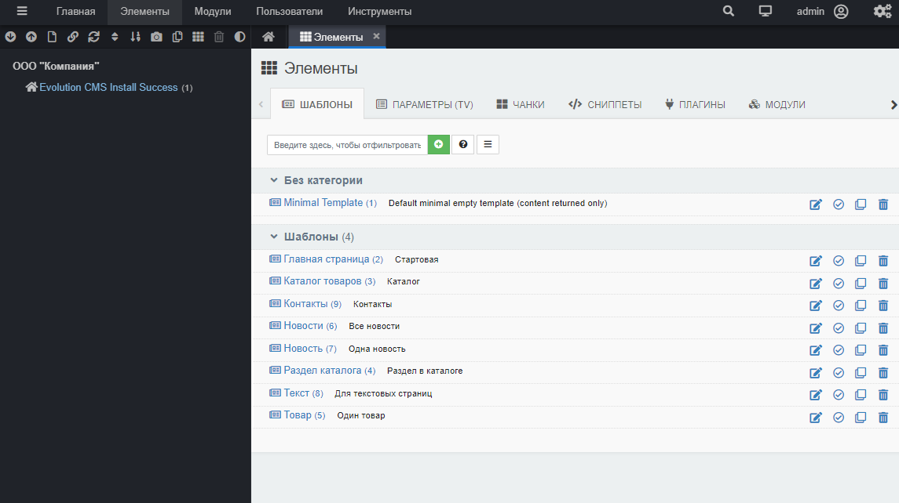
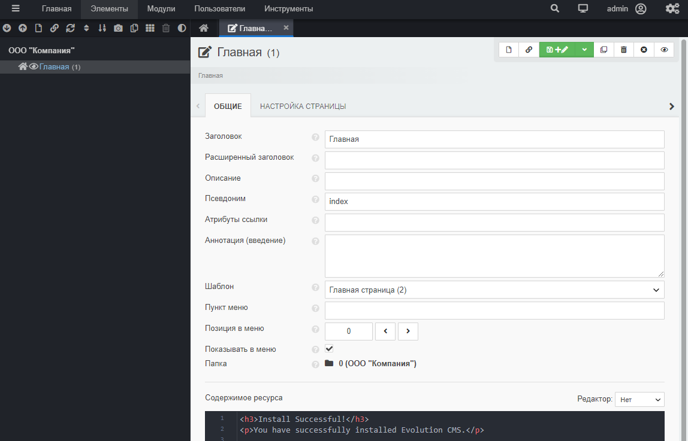

# Структура сайта и шаблоны в Evolution CMS

## Оглавление

- [Введение](#part1)
- [Создаём шаблоны](#part2)
- [Создаём структуру сайта](#part3)
- [Про URL](#part4)

## Введение <a name="part1"></a>

Шаблонам в Evolution CMS уделяется очень внимания. Я бы назвал шаблон единицей смысла, структуры и дизайна.

**За что отвечает шаблон?**

- внешний вид страницы
- тип отдаваемого содержимого (html,xml)
- дополнительные поля страницы
- имя класса контроллера для выдачи данных

>Если проводить аналогии с другими cms, то ближайший аналог в Drupal - "тип материала", в WordPress - "тип контента" (посты,страницы).

Как и в этих cms, шаблону могут быть назначены *свои* параметры, характерные именно для того типа контента, который он отдаёт.

**Пример:** Для шаблона "Новость" будет логичным задать дополнительный параметр типа изображение "Изображение новости". Для шаблона "Товар" не помешает текстовый  параметр "Цена товара" и так далее.

## Создаём шаблоны <a name="part2"></a>

Создадим шаблоны, которые потребуются нам на этом этапе.

#### А как создать шаблон?

Заходим в "Элементы"-"Шаблоны" и создаём новый шаблон.


Обратите внимание на поля "псевдоним" и чекбокс "Создать файл шаблона при сохранении". Заполняйте псевдоним и ставьте чекбокс. Это обязательно будет нужно в дальнейшем.

> Заодно я указываю категорию "Шаблоны", которую назначу всем шаблонам. Название произвольное и нужно для поддержания порядка на сайте. Скажем, на большом сайте можно разбить все шаблоны по категориям, чтобы легче ориентироваться в админке.

### Наши шаблоны

Чтобы создать шаблоны, необходимо представить структуру сайта.

- Главная страница
- Каталог
  - Раздел каталога
    - Товар
    - ...
    - Товар
  - Ещё раздел каталога
    - Товар
    - ...
    - Товар
  - ...
- Новости
  - Новость
  - ...
  - Новость
- О компании
-  Контакты

Вот таблица, где расписано, какие имена, псевдонимы и описания нужно задать шаблонам для будущего сайта компании.

Если вы решили, что компания продаёт не товары, а услуги, никто не запрещает вам изменить "каталог товаров" на "услуги" а "товар" на "услуга". Просто  скорректируйте разработку, исходя из своих нужд.

| Имя              | Псевдоним |      Описание |
| ---------------- | :-------: | ------------: |
| Главная страница | main         | Стартовая   |
| Каталог товаров  | catalog      | Каталог |
| Раздел каталога  | catalog_group| Раздел в каталоге |
| Товар            | catalog_item | Один товар |
| Новости          | news_all     | Все новости |
| Новость          | news_one     | Одна новость |
| Текст            | textpage     | Для текстовых страниц |
| Контакты         | contacts     | Контакты |


Сделайте эту работу и сравните результаты с моими.
А чекбокс "Создать файл шаблона при сохранении" не забыли?



Разумеется, вы вполне можете называть шаблоны так, как вам захочется. Это же справедливо и для поля "описание". А вот с псевдонимом я бы воздержался от дефисов и спецсимволов - могут возникнуть проблемы.

**Важно:**
Псевдоним **в шаблоне** не имеет никакого отношения к URL. Это именно англоязычное название для шаблона, которое нам понадобится впоследствие.

## Создаём структуру сайта <a name="part3"></a>

Теперь пришло время создать черновую структуру сайта в админке.
Слева в дереве вы уже видите первую страницу. Зайдите в редактирование и смените ей шаблон на "Главная страница".



Поизучайте поля. Переименуйте"Заголовок" в "Главная". Поле "Расширенный заголовок" и поле "Пункт меню" очистите. Сохраните страницу.

**Важно:** 
Поле "псевдоним" в **ресурсах** имеет самое прямое отношения к УРЛ. Это как раз и есть ЧПУ вашей страницы. По умолчанию генерируется автоматически путём транслитерации заголовка.


Теперь будем делать структуру сайта. Это будущие страницы, которые мы наполним контентом и будем показывать пользователям.

**Какая структура сайта нам нужна?**

- Главная страница
- Каталог  (_шаблон "Каталог товаров", псевдоним catalog_)
  - Раздел каталога (_шаблон "Раздел каталога", псевдоним любой_)
    - Товар (_шаблон "Товар", псевдоним любой_)
    - ...
    - Товар
  - Ещё раздел каталога
    - Товар
    - ...
    - Товар
  - ...
- Новости (_шаблон "Новости", псевдоним news_)
  - Новость (_шаблон "Новость", псевдоним любой_)
  - ...
  - Новость
- О компании (_шаблон "Текст", псевдоним about_)
-  Контакты (_шаблон "Контакты", псевдоним contacts_)

Слева сверху найдите иконку "Новый ресурс" и, используя её, добавьте новый ресурс. Шаблоны выбирайте, исходя из таблицы выше.

А вот названия разделов каталога, новостей и товаров вы можете придумать на ходу. Как и их количество - я сделаю пяток новостей, десять товаров и два-три  раздела.


Для создания вложенных ресурсов типа новостей нажмите на правую кнопку мыши на родительском ресурсе и в меню выберите "Дочерний ресурс".

Для новостей не обязательно указывать псевдоним, пусть cms генерирует его сама. Мы указали псевдонимы только для важных сущностей, таких так общая страница каталога, страница контактов. Также я снимаю чекбокс "Показывать в меню" у новостей и товаров - ни к чему отображать в менюшках сотню сущностей.

Давайте сравним, что получилось у меня и у вас:


## Зависимость URL от структуры <a name="part4"></a>

Откройте товар для редактирования и найдите сверху кнопку "Просмотр". Нажмите её и обратите внимание, по какому адресу открылся документ.

```
http://evocompany.localhost/catalog/any/item_one
```

Evolution CMS сгеренировала адрес, отталкиваясь от расположения ресурса.
Товар лежит в папке "Разное", которая имеет псевдоним `any`. Ещё выше раздел каталога "Каталог" с псевдонимом `catalog`.
Сам товар  имеет псевдоним (у меня) `item_one`. Система сделала урл-адрес, основываясь на структуре сайта `/catalog/any/item_one`.

**Важно:** 
Делаем вывод: структура важна не только для того, чтобы администратор сайта знал, где что лежит, но и для формирования адресов сайта.

> А вот для товаров и новостей я псеводнимы не указывал, и система сама сделала транслитерацию заголовка в качестве ЧПУ.

## Итого

- Созданы нужные шаблоны
- Создана структура сайта внутри админ-панели
- Снаружи пока без изменений - сайт пустой

---

Отлично. Теперь пора разобраться с ТВ-параметрами: добавить постам картинки, сеошные теги и разные мелочи. [Переходите к уроку про ТВ-параметры](/005_%D0%A2%D0%92-%D0%BF%D0%B0%D1%80%D0%B0%D0%BC%D0%B5%D1%82%D1%80%D1%8B%20%D0%B2%20Evolution%20CMS.md).
