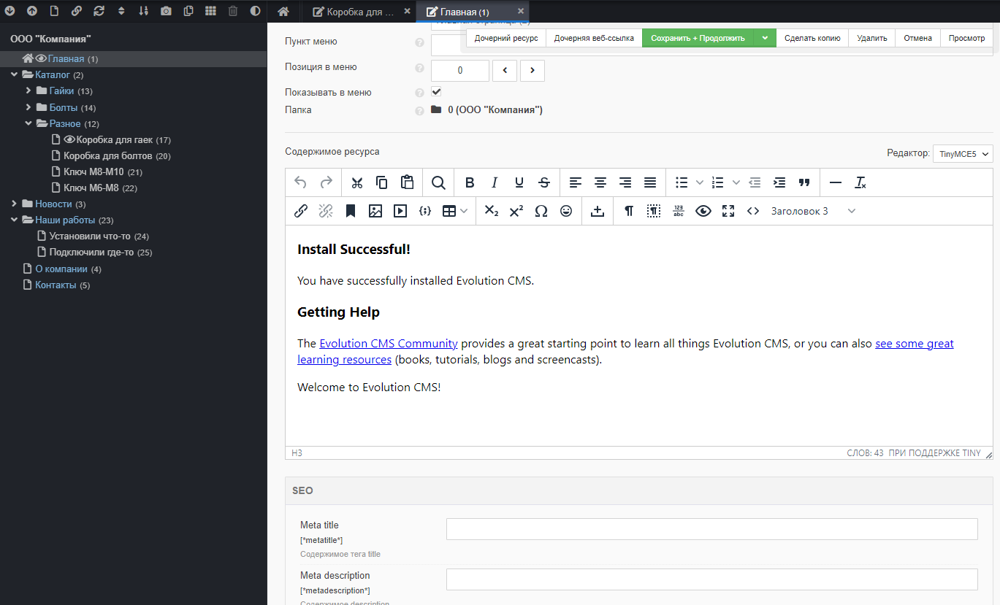
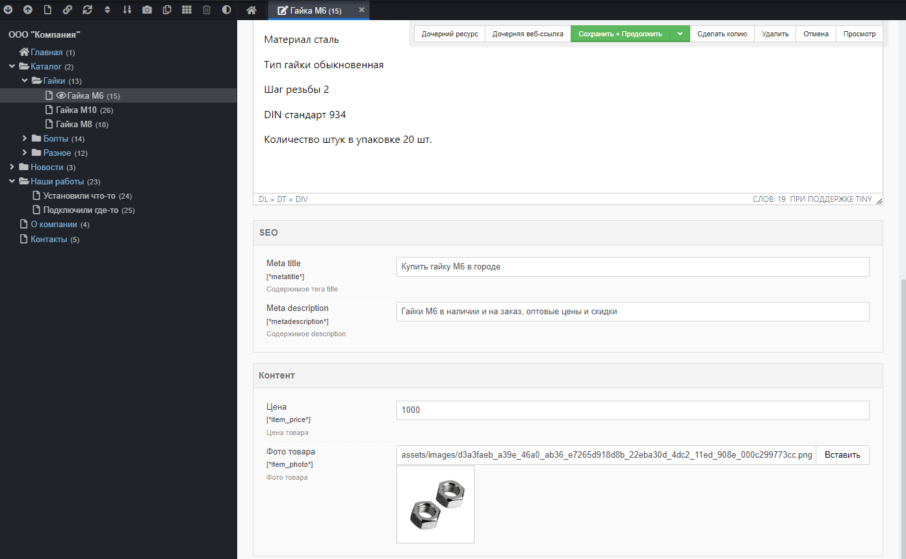

# ТВ-параметры в Evolution CMS

## Оглавление

- [Введение в TV](#part1)
- [Создаём ТВ](#part2)

## Введение в ТВ-параметры 

> В сообществе устоялись термины "тв", "твшка". Будем их придерживаться.

А вот правильнее будет их назвать TV, поскольку template variables - переменные шаблона.

### Описание

ТВ-параметры позволяют добавить к ресурсу дополнительную информацию, которую затем можно использовать наравне с основными полями.

Основные поля - это  поля по умолчанию, которые вы можете увидеть, открыв для редактирования любой созданный документ.

Количество основных полей впечатляет, однако, они могут покрыть далеко не все нужды даже для простого сайта. 

**Важно**: В дальнейшем мы наведём порядок, убрав ненужные поля и  изменив их порядок под свои нужды. На данном этапе давайте пропустим это.

### Для чего нужны TВ-параметры?

TВ-параметр нужен для упорядоченного и логичного хранения информации на сайте.

На нашем сайте есть 2 типа материалов - товары и новости. Для товара можно создать два параметра. В одном будет храниться цена, в другом фотография. А для новости создать один параметр - фотографию.

> Зачастую TВ-параметры используются для создания SEO-полей наподобие meta description, keywords и т.д.

### ТВ имеют разные типы

ТВ имеют различные типы и в зависимости от этого меняется их поведение и внешний вид.
Например, можно создать параметр, где пользователь сможет писать текст, а можно сделать выбор файла/файлов.

### ТВ привязываются к шаблону

Именно это свойство позволяет точно и логично привязать нужные параметры нужным типам материала. Если ТВ-параметр "Цена" назначен шаблону "Товар", редактор сайта увидит цену в товарах. Но никогда не увидит цену, создавая "Новость".

Обратите на это внимание, т.к. некоторые разработчики зачастую грешат излишним функционалом для шаблонов, привязывая десятки ненужных ТВ в шаблон. 

Не надо. Чем проще, тем лучше.

## Создаём ТВ 

Для сайта нам понадобятся следующие параметры:

| Имя параметра             | Заголовок			|               Описание | Категория |
| --------------- | --------------------| ---------------------: | --------- |
| metatitle       | Meta title			| Содержимое тега title		| SEO       |
| metadescription | Meta description	| Содержимое description	| SEO       |
| news_photo      | Главное фото		| Главное фото к новости	| Контент   |
| item_price      | Цена				| Цена товара				| Контент	|
| item_photo      | Фото товара         | Фото товара				| Контент   |

Пока что хватит. Я разбил список ТВ на две категории (SEO и Контент), чтобы мы могли их вынести в отдельные секции на страницах. Это удобно.

Заголовок ТВ - это то, что вы увидите в админке при редактировании ресурсов. Имя ТВ используется в коде шаблонов/контроллеров.

**Подсказка по полям для ТВ:**

|                                    |             |       Детали       |
| -------------------------------------- | ----------- | ------------------ |
| Имя параметра                          | **требуется**   | латиницей без спецсимволов, допустимы подчёркивания, цифры и тире |
| Заголовок                              | опционально | любое, понятное вам название |
| Описание                               | опционально | иногда нужно          |
| Новая категория/Существующая категория | опционально | для структурирования параметров  |
| Тип ввода                              | **важно**       | определяет, как будет выглядеть поле ввода этого параметра |
| Шаблоны                                | **важно**       | список шаблонов, где ТВ-параметр будет показан |

Варианты типов ввода для ТВ-параметров можно позже изучить в документации, нам они пока что практически не нужны.

### Создайте параметры

Выберите для сео-параметров metatitle и metadescription **все** шаблоны. Ведь ключевые слова и тайтлы нужны для всех ресурсов сайта. Задайте им категорию "SEO".

Такой категории пока что нет, и она будет создана после сохранения первого ТВ, если вы ввели название в поле "Новая категория". В дальнейшем просто выбирайте её из списка "Существующие категории".

* Параметр "Главное фото" назначьте шаблону "Новость".
* Параметры "Цена" и "Фото товара" назначьте шаблону "Товар".

Для  параметров "Фото товара" и "Главное фото"  нужно указать тип ввода **Image**. Это сменит тип ТВ, чтобы появилась возможность загружать файлы изображений:

### Проверка

Давайте проверим себя и заодно посмотрим, как выглядят наши параметры.

Откройте главную страницу.

Вы должны увидеть секцию SEO и два созданных параметра.

Теперь откройте товар или новость. У вас должна присутствовать секция SEO и секция Контент, где размещены разные параметры: для товара это будет цена и фото, для новости - только фото.

Изображение уже можно закачивать (жмите "Вставить"). Оно должно отобразиться в админ-панели.

> Способ отображения ТВ-параметров при редактировании вы можете настроить - найдите в настройках сайта опцию "Группировать ТВ-параметры" и укажите, как хотите видеть. Я привык делать "Секциями на вкладке Общие".
> При желании вы можете даже вынести ТВ в отдельные вкладки сверху.

Более подробно про то, как сделать админку удобнее, мы разберём в конце курса.

## Итого

- Сайт работает. Есть структура.
- У товаров есть четыре тв-параметра, у новостей три, у других страниц два.
- Снаружи всё ещё пусто, но мы можем наполнять товары и новости.

---

Если всё хорошо, то настало время первоначального заполнения. Давайте поставим [визуальный редактор](/006_%D0%92%D0%B8%D0%B7%D1%83%D0%B0%D0%BB%D1%8C%D0%BD%D1%8B%D0%B9%20%D1%80%D0%B5%D0%B4%D0%B0%D0%BA%D1%82%D0%BE%D1%80.md).
