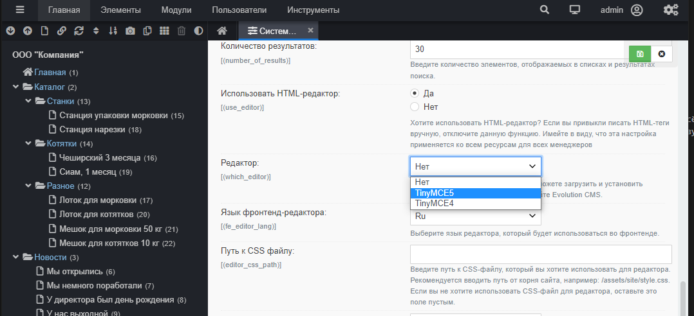

# Заполнение сайта в  Evolution CMS

## Оглавление

- [Визуальный редактор TinyMCE](#part1)
- [Наполнение](#part2)

## Визуальный редактор TinyMCE <a name="part1"></a>

В параметрах вы могли видеть поле "Содержимое ресурса", которое содержит html-код. Разумеется, можно всё оставить так и заполнять содержимое чистым кодом. Однако это неудобно. Давайте установим и настроим визуальный редактор.

### Варианты установки TinyMCE

**Первый вариант**

Открыть "Модули" - "Extras", найти там Tiny и установить. Так вы получите TinyMCE 4-й версии.

**Второй вариант**

Открываем консоль, переходим в core
```
cd evocompany.localhost/core
```

и ставим TinyMCE 5
```
php artisan extras extras TinyMCE5 master
```

Далее я рекомендовал бы сделать `composer update` - иногда что-то идёт не по плану...


### Включаем редактор

Есть опять же два способа - вы можете просто зайти в админку и в конфигурации выбрать нужный редактор (я поставил оба, но выбрал для использования 4-ю версию).



Однако мы используем для хранения настроек сайта **файлы**. Поэтому идём в `core\custom\config\cms\settings.php` и ставим там настройку, включающую редактор
```php
'which_editor' => 'TinyMCE4'
```


### Наполнение сайта

Откройте любой ресурс и проверьте, что редактор работает


На данном этапе настоятельно советую взять и забить сайт более-менее подходящей "рыбой", включая фотографии товаров, описания и цены. Либо, если у вас уже есть актуальное наполнение, заняться им. Живая информация всегда предпочтительнее "рыбы".

На реальном большом проекте этот подход экономит время. Контент-менеджер сможет заполнять пустой снаружи сайт. Главное -- хорошенько продумать структуру и ТВ.

## Итого

- Сайт работает. Есть структура.
- Мы заполняем контентом ресурсы сайта.
- Сайт всё ещё пуст снаружи

---

Если всё хорошо, то настало время [дизайна и шаблонизации](/007_Шаблон.%20Интеграция%20дизайна%20в%20Evolution%20CMS.md).
