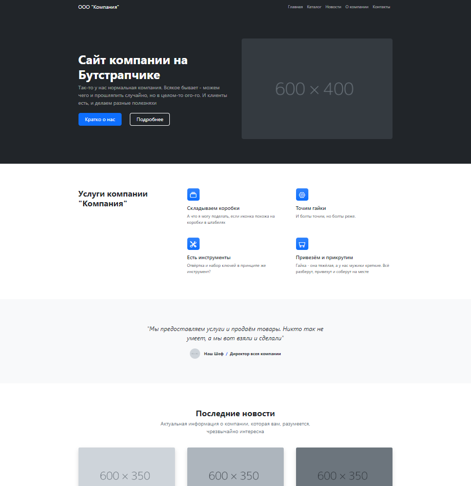
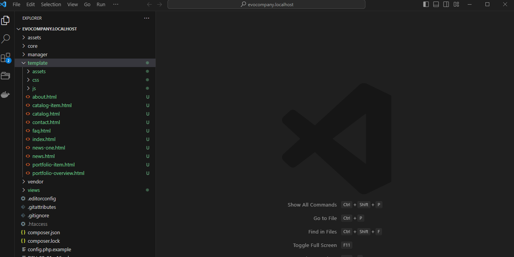
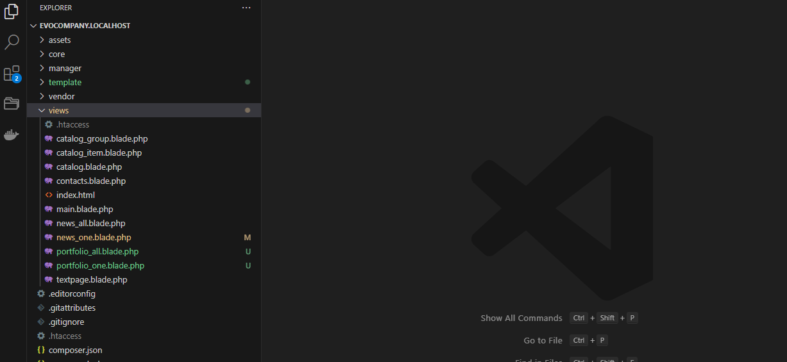
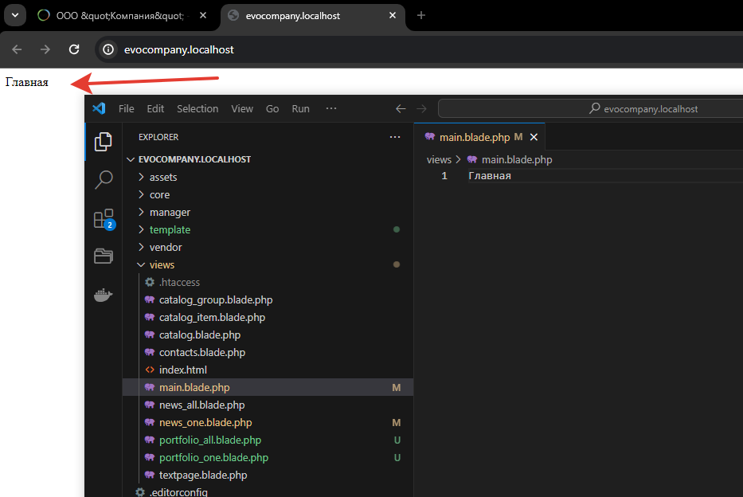
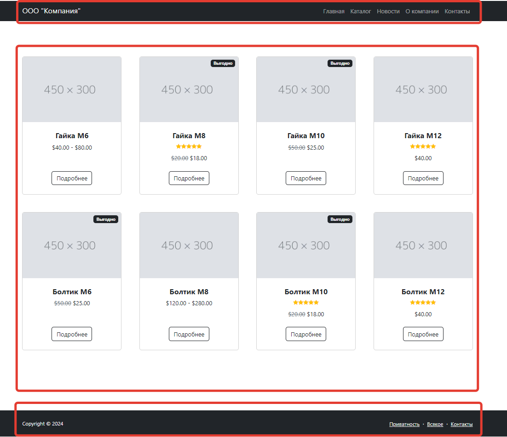
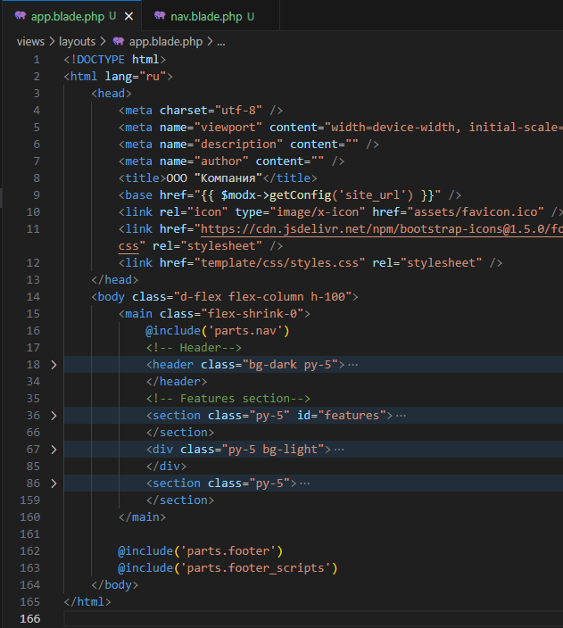
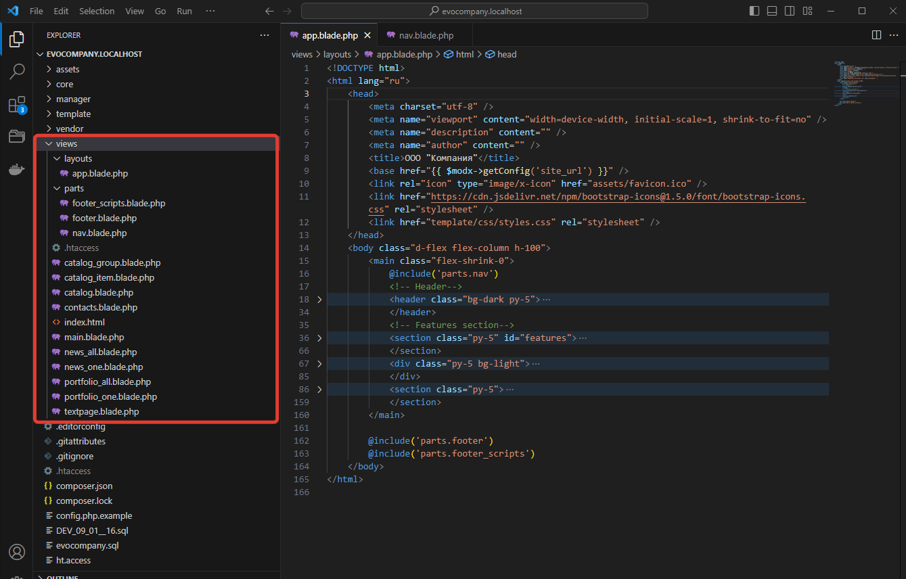
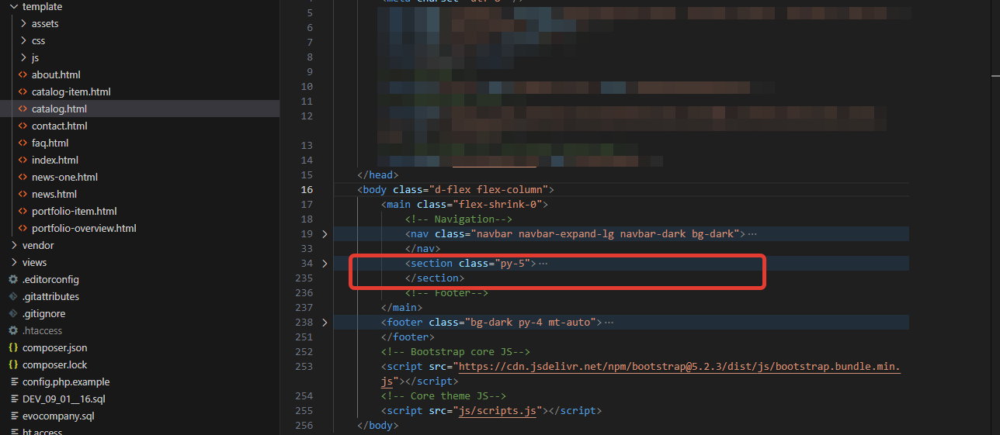
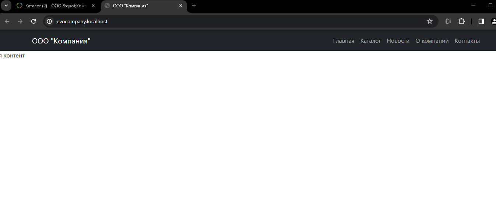
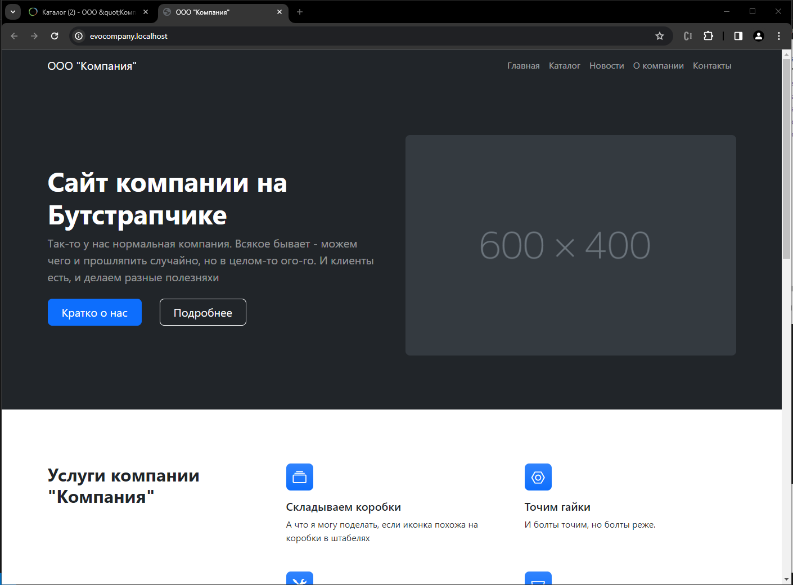

# Шаблон и интеграция дизайна в Evolution CMS

Наконец-то мы перешли к фронтенду сайта и сможем сделать какой-никакой дизайн.

Шаблонизация в Evolution CMS довольно простая и при этом гибкая. По сути, шаблонов для Evolution CMS не существует. И одновременно их же -- миллионы. Любая валидная вёрстка - считайте, 90% шаблона есть.


## Оглавление

- [Будущий дизайн, гит, сборка](#part1)
- [Копируем файлы](#part2)
- [Связь псевдонима и файла шаблона](#part3)
- [Проверка](#part4)
- [Blade](#part5)
- [Шаблоны. Базовый шаблон](#part6)
- [Шаблоны. Наследуем шаблоны](#part7)
- [Шаблоны. Выносим части шаблона в отдельные файлы](#part8)
- [Шаблоны. Секции содержимого](#part9)

## Про будущий дизайн <a name="part1"></a>

Для начала скачайте шаблон будущего сайта. Репозиторий лежит на
[моём гитхабе](https://github.com/0test/layout-lessons-evolution-company). 

Жмите `Code -> Download ZIP`, либо клонируйте репозиторий к себе, если умеете работать с git.

**Что это за src, dist, pug?**

Не обращайте внимания ни на что, кроме папки `dist`. Именно там хранится привычный html-код шаблона.

> Остальные файлы и папки необходимы для удобной и быстрой работы с вёрсткой и в уроках по цмс мы их не будем рассматривать. Любопытный читатель может открыть `readme.md`.

Открывайте `dist/index.html` и смотрите, что мы будем делать.



Шаблон простой, основан на бутстрап 5. По сути, это некая стартовая версия, на основе которой мы будем работать. Шаблон я буду периодически обновлять, так что возможны некоторые несущественные несовпадения с картинкой.

## Копируем файлы <a name="part2"></a>


В Evolution CMS нет строгого требования к папке, где должны быть размещены изображения, js и css файлы шаблона. Они могут быть где угодно, однако, я бы рекомендовал придерживаться какого-то одного подхода.

Строго требуется только размещение файлов шаблона в папке `views`, но мы до этого дойдём.

Создайте папку `template` в корне сайта, и скопируйте туда всё содержимое папки `dist` из репозитория.



Файлы `.html` можно не копировать, они ни на что не влияют. Просто в дальнейшем удобнее таскать оттуда кусочки кода, не открывая ещё одну папку.

**Вспоминаем:**

На [четвёртом занятии](/004_Структура%20сайта%20и%20шаблоны.md) мы делали шаблоны в админ-панели и назначали их страницам/разделам, создавая структуру сайта.

Давайте вспомним, что мы создали. Теперь обратите внимание на поле "Псевдоним". 

| Имя              | Псевдоним |      Описание |
| ---------------- | :-------: | ------------: |
| Главная страница | main         | Стартовая   |
| Каталог товаров  | catalog      | Каталог |
| Раздел каталога  | catalog_group| Раздел в каталоге |
| Товар            | catalog_item | Один товар |
| Новости          | news_all     | Все новости |
| Новость          | news_one     | Одна новость |
| Наши работы      | portfolio_all| Всё портфолио |
| Работа           | portfolio_one| Одна работа в портфолио |
| Текст            | textpage     | Для текстовых страниц |
| Контакты         | contacts     | Контакты |

В тот момент псевдоним был нам не важен. Теперь настало время его использовать.

## Связь псевдонима и файла шаблона <a name="part3"></a>

Откройте папку `views` в корне сайта.



Что-то знакомое - textpage, catalog...

Evolution CMS сделала пустые файлы, соответствующие тем псевдонимам шаблона, что мы задали в админ-панели при создании шаблонов
К псевдониму добавилось окончание `.blade.php`.

> Если вы не забыли нажать чекбокс "Создать файл шаблона при сохранении", разумеется. Если же забыли - можно создать файл руками.

Резюмируем:

* Шаблон в папке views связан с шаблоном в админ-панели через поле псевдоним
* Файлы ассетов типа js/css/img могут быть расположены где угодно


## Проверка <a name="part4"></a>

Давайте проверим, что наши шаблоны работают?

Откройте файл `main.blade.php`и напишите там слово "главная". Сохраните и перейдите на главную страницу вашего сайта.



Попробуйте сделать то же самое с другими файлами.
Если какой-то из шаблонов не работает, проверьте внимательно псевдоним и имя файла. Они должны быть одинаковы.

## Про Blade <a name="part5"></a>

В Evolution CMS используется шаблонизатор Blade, и это не так страшно выглядит, как называется. Он позаимствован из Laravel. Привыкнув работать с Blade здесь, вам будет гораздо легче освоиться с Blade в Laravel или с Twig в Drupal.

**Зачем шаблонизатор?**

Если заглянуть в дизайн и представить этот сайт с сотней товаров, вы увидите, что есть элементы, которые будут всегда неизменны - шапка, логотип, раздел меню. А есть области, где на разных страницах будет разный контент - заголовок, текст, фото.

Именно этим и занят шаблонизатор. Мы задаём некий "шаблон", размечаем его и определяем, в какой области что показывать, а что будет неизменным



Я примерно показал на скрине, где будут изменяемые области: сверху шапка сайта и меню, снизу подвал, а центр мы отдаём под изменяемую область с контентом.

## Шаблоны. Базовый шаблон. <a name="part6"></a>

Внимательно изучите верстку будущего сайта.
Выделите для себя, какие части повторяются, какие неизменны. Где находится контент? Где меню? Какие блоки как называются? А как часто повторяется та или иная часть на разных страницах?

Очень не хочется в каждый шаблон копировать неизменные части. И это правильно. Нужно создать некий "базовый" шаблон, который включает в себя только неизменные части дизайна.

А все остальные страницы будут "дочерними" шаблонами от этой базы.
Таким образом мы сможем поменять одну часть на всех шаблонах разом.

Давайте сделаем базовый шаблон.

Создайте папку `layouts` внутри `/views`. Это общепринятое название, вы, разумеется, можете назвать её, как желаете.
Внутри создайте файл `app.blade.php`. Этот файл и будет нашим базовым шаблоном для всех страниц.

Теперь копируйте содержимое файла `index.html` в файл `app.blade.php`.

В шаблоне есть подключаемые файлы js и css. Исправьте пути на верные:

```html
<link href="template/css/styles.css" rel="stylesheet" />
```

```html
<script src="template/js/scripts.js"></script>
```

Базовый шаблон на этом этапе больше не будем трогать, но обязательно к нему вернёмся.

(На данном этапе сайт по прежнему пустой на фронтенде -- мы же не используем базовый шаблон, он просто лежит как файл)

## Шаблоны. Наследуем шаблоны. <a name="part7"></a>

Теперь мы хотим, чтобы все наши остальные шаблоны зависели от базового.

Зависимость создаётся директивой `@extends('путь.шаблон')`.

Откройте `/views/main.blade.php` и впишите туда следующее:

```
@extends('layouts.app')
```

В блейде действует так называемая "точечная" нотация. Если быть проще, то вместо слешей - точки.
В переводе на человеческий это означает `"наследуйся из папки layouts файл app"`.

**Точки вместо слешей, .blade.php не пишем**

Повторите вставку кода extends **для всех** шаблонов внутри папки `/views`.

> файл index.html внутри - служебный, его не трогайте

Сохраните файлы и "погуляйте" по сайту при помощи кнопки "Просмотр".

Скажем, попробуйте посмотреть, как выглядит страница контакты и страница товара.

Если с контактами всё хорошо, то в новостях у вас "слетит" вёрстка. В чём дело?
Обычный html и особенность путей. Мы указали пути к css и js без слешей.

Давайте чуток исправим базовый `app` файл.
Впишите в `<head>`:

```html
<base href="{{ $modx->getConfig('site_url') }}" />
```

Что мы сделали? Определили базовый путь и присвоили ему значение из конфигурации сайта.

**Запоминаем эту конструкцию. Она нужна для того, чтобы вывести из конфигурации сайта какое-то значение**

Загляните в исходный код. После обработки сайт вернёт следующее:

```html
<base href="http://evocompany.localhost/" />
```

При желании поправьте пути изображений. Но это не критично.

Теперь все страницы должны открываться корректно и без ошибок.

## Шаблоны. Выносим части шаблона в отдельные файлы <a name="part8"></a>

Давайте унесём некоторые части шаблона в отдельные файлы. 

Ведь будет гораздо проще править шапку и меню, если они будут определены в одном единственном файле, а не размажутся по десятку шаблонов.


Создайте папку `parts` внутри `views`. Сюда будем засовывать части шаблонов.

Найдите в `app.blade.php` тег `nav` и вырежьте его со всем содержимым.

Вместо этого напишите там:

```html
@include('parts.nav')
```

Проделайте ту же работу с `footer`. Заодно я утащил в файл `footer_scripts` скрипты ниже футера. А вдруг мы захотим добавить что-то туда?

**Запоминаем: директива `@include` вставляет содержимое файла в указанное место шаблона**

Что у вас должно получиться в `app.blade.php`:

 

(длинные секции кода я свернул)

А вот так выглядит папка `views`



## Шаблоны. Секции содержимого <a name="part9"></a>

Сейчас все шаблоны наследуются от app.blade. Поэтому все страницы сайта выглядят одинаково.
Как же вывести в разных шаблонах разное содержимое? Вынести это в переменные. И пускай Evolution сама определяет, где и что вставлять.

Давайте поймём, с какого места в шаблоне начинаются различия. Изучите вёрстку. Постарайтесь понять, где заканчиваются одинаковые теги, а где уже начинаются различия в страницах.



Я сделал вывод, что всё содержимое, находящееся после `<nav>` и до окончания тега `<main>` и есть изменяемое. Идём в базовый шаблон `app.blade.php` и вырезаем всё лишнее

Получается вот так:

```html
<!DOCTYPE html>
<html lang="ru">
    <head>
        <meta charset="utf-8" />
        <meta name="viewport" content="width=device-width, initial-scale=1, shrink-to-fit=no" />
        <meta name="description" content="" />
        <meta name="author" content="" />
        <title>ООО "Компания"</title>
		<base href="{{ $modx->getConfig('site_url') }}" />
        <link rel="icon" type="image/x-icon" href="assets/favicon.ico" />
        <link href="https://cdn.jsdelivr.net/npm/bootstrap-icons@1.5.0/font/bootstrap-icons.css" rel="stylesheet" />
        <link href="template/css/styles.css" rel="stylesheet" />
    </head>
    <body class="d-flex flex-column h-100">
        <main class="flex-shrink-0">
            @include('parts.nav')
            <!-- вот тут будет контент -->
        </main>
        @include('parts.footer')
        @include('parts.footer_scripts')
    </body>
</html>

```

**Вот щас важно:**

Теперь внутри `<main>` нужно определить то самое место, которое смогут поменять дочерние шаблоны. Пишем:

```html
@yield('content')
```

Директива `@yield` выведет содержимое секции `content`.

Ближайшая аналогия - как будто бы мы написали вывод переменной content в определённое место.

Давайте зададим эту переменную?

Откройте файл шаблона главной страницы `main.blade.php` и измените его:

```html
@extends('layouts.app')

@section('content')
я контент
@endsection
```

Открывайте главную страницу и смотрите, что вышло



**Запомнить: директива @section задаёт содержимое секции, которое потом можно вывести при помощи @yield**

Ну и вместо "я контент" теперь мы можем спокойно скопировать в section  содержимое главной - пока что в виде тегов, без изменяемого содержимого.

Получается вот такая вот "простынка". В дальнейшем мы её также приведём в порядок.

<!-- prettier-ignore -->
```html
@extends('layouts.app')
@section('content')
<header class="bg-dark py-5">
  <div class="container px-5">
    <div class="row gx-5 align-items-center justify-content-center">
      <div class="col-lg-8 col-xl-7 col-xxl-6">
        <div class="my-5 text-center text-xl-start">
          <h1 class="display-5 fw-bolder text-white mb-2">Сайт компании на Бутстрапчике</h1>
          <p class="lead fw-normal text-white-50 mb-4">Так-то у нас нормальная компания. Всякое бывает - можем чего и прошляпить случайно, но в целом-то ого-го. И клиенты есть, и делаем разные полезняхи</p>
          <div class="d-grid gap-3 d-sm-flex justify-content-sm-center justify-content-xl-start">
            <a class="btn btn-primary btn-lg px-4 me-sm-3" href="#features">Кратко о нас</a>
            <a class="btn btn-outline-light btn-lg px-4" href="about.html">Подробнее</a>
          </div>
        </div>
      </div>
      <div class="col-xl-5 col-xxl-6 d-none d-xl-block text-center"></div>
    </div>
  </div>
</header>
<section class="py-5" id="features">
  <div class="container px-5 my-5">
    <div class="row gx-5">
      <div class="col-lg-4 mb-5 mb-lg-0"><h2 class="fw-bolder mb-0">Услуги компании "Компания"</h2></div>
      <div class="col-lg-8">
        <div class="row gx-5 row-cols-1 row-cols-md-2">
          <div class="col mb-5 h-100">
            <div class="feature bg-primary bg-gradient text-white rounded-3 mb-3"><i class="bi bi-collection"></i></div>
            <h2 class="h5">Складываем коробки</h2>
            <p class="mb-0">А что я могу поделать, если иконка похожа на коробки в штабелях</p>
          </div>
          <div class="col mb-5 h-100">
            <div class="feature bg-primary bg-gradient text-white rounded-3 mb-3"><i class="bi bi-nut"></i></div>
            <h2 class="h5">Точим гайки</h2>
            <p class="mb-0">И болты точим, но болты реже.</p>
          </div>
          <div class="col mb-5 mb-md-0 h-100">
            <div class="feature bg-primary bg-gradient text-white rounded-3 mb-3"><i class="bi bi-tools"></i></div>
            <h2 class="h5">Есть инструменты</h2>
            <p class="mb-0">Отвёртка и набор ключей в принципе же инструмент?</p>
          </div>
          <div class="col h-100">
            <div class="feature bg-primary bg-gradient text-white rounded-3 mb-3"><i class="bi bi-minecart"></i></div>
            <h2 class="h5">Привезём и прикрутим</h2>
            <p class="mb-0">Гайка - она тяжёлая, а у нас мужики крепкие. Всё разберут, привезут и соберут на месте</p>
          </div>
        </div>
      </div>
    </div>
  </div>
</section>
<section class="py-5">
  <div class="container px-5 my-5">
    <div class="row gx-5 justify-content-center">
      <div class="col-lg-8 col-xl-6">
        <div class="text-center">
          <h2 class="fw-bolder">Последние новости</h2>
          <p class="lead fw-normal text-muted mb-5">Актуальная информация о компании, которая вам, разумеется, чрезвычайно интересна</p>
        </div>
      </div>
    </div>
    <div class="row gx-5">
      <div class="col-lg-4 mb-5">
        <div class="card h-100 shadow border-0">
          
          <div class="card-body p-4">
            <a class="text-decoration-none link-dark stretched-link" href="#!"><h5 class="card-title mb-3">Мы открылись</h5></a>
            <p class="card-text mb-0">Some quick example text to build on the card title and make up the bulk of the card's content.</p>
          </div>
          <div class="card-footer p-4 pt-0 bg-transparent border-top-0">
            <div class="d-flex align-items-end justify-content-between">
              <div class="d-flex align-items-center">
                
                <div class="small">
                  <div class="fw-bold">Kelly Rowan</div>
                  <div class="text-muted">March 12, 2023</div>
                </div>
              </div>
            </div>
          </div>
        </div>
      </div>
      <div class="col-lg-4 mb-5">
        <div class="card h-100 shadow border-0">
          
          <div class="card-body p-4">
            <a class="text-decoration-none link-dark stretched-link" href="#!"><h5 class="card-title mb-3">Мы расширяем ассортимент гаек и болтов</h5></a>
            <p class="card-text mb-0">This text is a bit longer to illustrate the adaptive height of each card. Some quick example text to build on the card title and make up the bulk of the card's content.</p>
          </div>
          <div class="card-footer p-4 pt-0 bg-transparent border-top-0">
            <div class="d-flex align-items-end justify-content-between">
              <div class="d-flex align-items-center">
                
                <div class="small">
                  <div class="fw-bold">Josiah Barclay</div>
                  <div class="text-muted">March 23, 2023</div>
                </div>
              </div>
            </div>
          </div>
        </div>
      </div>
      <div class="col-lg-4 mb-5">
        <div class="card h-100 shadow border-0">
          
          <div class="card-body p-4">
            <a class="text-decoration-none link-dark stretched-link" href="#!"><h5 class="card-title mb-3">Мы закрылись</h5></a>
            <p class="card-text mb-0">Some more quick example text to build on the card title and make up the bulk of the card's content.</p>
          </div>
          <div class="card-footer p-4 pt-0 bg-transparent border-top-0">
            <div class="d-flex align-items-end justify-content-between">
              <div class="d-flex align-items-center">
                
                <div class="small">
                  <div class="fw-bold">Evelyn Martinez</div>
                  <div class="text-muted">April 2, 2023</div>
                </div>
              </div>
            </div>
          </div>
        </div>
      </div>
    </div>
  </div>
</section>
@endsection

```

Проверьте себя. Главная страница:




Сделайте нечто похожее для оставшихся шаблонов.

Работы много, она монотонная - скопировал-вставил, проверил. Рекомендую идти пошагово, прямо по дереву документов сайта. Главная, каталог, раздел, новости, новость... И так далее.

Советую сначала во все шаблоны раскидать секцию и наследование:
```
@extends('layouts.app')
@section('content')
<!-- сюда контент -->
@endsection
```
И уже потом копировать из `template` куски верстки. Это чуток ускорит процесс.
Файлы `catalog_group.blade.php` и `catalog.blade.php` сделайте одинаковыми на основе `catalog.html`.

После работы проверьтесь - каждая страница при нажатии на "Просмотр" в админке должна отдавать корректный и, что главное, свой шаблон.


## Итого

- Знаем про связь псевдонима и файла шаблона
- Запомнили папку `views`.
- поняли, как работает наследование от базового шаблона
- запомнили пару директив для шаблонов - section, yield, extend
- увидели первую команду `$modx->getConfig()`
- сайт начинает приобретать внешний вид: новости, главная, контакты
- на сайте **не выводится** содержимое из админки

---

Теперь настало время оживить сайт и [выводить в шаблонах настоящее содержимое](/008_Выводим%20контент.%20Новости%20и%20товары.md).
