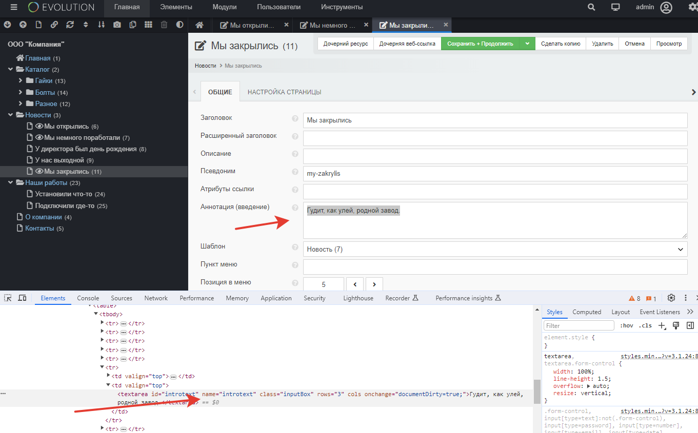
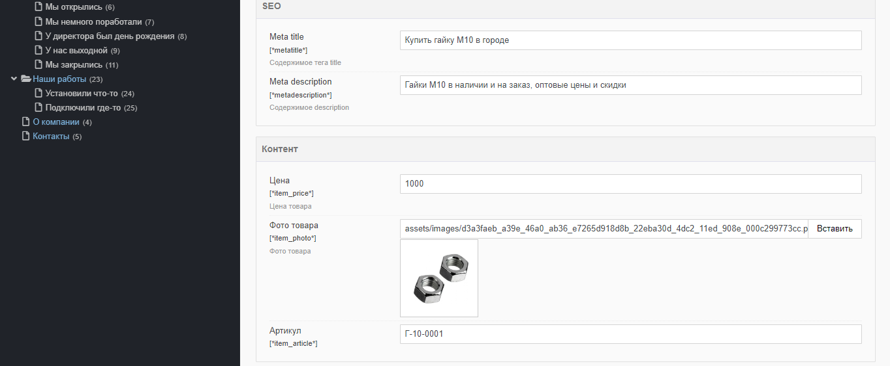
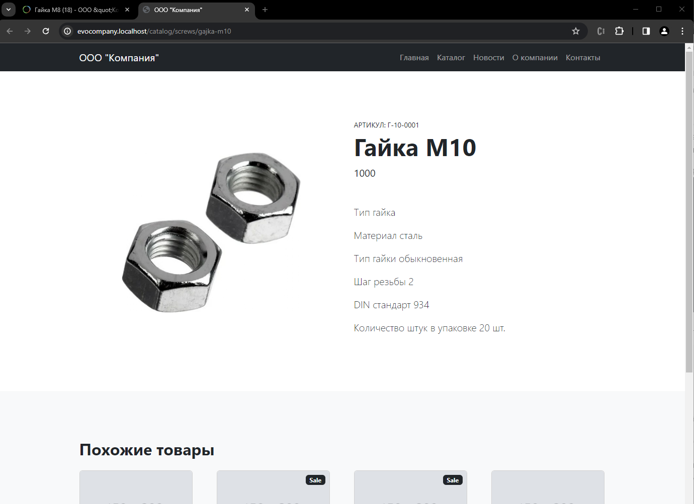

# Выводим контент. Новости и товары

Шаблоны готовы, теперь нужно выводить информацию. Давайте отдадим шаблонизатору настоящий контент сайта? 

Давайте выведем контент на страницах новостей и товаров. 
Я предварительно заполнил сайт "рыбой": вставил везде картинки, цены и наскоро написал тексты.

> Совет: если лень писать текст, а хочется хоть что-то осмысленное, попросите "Алису". Она неплохо генерирует порции бреда, выглядящего как типичный продукт рерайтера из 8-Б класса по цене 70 рублей за тысячу знаков.


## Оглавление

- [Переменные и директивы в шаблонах](#part1)
- [Выводим содержимое документа](#part2)

## Переменные и директивы в шаблонах <a name="part1"></a>

Сначала общая информация, вне контекста нашего сайта.

Шаблоны Blade содержат *HTML-теги*, *переменные* и *директивы*, которые позволяют выводить значения, использовать оператор "if-else", выполнять итерацию данных в цикле и многое другое.

### Переменные

Вы можете отобразить содержимое переменной `name` следующим образом:

```php
Hello, {{ $name }}
```

#### Экранирование переменных

Выражения со скобками `{{ }}` автоматически обрабатываются функцией htmlspecialchars для предотвращения XSS-атак. Если вы не хотите, чтобы ваши данные были экранированы, вы можете использовать следующий синтаксис `{!! !!}`.

```php
Hello, {!! $name !!}
```

В Evolution CMS изначально вам доступны системные переменные:

```php
$modx
$documentObject
```

Строго говоря, это объекты. И через их методы и свойства можно получить доступ к различным данным, предоставляемым системой.

Данные из настроек сайта:

```php
{!! $modx->getConfig('site_name) !!} // имя сайта
```

Любое поле ресурса:

```php
{!! $documentObject['content'] !!}  // поле контент
```

Сильно не вникайте, мы до этого доберёмся. Но для теста можете попробовать в любом шаблоне вывести что-нибудь.

## Выводим содержимое документа <a name="part2"></a>

Теперь, когда вы знаете чуть больше о шаблонизаторе, давайте сделаем полноценный шаблон для новости и товара. Почему так? Там чуть меньше разметки и нам будет легче.

Откройте файл `templates/news-one.html`, изучите его. В верстке есть 2 блока - сама новость и лента других новостей. Второе мы пока что пропустим, так как ещё не изучили тему лент материалов. Копируйте верстку "как есть".

А вот для создания новости у нас есть все знания.

Откройте `news_one.blade.php` и отредактируйте его код примерно таким образом:
 
```html
@extends('layouts.app')
@section('content')
<section class="py-5">
  <div class="container px-5 my-5">
    <div class="row gx-5">
      <div class="col-lg-3"></div>
      <div class="col-lg-9">
        <article>
          <header class="mb-4">
            <h1 class="fw-bolder mb-1">{{ $documentObject['pagetitle'] }}</h1>
            <div class="text-muted fst-italic mb-2">{{ $documentObject['createdon'] }}</div>
          </header>
          <figure class="mb-4"></figure>
          <section class="mb-5">
            {!! $documentObject['content'] !!}
          </section>
        </article>
      </div>
    </div>
  </div>
</section>
<!--  тут код из Relateive news, для экономии я не стал его писать-->
@endsection
```

Мы используем массив `$documentObject` и в скобках указываем машинное имя поля, которое хотим вывести. ТВ-параметр - это тоже поле (`$documentObject['news_photo']`).

> Обратите внимание, content выводится с другим синтаксисом. Там точно будут html-теги, и именно поэтому мы **отключаем** экранирование.

Где найти машинное наименование поля? В документации, в отладчике Tracy(позже) или же просто проинспектировать документ в админке:



Таким образом, если мы захотим вывести аннотацию, то напишем

```php
{{ $documentObject['introtext'] }}
```

А если мы вдруг захотим вывести что-то из системной конфигурации, скажем, имя сайта, то следует воспользоваться другим массивом.

```php
{{ $modx->getConfig('site_name') }}
```

Откуда взялось `site_name` и что ещё можно вывести, вы, наверное, уже догадались. Если нет, подсказка в уроке номер три.

Запоминаем:

> Для документа `$documentObject`
> Для конфигурации `$modx->getConfig`

Теперь мы умеем выводить информацию на страницу новости. Проверьте себя:


С новостью справились, давайте сделаем товар. Открываем и изучаем файл верстки товара `templates/catalog-item.html` и файл `catalog_item.blade.php`.

Собственно говоря, практически одно и то же с новостями. Секцию "Похожие товары" оставляем пока что кодом, а вот секцию товара редактируем.

<!-- prettier-ignore -->
```html
@extends('layouts.app')
@section('content')
<section class="py-5">
  <div class="container px-4 px-lg-5 my-5">
      <div class="row gx-4 gx-lg-5 align-items-center">
          <div class="col-md-6">
              
          </div>
          <div class="col-md-6">
              <div class="small mb-1">АРТИКУЛ: BST-498</div>
              <h1 class="display-5 fw-bolder">{{ $documentObject['pagetitle'] }}</h1>
              <div class="fs-5 mb-5">
                  <span>{{ $documentObject['item_price'] }}</span>
              </div>
              <div class="lead">
                  {!! $documentObject['content'] !!}
              </div>
          </div>
      </div>
  </div>
</section>
<!-- тут у вас код "Похожие товары" -->
@endsection
```

Обратите внимание, что тут другие имена ТВ-параметров. Это и логично, мы специально задавали свой ТВ для фото(*item_photo*) и для цены(*item_price*).

А ещё мы забыли про параметр "Артикул". Ничего страшного, создайте новый ТВ-параметр с именем *item_article* , заголовком *"Артикул"* и описанием по вкусу. Привяжите его к шаблону товара и заполните какой-нибудь рыбой.

Вы должны увидеть при редактировании товаров нечто подобное:



Ну и в коде шаблона нужно вывести полученное значение.

```html
<div class="small mb-1">АРТИКУЛ: {{ $documentObject['item_article'] }}</div>
```




К полю "цена" я бы добавил символ рубля. Но это я сделал за кадром. И вы.

## Итого

Итак, мы научились выводить содержимое системных полей и ТВ-параметров для одиночных страниц.

---

А как быть, если на главной странице, в каталоге или в новостях нужно вывести ленту всех материалов?

Откуда взять данные для текстов и пагинации, раз в documentObject только текущий документ?

Пора переходить к [контроллерам](/009_Контроллеры%20в%20Evolution%20CMS.md).