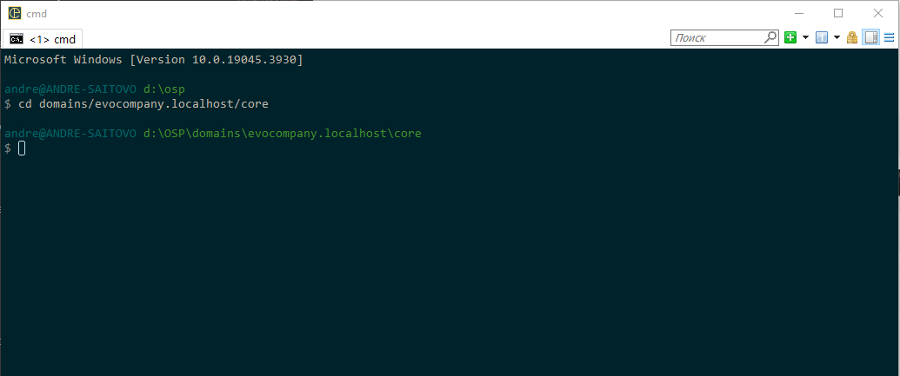
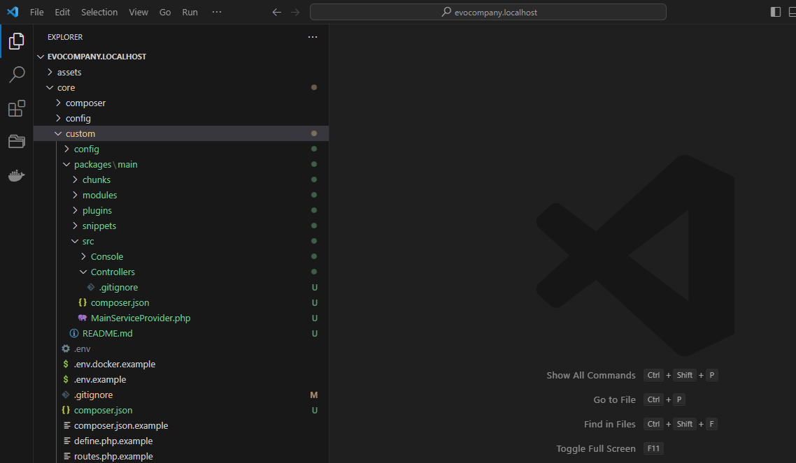
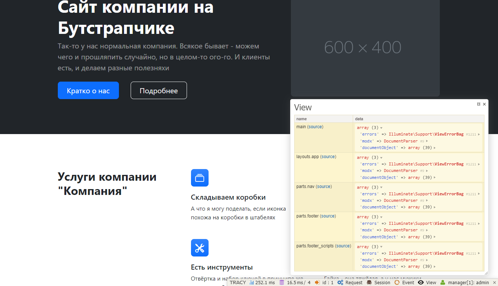
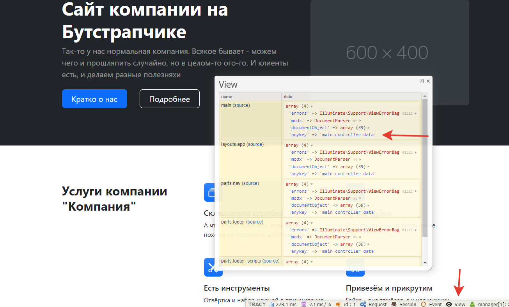
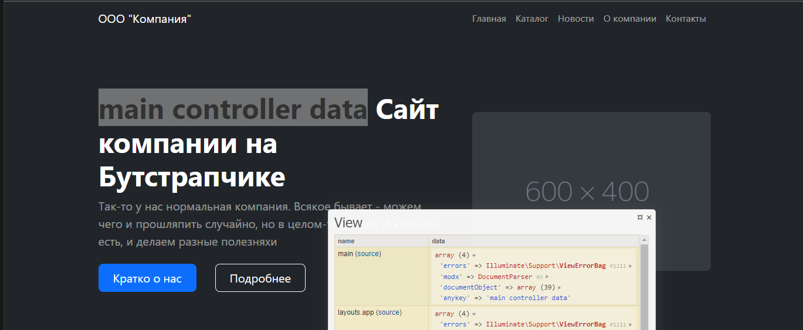

# Контроллеры. Пакет main.

В этом уроке будет общая информацию о контроллерах, установка базового пакета и создание "базового" контроллера. Тема объёмная, так что к новостям и товарам мы приступим на следующем занятии.

## Оглавление

- [Контроллеры](#part3)
- [Базовый контроллер](#part4)
- [Отладка и Tracy](#part5)
- [Контроллер шаблона](#part6)
- [Наследование](#part7)

## Контроллеры <a name="part3"></a>

Сначала немного общей информации.

### Определение

Контроллер - это класс, который обрабатывает входящие запросы и отдаёт данные в представление. Что такое представление? Всё, что лежит в папке `views`. Наши шаблоны.

Связь осуществляется через поле _шаблона_ `псевдоним`. Да, опять оно. Важное поле в Evolution CMS.

### Примеры

Для шаблона с псевдонимом `main` соответствующее название контроллера `MainController.php`

Для шаблона с псевдонимом `news_one` соответствующее название контроллера `NewsOneController.php`

>Символ подчёркивания вырезается. В псевдониме используйте только буквы и подчёркивание.

### Пакет Main

Для того, чтобы полноценно работать с контроллерами в Evolution CMS, нужно совершить несколько действий.

#### Команда package:create

Открываем консоль сервера, переходим в папку сайта и идём в папку `core`.
```
cd domains/evocompany.localhost/core
```



Теперь обновим существующие пакеты, чтобы не было ошибок. Пишем команду:

```shell
composer update
```

Операция длительная - менеджер зависимостей composer проверяет, что у нас установлено, и при необходимости скачивает и обновляет пакеты и их зависимости.

Теперь необходимо создать некий "стартовый" пакет, где мы будем писать контроллеры. Как правило, этот пакет называют `main`. Введите команду:

```shell
php artisan package:create main
```

Перейдите в папку `/core/custom/packages/`. Внутри вы должны увидеть папку `main` с разными вложенными папками и файлами.



На данном этапе все они нас не особо интересуют, кроме папки `/core/custom/packages/main/src/Controllers`. Именно здесь будут расположены контроллеры. 

В дальнейшем я буду говорить о папке `Controllers` как о папке внутри пакета `main`, чтобы не писать каждый раз полный путь.

#### Указываем namespace

Теперь нужно указать Evolution CMS область имен, откуда она будет брать контроллеры. Это делается в системной настройке `Controller Namespace`.

Можно указать её в настройках сайта в админ-панели, либо вынести в файл `settings.php` (третий урок). Мы сделаем второй вариант.

Ищем файл `core\custom\config\cms\settings.php`.
Добавляем настройку:

```php
<?php
return [
    /*
    тут у вас уже есть другие параметры
    */
    'ControllerNamespace' => 'EvolutionCMS\\Main\\Controllers\\'
];
```

Двойные слеши нужны для экранирования. Обратите внимание, что этот namespace у нас будет во всех контроллерах в папке `core/custom/packages/main/src/Controllers/`.

Пример:

```php
<?php
namespace EvolutionCMS\Main\Controllers;
```

Почему Main? Потому что имя пакета `main`. Для пакета с другим именем замените `Main` на ваше наименование.

## Базовый контроллер <a name="part4"></a>

Особенность работы с контроллерами в Evolution CMS такова, что нужно создать `BaseController` - некий базовый контроллер "для всего".

Он будет использоваться по умолчанию, если вы забыли/не захотели указать контроллер для определённого шаблона. Опять же, это удобно, если нужно прокидывать некие данные всюду. 

Давайте пока что сделаем его пустым, как некую "заглушку". Создайте файл `Controllers/BaseController.php`:

```php
<?php
namespace EvolutionCMS\Main\Controllers;

class BaseController{
    public function __construct() {
        //
    }
}
```

Вот и всё. В дальнейшем мы к нему вернёмся.

Теперь нужно сделать контроллеры для шаблонов.

## Отладка и Tracy <a name="part5"></a>

Чтобы нам было проще жить с контроллерами, давайте включим Tracy. Это удобная панель для отображения различных данных.

Создайте папку

```
core/custom/config/tracy/
```

Создайте файл `active.php`

```php
<?php
return 'adminfrontonly';
```

Теперь откройте любую страницу и обратите внимание на подвал сайта:



Я открыл вкладку "view". Слева мы видим наши шаблоны, справа -- доступные переменные и их значения. Помните, я говорил про системные переменные `documentObject` и `modx`? Вот они.

## Контроллер шаблона <a name="part6"></a>

### Главная страница

Для разминки сделаем контроллер для какой-нибудь простой страницы

Амбула: в шаблонах откуда-то надо брать данные. И это "откуда-то" как раз и есть связь шаблона и контроллера. 

**Важно:**
Разумеется, у нас есть переменные `documentObject` и `modx`, и, зачастую, ими можно прекрасно обойтись на простой странице. А то и добавить сразу в блейд. 

Но вдруг нам нужно что-то обработать, получить какие-то данные вне контекста ОДНОЙ страницы? (лента новостей, скажем).

Вспоминаем псевдонимы.

| Имя              | Псевдоним |      Описание |
| ---------------- | :-------: | ------------: |
| Главная страница |   main    |   Для главной |

У шаблона главной страницы псевдоним `main`. Значит, создаём файл `Controllers/MainController.php`:

```php
<?php
namespace EvolutionCMS\Main\Controllers;

class MainController{
    public function __construct() {
        dd('main');
    }
}
```

> Функция `dd()` означает dump & die - выведи и умри, если буквально. Она выводит любые переменные и объекты на печать.

Откройте главную страницу сайта, там должно быть напечатано слово `main` и больше ничего.

Что может пойти не так: неверное имя контроллера, неверное местоположение файла, неверное название класса.

### Как отдать данные во view?

В любом контроллере доступен объект `EvolutionCMS()`. Среди прочих в нем имеется метод `addDataToView`, который как раз отдаёт данные в шаблон.

Пишем:

```php
<?php
namespace EvolutionCMS\Main\Controllers;

class MainController {
    public $data = [];

    public function __construct() {
        $this->setData();
        $this->sendToView();
    }

    public function setData()
    {
        $this->data['anykey'] = 'main controller data';

        return $this;
    }

    public function sendToView()
    {
        EvolutionCMS()->addDataToView($this->data);

        return $this;
    }
}
```

#### Что происходит?

- Сделана переменная `$data`, где мы будем хранить нужные нам данные.
- Сделан метод `setData` для присваивания данных. Просто для удобства и чтобы не писать "простыни" в `__construct`.
- В нём мы установили переменной `$data` ключ `anykey` и задали ему  текстовое значение для теста.
- Сделан метод `sendToView`, он отдаёт данные `$data` в шаблон, используя стандартный метод из Evolution CMS.
- В `__construct` вызываем по очереди оба метода, чтобы присвоить значения и отдать их в шаблон.

Откройте главную страницу и обратите внимание на  панель Tracy.

Во вкладке `View` можете увидеть данные, которые в нашем распоряжении. В частности, свежесозданный `anykey` и его значение.




#### А как с шаблоном быть?

Откройте шаблон главной страницы и вставьте в любом месте переменную. Так, как мы делали в предыдущем уроке.

```
{{ $anykey }}

```
Я сунул её прямо в заголовок h1.




## Итого


- Вы запомнили базовую информацию про контроллеры
- Поняли, как сделать контроллер для шаблона
- Поняли, как отдать любую свою переменную из контроллера во view


---
Давайте перейдём к конкретной работе с контроллерами и сделаем [вывод новостной ленты](/010_Контроллеры.%20%20Выводим%20анонсы%20новостей%20%20и%20товары%20в%20каталоге.md)