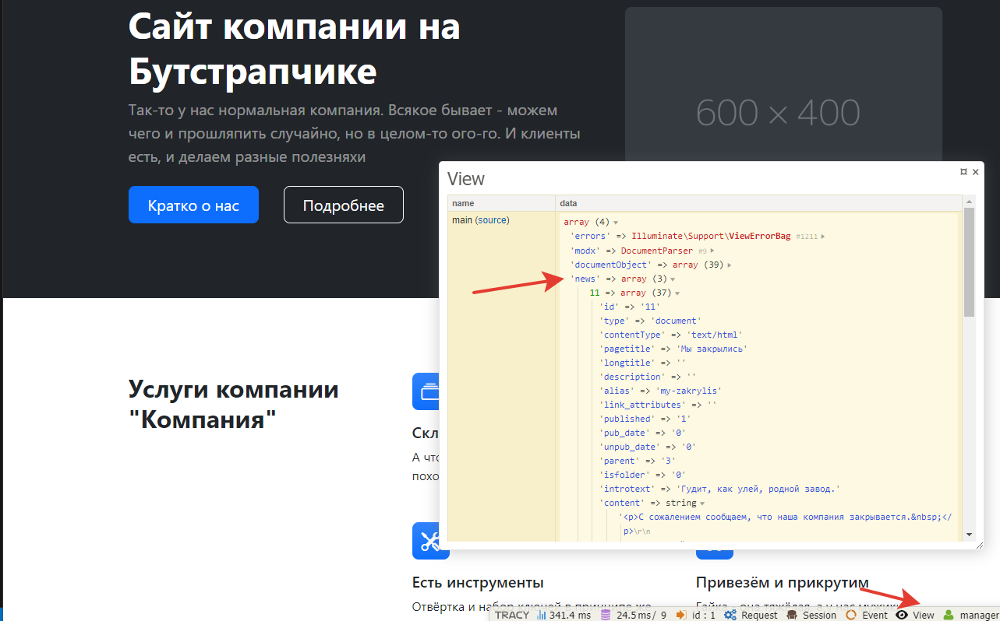
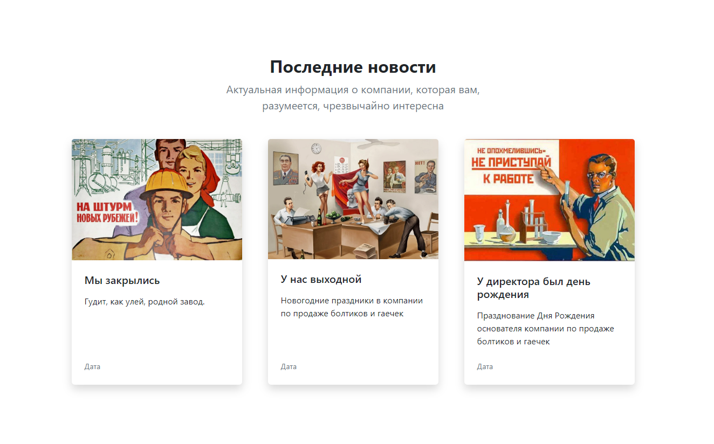
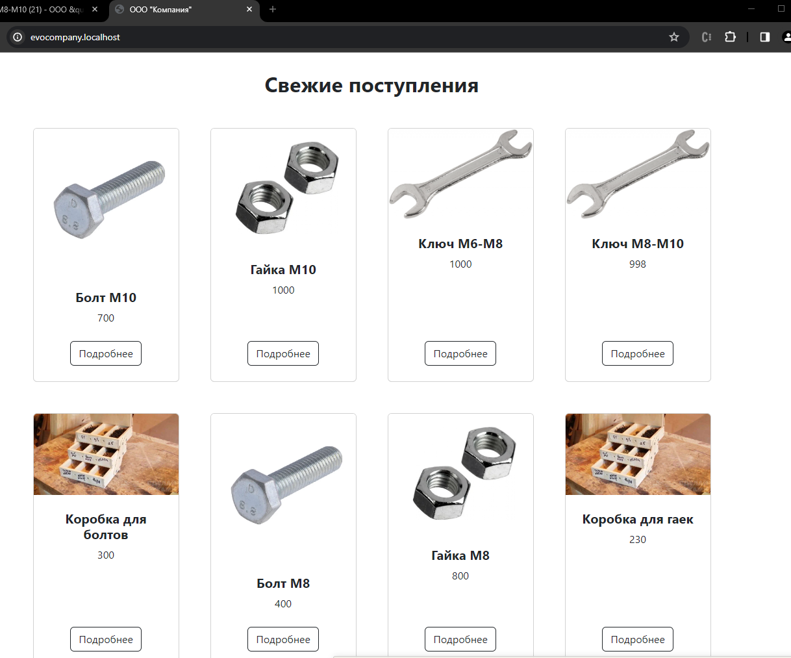

# Контроллеры.  Выводим анонсы новостей  и товары в каталоге

Пора сделать каталог товаров и новости. Начнём мы с главной страницы, т.к. на ней есть и новости и товары.

Итак, обратите внимание на верстку, найдите там секции с новостями и товарами.

На остальную разметку внимания не обращайте, мы до неё обязательно дойдём.

## Оглавление

- [Новости на главной](#part1)
- [Товары на главной](#part2)
- [Наследование](#part2)

## Новости на главной <a name="part1"></a>

Сделаем ленту новостей на главной странице.

В дизайне мы видим 3 последних новости.

Вспоминаем псевдонимы.

| Имя              | Псевдоним |      Описание |
| ---------------- | :-------: | ------------: |
| Главная страница |   main    |   Для главной |

У шаблона главной страницы псевдоним `main`. Значит, в `Controllers/MainController.php` нам нужно получить неким образом эти три новости, отдать их во вьюшку и, исходя из верстки, шаблонизировать.

```php
<?php
namespace EvolutionCMS\Main\Controllers;

class MainController{
    public function __construct() {
        dd('main');
    }
}
```

### Используем DocLister

Для создания лент ресурсов есть много способов. Самый простой на данном этапе - использование сниппета DocLister. Мы установили его ранее. Теперь просто воспользуемся им в контроллере при помощи метода Evolution CMS `runSnippet`.

> Сниппет - кусок самостоятельного кода, который реализует любую функциональность, доступную в php.
> Может быть как написан вами, так и скачан в рамках готовых дополнений (тот же DocLister).

Подробности про сниппеты вы можете найти в документации, а пока достаточно знать, что DocLister специализируется как раз на выборке различных лент материалов, их фильтрации и обработке.

> А метод runSnippet запускает сниппет. Он часть Evolution CMS.

Давайте применим эти знания для выбора новостей.

```php
<?php
namespace EvolutionCMS\Main\Controllers;

class MainController {
    public $data = [];
    public function __construct() {
        $this->setData();
        $this->sendToView();
    }
    public function setData()
    {
        $result = EvolutionCMS()->runSnippet('DocLister',[
            'parents' => 3,
            'depth' => 1,
            'tvPrefix' => '',
            'tvList' => 'news_photo',
            'display' => 3,
            'returnDLObject' => 1,
        ]);
        $this->data['news'] = $result->getDocs();
    }
    public function sendToView()
    {
        EvolutionCMS()->addDataToView($this->data);
        return $this;
    }
}
```

Мы воспользовались той же структурой контроллера, но в setData убрали фейковые ключи, которые нужны были только для демонстрации.
Вместо них происходит вызов `runSnippet`, который "дёргает" Доклистер.

Доклистеру переданы параметры, самый важный из которых `returnDLObject`. Это просьба вернуть объект, а не отдавать сразу результаты. В противном случае мы получили бы свёрстанный html. А мы хотим сами верстать новости.

Параметр `parents` указывает, откуда выбирать посты. Параметр `depth` глубину выборки, а `display` количество постов.

Параметры `tvList` и `tvPrefix` относятся к выбору ТВ-параметров - по умолчанию Доклистер не выбирает ТВ документа, чтобы сэкономить на mysql-запросах. Так что все нужные ТВ необходимо перечислить в `tvList`. В нашем случае это фото к новости `news_photo`.

Итак, у нас есть переменная `$news`, в которой массив выбранных документов. Эту переменную метод `sendToView` отдаёт шаблону.
Теперь мы можем оперировать данными уже в шаблоне.

Проверьте себя, используя Трейси:




Я вижу массив, состоящий из трёх новостей. Значит, всё хорошо и мы можем этот массив обработать в шаблоне.

#### Цикл foreach

Заходим в шаблон главной страницы `main.blade.php` и правим секцию "Последние новости":

<!-- prettier-ignore -->
```html
@extends('layouts.app')
<section class="py-5">
    <div class="container px-5 my-5">
        <div class="row gx-5 justify-content-center">
            <div class="col-lg-8 col-xl-6">
                <div class="text-center">
                    <h2 class="fw-bolder">Последние новости</h2>
                    <p class="lead fw-normal text-muted mb-5">Актуальная информация о компании, которая вам, разумеется, чрезвычайно интересна</p>
                </div>
            </div>
        </div>
        <div class="row gx-5">
            @foreach ($news as $news_one)
            <div class="col-lg-4 mb-5">
                <div class="card h-100 shadow border-0">
                    
                    <div class="card-body p-4">
                        <a class="text-decoration-none link-dark stretched-link" href="{{ urlProcessor::makeUrl($news_one['id'] ) }}">
                            <h5 class="card-title mb-3">
                                {{ $news_one['pagetitle'] }}
                            </h5>
                        </a>
                        <p class="card-text mb-0">{{ $news_one['introtext'] }}</p>
                    </div>
                    <div class="card-footer p-4 pt-0 bg-transparent border-top-0">
                        <div class="d-flex align-items-end justify-content-between">
                            <div class="d-flex align-items-center">
                                <div class="small">
                                    <div class="text-muted">Дата</div>
                                </div>
                            </div>
                        </div>
                    </div>
                </div>
            </div>
            @endforeach
        </div>
    </div>
</section>
```

Обратите внимание на `@foreach` - это цикл по массиву  `$news`, который отдан в шаблон. Внутри цикла мы просто получаем доступ к значениям каждого поста и выводим их в нужных местах.

Внимания заслуживает и конструкция urlProcessor.

```
{{ urlProcessor::makeUrl($post['id'] ) }}
```

Это директива EvolutionCMS. Служит для создания ссылки на документ. В неё мы просто передали id поста.

Запомним:

> `{{ urlProcessor::makeUrl( идентификатор ) }}` сделает нам ссылку

Таким образом, вы должны увидеть на главной странице сверстанный список новостей.



Чтобы корректно вывести дату, нужно чуток магии: в блейде напишите 

```
{{ date('d.m.Y H:i',$news_one['createdon']) }}
```
Мы берём поле createdon и форматируем его обычной функцией php.


## Товары на главной <a name="part2"></a>

Давайте сделаем то же самое, но уже с товарами. У меня их 8 штук, они имеют поля фото и цена. Принцип тот же. 

Мы задействуем метод `setData` в контроллере, и копируем вызов Доклистера, поправив его параметры под себя.

```php
        $result = EvolutionCMS()->runSnippet('DocLister',[
            'parents' => 2,
            'depth' => 3,
            'tvPrefix' => '',
            'tvList' => 'item_price,item_photo',
            'display' => 8,
            'returnDLObject' => 1,
            'addWhereList' => 'c.template = 5'
        ]);
        $this->data['products'] = $result->getDocs(); 
```

Что изменилось?

Изменили "родителя" на 2 - это id каталога у меня. Сделали поглубже depth, чтобы Доклистер мог "провалиться" внутрь папок.

И, что немаловажно, добавили параметр `addWhereList`, который отфильтровывает только ресурсы с шаблоном номер 5. Это как раз id шаблона товара. Нам ведь не нужны в этой ленте разделы каталога?

Теперь, когда есть все данные, работаем в шаблоне.
```html 
@foreach ($products as $product)
<div class="col mb-5">
    <div class="card h-100">
        
        <div class="card-body p-4">
            <div class="text-center">
                <h5 class="fw-bolder">{{$product['pagetitle']}}</h5>
                {{$product['item_price']}} руб
            </div>
        </div>
        <div class="card-footer p-4 pt-0 border-top-0 bg-transparent">
            <div class="text-center"><a class="btn btn-outline-dark mt-auto" href="{{ urlProcessor::makeUrl($product['id'] ) }}">Подробнее</a></div>
        </div>
    </div>
</div>
@endforeach
```



У вас должно получиться что-то такое. Рубли я опять добавить забыл. Но вы справитесь.

---
Изучите документацию Доклистер. Серьёзно, Доклистер - база для многих вещей в Evolution CMS.

---


## Итого

- Работает лента товаров на главной
- Работает лента новостей на главной
- По клику мы можем перейти внутрь новости и товара
- Вы запомнили базовую информацию про контроллеры
- Первый раз использовали Доклистер.

---
Давайте теперь усложним задачу, и сделаем уже полноценные [разделы для новостей и товаров](/011_Контроллеры.%20%20Раздел%20новостей%20и%20каталог.md).