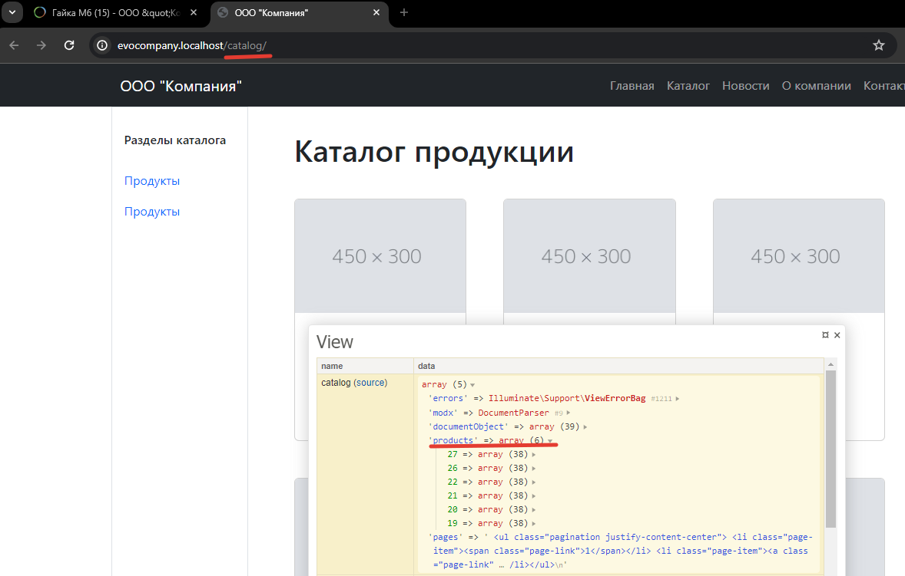

# Контроллеры.  Раздел новостей и каталог

Продолжаем делать каталог товаров и ленту новостей. Заодно изучим наследование классов и трейты.

## Оглавление

- [Новости на сайте](#part1)
- [Наследование контроллеров](#part2)
- [Товары на сайте](#part3)
    - [Traits/Трейты в php](#part3-1)

## Новости на сайте <a name="part1"></a>


Давайте сделаем всю ленту новостей

Смотрим на дизайн/верстку и видим, что у нас есть 3 блока - заголовок, сама лента новостей и пагинация.


Вспоминаем псевдонимы шаблонов.

| Имя              | Псевдоним |      Описание |
| ---------------- | :-------: | ------------: |
| Новости          | news_all     | Все новости |

У шаблона главной страницы новостей псевдоним `news_all`. Значит, делаем контроллер `Controllers/NewsAllController.php` где нужно получить новости, отдать их во вьюшку и, исходя из верстки, шаблонизировать. 

А ещё новостей может быть сильно больше трёх, и для таких случаев нужна пагинация.

```php
<?php
namespace EvolutionCMS\Main\Controllers;

class NewsAllController {
    public $data = [];
    public function __construct() {
        $this->setData();
        $this->sendToView();
    }
    public function setData()
    {
        $result = EvolutionCMS()->runSnippet('DocLister',[
            'parents' => 3,
            'depth' => 1,
            'tvPrefix' => '',
            'tvList' => 'news_photo',
            'returnDLObject' => 1,
            'paginate' => 'pages',
            'display' => 3,
            'TplPrevP' => '@CODE: <li class="page-item"><a class="page-link" href="[+link+]">&laquo;</a></li>',
            'TplNextP' => '@CODE: <li class="page-item"><a class="page-link" href="[+link+]">&raquo;</a></li>',
            'TplPage' => '@CODE: <li class="page-item"><a class="page-link" href="[+link+]">[+num+]</a></li>',
            'TplCurrentPage' => '@CODE: <li class="page-item"><span class="page-link">[+num+]</span></li>',
            'TplWrapPaginate'=>'@CODE: <ul class="pagination justify-content-center">[+wrap+]</ul>',
        ]);

        $this->data['news'] = $result->getDocs();    
    }
    public function sendToView()
    {
        EvolutionCMS()->addDataToView($this->data);
        return $this;
    }
}
```

Если сравнить этот код с кодом новостей на главной, меняются только параметры вызова Доклистера. Всё, что делают эти опции - это добавляют пагинацию и её разметку.

Теперь идём в `news.blade.php` и уже знакомым вам циклом перебираем массив `news`, выводя содержимое новостей:
```html
<div class="row gx-5">
    @foreach ($news as $news_one)
    <div class="col-lg-4 mb-5">
        <div class="card h-100 shadow border-0">
            
            <div class="card-body p-4">
                <a class="text-decoration-none link-dark stretched-link" href="{{ urlProcessor::makeUrl($news_one['id'] ) }}">
                    <div class="h5 card-title mb-3">{{ $news_one['pagetitle'] }}</div>
                </a>
                <p class="card-text mb-0">{{ $news_one['introtext'] }}</p>
            </div>
            <div class="card-footer p-4 pt-0 bg-transparent border-top-0">
                <div class="d-flex align-items-end justify-content-between">
                    <div class="d-flex align-items-center">
                        <div class="small">
                            <div class="text-muted">{{date('d.m.Y',$news_one['createdon']) }}</div>
                        </div>
                    </div>
                </div>
            </div>
        </div>
    </div>
    @endforeach
</div>
<div class="rox gx-5">
    {!! $modx->getPlaceholder('pages') !!}
</div>
```

Добавилось одно новое выражение `{!! $modx->getPlaceholder('pages') !!}`. Это пагинация. Остальная разметка и директивы 1 в 1 повторяют код в шаблоне для главной страницы.

**Плейсхолдер это...**

В Evolution CMS есть такая сущность - плейсхолдер. Это переменная, доступная всегда и везде. Доклистер засовывает в плейсхолдер `pages` пагинацию, а метод `getPlaceholder` её достаёт оттуда.

> Что может пойти не так? Если у вас меньше 3 новостей, разумеется, пагинации не будет. Либо добавьте новости, либо уменьшите количество в параметре display.

**Останавливаемся и думаем**

Обратие внимание на код контроллера - все эти setData, sendToView. Они повторяются. Если мы прямо сейчас приступим к товарам, то код будет скопирован в третий(!) раз. А мы не пишем одинаковый код дважды, если есть возможность что-то куда-то вынести и переиспользовать.

И на этой весёлой ноте перейдём к наследованию. Перед тем, как делать товары.

## Наследование контроллеров (классов) <a name="part2"></a>

В девятом уроке мы создавали базовый контроллер и обещали себе к нему вернуться. Настало его время. Открываем `BaseController.php`.

Суть происходящего: в базовый контроллер мы унесём все повторяющиеся методы типа setData, sendToView, обявление переменных. А контроллеры страниц наследуем от него. Таким образом, мы сможем не копипастить всю лапшу кода каждый раз при создании новых контроллеров, а вызывать только 1-2 метода, каждый раз определяя в них нужные данные.

Заодно мы даём себе возможность в будущем что-то вписать в BaseController и в любых других контроллерах получить этот функционал.

Это и есть наследование классов в php. Делая extends от какого-то родительского класса, мы можем в его детях использовать его методы.

Итак, BaseController приобретает такой вот вид:

```php

<?php
namespace EvolutionCMS\Main\Controllers;
class BaseController{
    public $data = [];
    public function __construct() {
        $this->setData();       //  задать переменные
        $this->sendToView();    //  отдать в шаблон
    }
    public function setData()
    {
        /**
         * этот метод будем вызывать в других контроллерах
         * и именно в нём будем задавать значения для 
         * переменной $data
         */
    }
    public function sendToView()
    {
        EvolutionCMS()->addDataToView($this->data);
        return $this;
    }    
}
```

Возвращаемся к контроллеру главной страницы и убираем лишнее. 

```php
<?php
namespace EvolutionCMS\Main\Controllers;

class MainController extends BaseController {

    public function setData()
    {
        $result = EvolutionCMS()->runSnippet('DocLister',[
            'parents' => 3,
            'depth' => 1,
            'tvPrefix' => '',
            'tvList' => 'news_photo',
            'display' => 3,
            'returnDLObject' => 1,
            'orderBy' => 'createdon DESC'
        ]);

        $this->data['news'] = $result->getDocs();
        $result = EvolutionCMS()->runSnippet('DocLister',[
            'parents' => 2,
            'depth' => 3,
            'tvPrefix' => '',
            'tvList' => 'item_price,item_photo',
            'display' => 8,
            'returnDLObject' => 1,
            'addWhereList' => 'c.template = 5',
            'orderBy' => 'RAND()'
        ]);
        $this->data['products'] = $result->getDocs();        
    }
}
```

Обратите внимание на `MainController extends BaseController`.

Проверьте главную - всё должно работать по прежнему.

Таким же образом, убирая остальное, сделайте и `NewsAllController`.

```php
<?php
namespace EvolutionCMS\Main\Controllers;
class NewsAllController extends BaseController{
    public function setData()
    {
        $result = EvolutionCMS()->runSnippet('DocLister',[
            'parents' => 3,
            'depth' => 1,
            'tvPrefix' => '',
            'tvList' => 'news_photo',
            'returnDLObject' => 1,
            'paginate' => 'pages',
            'display' => 3,
            'TplPrevP' => '@CODE: <li class="page-item"><a class="page-link" href="[+link+]">&laquo;</a></li>',
            'TplNextP' => '@CODE: <li class="page-item"><a class="page-link" href="[+link+]">&raquo;</a></li>',
            'TplPage' => '@CODE: <li class="page-item"><a class="page-link" href="[+link+]">[+num+]</a></li>',
            'TplCurrentPage' => '@CODE: <li class="page-item"><span class="page-link">[+num+]</span></li>',
            'TplWrapPaginate'=>'@CODE: <ul class="pagination justify-content-center">[+wrap+]</ul>',
        ]);
        $this->data['news'] = $result->getDocs();    
    }
}
```

Проверьте себя - всё должно работать. Переходим к товарам.

## Товары на сайте <a name="part3"></a>

Будет сложно. Вспоминаем псевдонимы шаблонов для каталога:

| Имя              | Псевдоним |      Описание |
| ---------------- | :-------: | ------------: |
| Каталог товаров  | catalog      | Каталог |
| Раздел каталога  | catalog_group| Раздел в каталоге |

Внешний вид каталога (да и подраздела внутри каталога) вот такой:


Слева выводится меню каталога, справа 6 товаров и пагинация. В самом товаре ничего сложного -- нужно зацепить из ТВ параметров фото, цену. Можете добавить ещё артикул.

Делаем контроллеры для каталога и подраздела в каталоге: `CatalogController.php`, `CatalogGroupController.php`. Пока что просто копипастим любой подходящий контроллер, не забывая наследоваться от базового.

```php
<?php
namespace EvolutionCMS\Main\Controllers;
class CatalogGroupController extends BaseController{

}
```
Давайте ещё раз остановимся и подумаем. Чем похожи эти два контроллера? Оба должны нам дать левое меню. Оба должны дать ленту товаров. Но в контроллере подраздела товары должны браться не из всего каталога, а исключительно из выбранного раздела. Остальное абсолютно одинаково. Про меню на данном этапе мы забываем - менюшки на сайте будем делать отдельным уроком.

Можно поступить двумя способами.
1. В BaseController делаем метод для получения ресурсов. Он будет принимать некий параметр, который по умолчанию равен id каталога. В этом случае метод вернёт всё содержимое каталога. Если параметр передан, то метод вернёт содержимое конкретного раздела. 
Недостаток способа - путаница и нелогичность. Базовый контроллер нужен для базовых вещей, выносить туда функционал отдельных сущностей (пускай это целых два контроллера) неверно.

2. Сделать каким-то способом такой же функционал, как и в п.1, но распространить его влияние только на 2 файла: `CatalogController.php`, `CatalogGroupController.php`


### Traits/Трейты в php <a name="part3-1"></a>


Мы не ищем простых путей, да. 

Создайте файл `Controllers/CatalogTrait.php`.

```php
<?php
namespace EvolutionCMS\Main\Controllers;
/**
 * Трейт для использования 
 * в каталоге и разделах
 */
trait CatalogTrait{
    public function getCatalog($parent = null)
    {
        $result = evo()->runSnippet('DocLister', [
            'parents' => empty($parent) ? 2 : $parent,
            'depth' => 3,
            'tvPrefix' => '',
            'tvList' => 'item_price,item_photo',
            'returnDLObject' => 1,
            'paginate' => 'pages',
            'display' => 6,
            'TplPrevP' => '@CODE: <li class="page-item"><a class="page-link" href="[+link+]">&laquo;</a></li>',
            'TplNextP' => '@CODE: <li class="page-item"><a class="page-link" href="[+link+]">&raquo;</a></li>',
            'TplPage' => '@CODE: <li class="page-item"><a class="page-link" href="[+link+]">[+num+]</a></li>',
            'TplCurrentPage' => '@CODE: <li class="page-item"><span class="page-link">[+num+]</span></li>',
            'TplWrapPaginate'=>'@CODE: <ul class="pagination justify-content-center">[+wrap+]</ul>',
        ]);
        $this->data['products'] = $result->getDocs(); 
        $this->data['pages'] = evolutionCMS()->getPlaceholder('pages');
    }
}
```

**Куда тут смотреть?**

Метод `getCatalog` принимает id родительского документа, чтобы дать его на вход Доклистеру. Если id пуст, то это будет 2 (id каталога), если нет - то будет любой другой id нужного раздела.
Остальное всё по аналогии с предыдущими уроками: пагинация, получение документов, установка переменных.

**Как это использовать?**

Легко - `use CatalogTrait;` и все методы из трейта будут доступны в наших классах.

Модифицируем классы каталога и раздела каталога:

```php
<?php
namespace EvolutionCMS\Main\Controllers;
class CatalogController extends BaseController{
    use CatalogTrait;
    public function setData()  {
        $this->getCatalog();
    }
}
```

```php
<?php
namespace EvolutionCMS\Main\Controllers;
class CatalogGroupController extends BaseController{
    use CatalogTrait;
    public function setData()  {
        $this->getCatalog(evolutionCMS()->documentObject['id']);
    }
}
```
Обратите внимание на метод `setData`. В контроллере каталога мы не отдаём id, а вот разделе каталога получаем id документа и прокидываем его в `getCatalog`. Это и позволяет одной функцией получить либо весь каталог либо его конкретный раздел.

Кажется, данные готовы. Откройте каталог и откройте любой раздел. Обратите внимание на Трейси - в одном случае он отдаст все товары, в другом только те, что были в разделе.

Каталог



Раздел


Остались мелочи. Вывести эти товары в самих шаблонах.

```html
<div class="container px-4 px-lg-5 mt-3">
    <h1 class="pb-4">Каталог продукции</h1>
    <div class="row py-2 gx-4 gx-lg-5 row-cols-1 row-cols-md-2 row-cols-xl-3 justify-content-center">
        @foreach ($products as $product)
            <div class="col mb-5 col-12">
                <div class="card h-100">
                    
                    <div class="card-body p-4">
                        <div class="text-center">
                            <h5 class="fw-bolder">{{ $product['pagetitle'] }}</h5>
                            <div class="price text-muted">{{ $product['item_price'] }}</div>
                        </div>
                    </div>
                    <div class="card-footer p-4 pt-0 border-top-0 bg-transparent">
                        <div class="text-center"><a class="stretched-link btn btn-outline-dark mt-auto" href="{{ urlProcessor::makeUrl($product['id'] ) }}">Подробнее</a></div>
                    </div>
                </div>
            </div>
        @endforeach
    </div>
    <div class="row py-2 gx-5">
        {!! $modx->getPlaceholder('pages') !!}
    </div>
</div>
```

Код одинаковый для обоих blade шаблонов. Вот тут я предпочёл оставить копии кода, не унося это в один файл. Вполне возможно, что функционал и верстка каталога и раздела будут отличаться в дальнейшем. Пусть лежит, ничего страшного. Оптимизировать это можно в три секунды, если вдруг придёт такое желание.

Внешний вид:


## Итого

- Работает лента товаров
- Работает лента новостей
- Вы узнали про наследование и трейты

---
У нас осталась одна лента - это "Наши работы". И также в шаблоне товара есть блок "Похожие товары". Это тоже лента, и у неё есть свои особенности.

Давайте [доделаем "Портфолио" и товары](/012_Контроллеры.%20%20Раздел%20портфолио.md)