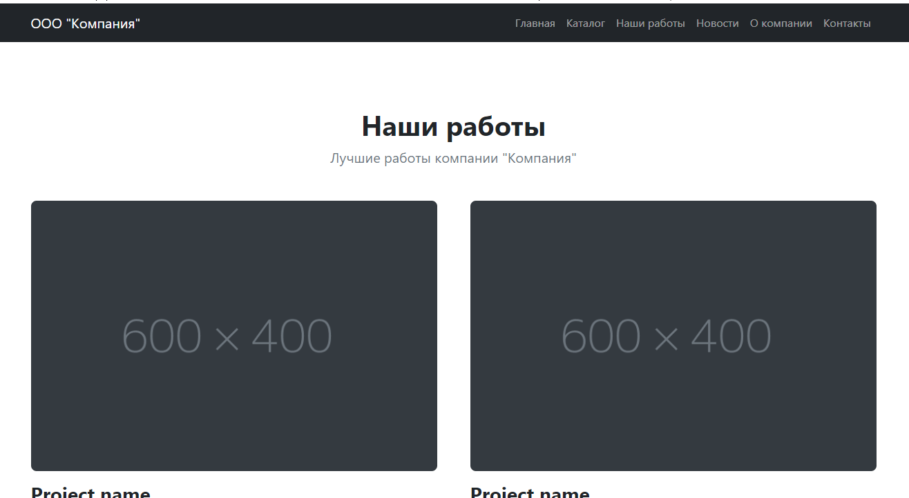
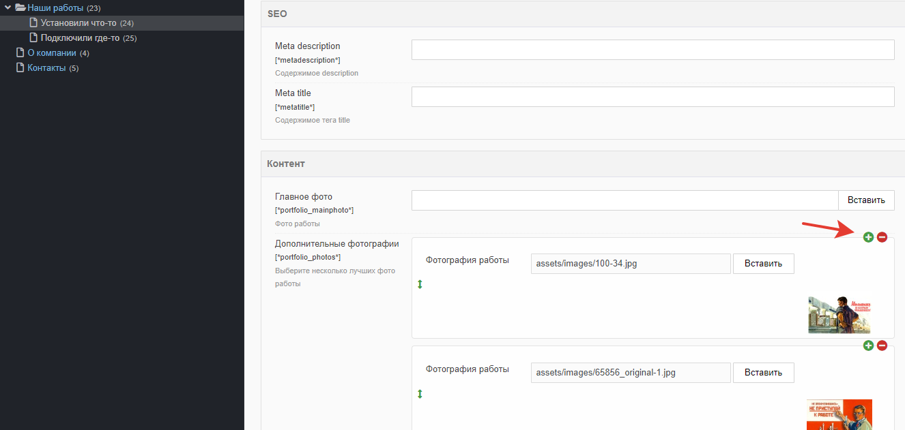
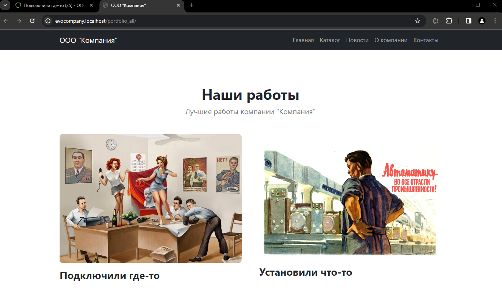
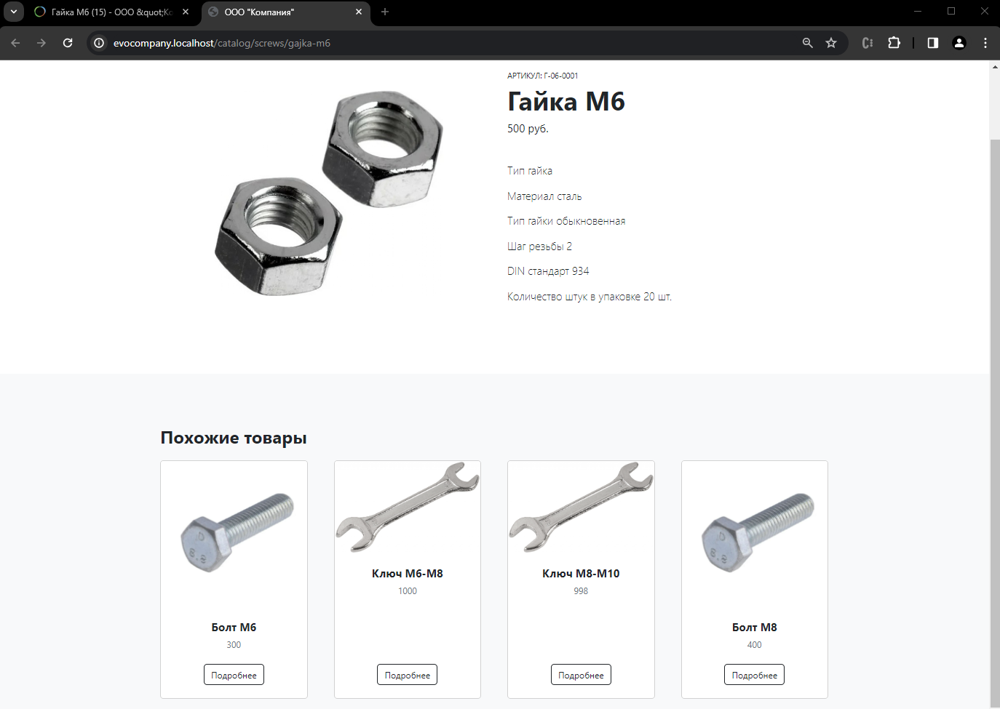

# Контроллеры.  Раздел  портфолио и доделка товара

Нам остаётся сделать ленту работ из портфолио и маленький блок "Похожие товары". Начнём с портфолио

## Оглавление

- [Раздел "Наши работы"](#part1)
    - [MultiTv](#part1-1)
- [Доделываем "Похожие товары"](#part2)


## Раздел "Наши работы" <a name="part1"></a>

Смотрим на дизайн/верстку `portfolio-item.html` и `portfolio-overview.html`  и видим, что весь раздел до крайности напоминает "Новости" - это просто заголовки, ссылка и фотография.



В каждой "Работе" предполагается главная фотография и некоторое количество фото дополнительно.

Мы не создали ТВ-параметры для этого шаблона, делаем это сейчас.

| Имя параметра             | Заголовок			|               Описание | Категория |
| --------------- | --------------------| ---------------------: | --------- |
| portfolio_mainphoto      | Главное фото         | Фото работы				| Контент   |
| portfolio_photos      | Дополнительные фотографии         | Выберите несколько лучших фото работы				| Контент   |

Параметру `portfolio_mainphoto` выберите тип ввода `image` - это просто фотография.
Для параметра `portfolio_photos` выберите тип ввода `multitv`. 


### MultiTv <a name="part1-1"></a>

В поле "Дополнительные фотографии" пользователь должен будет размещать неизвестное количество фотографий. 

В Evolution CMS нет "из коробки" возможности прицеплять к ресурсу неограниченное количество ТВ полей. Одним из решений этой проблемы является дополнение `multiTV`. Оно позволяет гибко создавать наборы полей (тексты, фото, прочее).

В данном случае нам нужно лишь неограниченное количество фотографий. Мы назначили ТВ параметру `portfolio_photos` тип `multitv`, давайте сделаем ему конфигурацию.

Конфигурация создаётся в папке `assets\tvs\multitv\configs\` и должна называться по имени ТВ с суффиксом `.config.inc.php`. Т.е. в нашем случае создаём файл 
```
assets\tvs\multitv\configs\portfolio_photos.config.inc.php
```

И пишем в нём что-то похожее на мой код:
```php
<?php
$settings['display'] = 'vertical';
$settings['fields'] = [
    'image' => [
        'caption' => 'Фотография работы',
        'type' => 'image'
	],
    'thumb' => [
        'caption' => 'Thumbnail',
        'type' => 'thumb',
        'thumbof' => 'image'
	],
];
$settings['configuration'] = [
    'enablePaste' => false,
    'hideHeader' => true,
    'enableClear' => false,
];
```

Кстати, в этой же папке есть пяток примеров, как сделать гораздо более сложные штуки. Поизучайте на досуге.

Теперь заполняем контентом парочку работ. Мульти ТВ должен выглядеть примерно вот так:




Вспоминаем псевдонимы шаблонов.

| Имя              | Псевдоним |      Описание |
| ---------------- | :-------: | ------------: |
| Наши работы      | portfolio_all| Всё портфолио |

У шаблона  псевдоним `portfolio_all`. Значит, делаем контроллер `Controllers/PortfolioAllController.php`

Давайте обойдёмся без пагинации, работ предполагается мало. 

```php
<?php
namespace EvolutionCMS\Main\Controllers;
class PortfolioAllController extends BaseController{
    public function setData()
    {
        $result = EvolutionCMS()->runSnippet('DocLister',[
            'parents' => 23,
            'depth' => 1,
            'tvPrefix' => '',
            'tvList' => 'portfolio_mainphoto',
            'returnDLObject' => 1,
        ]);
        $this->data['our_works'] = $result->getDocs();    
    }
}
```

 

Теперь идём в `portfolio_all.blade.phpp` и перебираем массив `news`, выводя содержимое каждой работы примерно так:
```html
<div class="row gx-5">
@foreach ($our_works as $one_work)
    <div class="col-lg-6">
        <div class="position-relative mb-5">
            
            <a class="h3 fw-bolder text-decoration-none link-dark stretched-link" href="{{ urlProcessor::makeUrl($one_work['id'] ) }}">{{ $one_work['pagetitle'] }}</a>
        </div>
    </div>
@endforeach
</div>
```

У меня получилось вот так:




## Доделываем "Похожие товары" <a name="part2"></a>

Откройте шаблон товара `catalog_item.blade.php`. Как видите, блок "Похожие товары" был вставлен статичным html. Надо это исправить. Функции следующие: в блоке должны отображаться товары из каталога, исключая текущий товар. Каждый раз товары должны быть разные.

Простыми конструкциями типа `$documentObject` не обойтись, делаем контроллер для товара.
Вспоминаем шаблон:
| Имя              | Псевдоним |      Описание |
| ---------------- | :-------: | ------------: |
| Товар            | catalog_item | Один товар |

Делаем `Controllers/CatalogItemControler.php` и пишем в нём выборку документов. 

```php
<?php
namespace EvolutionCMS\Main\Controllers;
class CatalogItemController extends BaseController{
    public function setData()  {
        $result = EvolutionCMS()->runSnippet('DocLister',[
            'parents' => 2,
            'depth' => 3,
            'tvPrefix' => '',
            'tvList' => 'item_price,item_photo',
            'display' => 4,
            'returnDLObject' => 1,
            'addWhereList' => 'c.id != ' . evolutionCMS()->documentObject['id'],
            'orderBy' => 'RAND()',
        ]);
        $this->data['related_products'] = $result->getDocs();    
    }
}
```

Все параметры также описаны в документации к Доклистеру. Советую разве что обратить внимание на `addWhereList`, где мы дописываем в запрос свой функционал, чтобы исключить id текущего документа из выборки.

Переходим в шаблон товара и пишем код с циклом по `related_products`. Я приведу полный листинг файла `catalog_item.blade.php`, чтобы вы могли свериться.

```html
@extends('layouts.app')
@section('content')
<section class="py-5">
    <div class="container px-4 px-lg-5 my-5">
        <div class="row gx-4 gx-lg-5 align-items-center">
            <div class="col-md-6">
                
            </div>
            <div class="col-md-6">
                <div class="small mb-1">АРТИКУЛ: {{ $documentObject['item_article'] }}</div>
                <h1 class="display-5 fw-bolder">{{ $documentObject['pagetitle'] }}</h1>
                <div class="fs-5 mb-5">
                    <span>{{ $documentObject['item_price'] }} руб.</span>
                </div>
                <div class="lead">
                    {!! $documentObject['content'] !!}
                </div>
            </div>
        </div>
    </div>
</section>
<section class="py-5 bg-light">
    <div class="container px-4 px-lg-5 mt-5">
        <h2 class="fw-bolder mb-4">Похожие товары</h2>
        <div class="row gx-4 gx-lg-5 row-cols-2 row-cols-md-3 row-cols-xl-4 justify-content-center">
            @foreach ($related_products as $one_product)
            <div class="col mb-5 col-12">
                <div class="card h-100">
                    
                    <div class="card-body p-4">
                        <div class="text-center">
                            <h5 class="fw-bolder">{{ $one_product['pagetitle'] }}</h5>
                            <div class="price text-muted">{{ $one_product['item_price'] }}</div>
                        </div>
                    </div>
                    <div class="card-footer p-4 pt-0 border-top-0 bg-transparent">
                        <div class="text-center"><a class="stretched-link btn btn-outline-dark mt-auto" href="{{ urlProcessor::makeUrl($one_product['id'] ) }}">Подробнее</a></div>
                    </div>
                </div>
            </div>
            @endforeach
        </div>
    </div>
</section>
@endsection
```

Смотрим, проверяем у себя:



Подобные блоки очень часто встречаются на сайтах. Внимательно изучив документацию к Доклистеру, можно делать довольно причудливые выборки. А если скрестить его с дополнением Selector (позволяет в админке удобно выбирать документы) можно сделать полностью настраиваемый блок товаров.


> P.S.: В шаблоне новости есть блок "Ещё новости". Это тоже лента, и она абсолютно аналогична примеру с "Похожие товары". Я её доделаю вне урока, чтобы не копировать одно и то же. Постарайтесь сделать также.


## Итого

- Работает лента портфолио
- Работают "Похожие товары"
- Вы узнали про наследование и трейты

---


