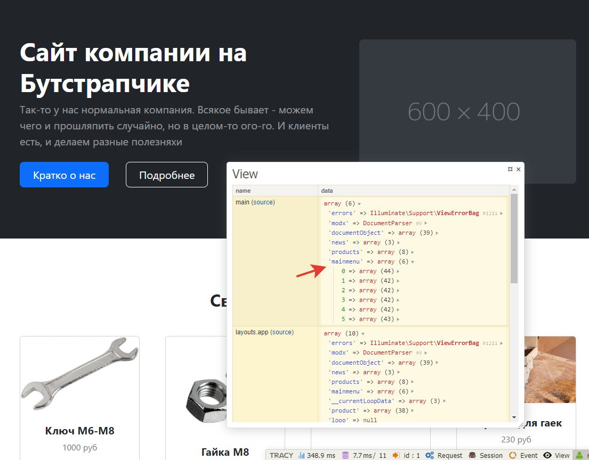
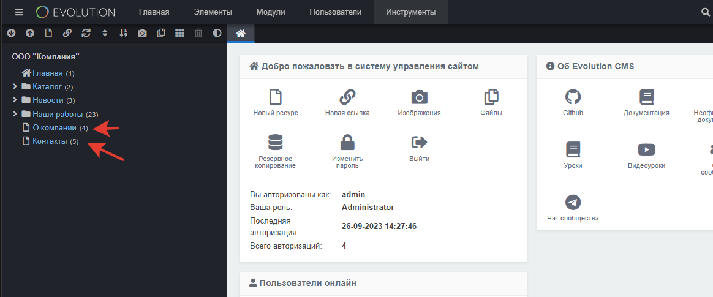
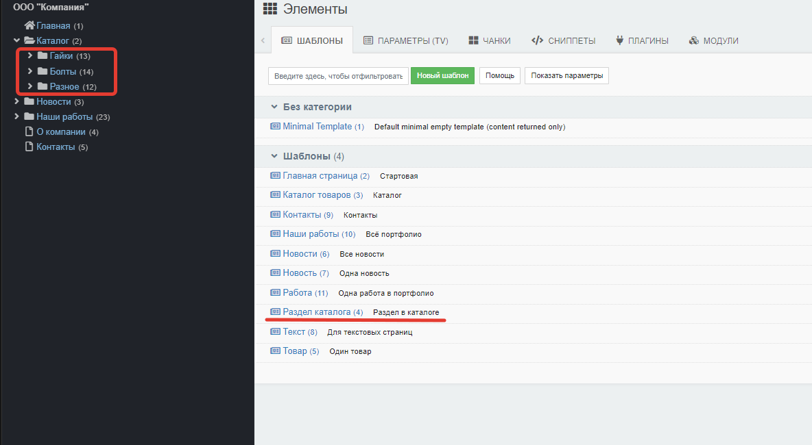

# Навигация по сайту в Evolution CMS

Давайте сделаем меню в шапке.


На всех страницах оно всегда одинаково. Разве что мы можем сделать "подсветку" активного пункта.

## Оглавление

- [Получаем данные](#part1)
- [Главное меню](#part2)
- [Меню в "подвале ](#part3)
- [Боковое меню  в каталоге ](#part4)

## Получаем данные <a name="part1"></a>

Меню выводится на всех страницах. Разумеется, в каждом контроллере писать свой метод для получения меню не стоит.
У нас есть класс BaseController, от которого наследуем все остальные классы.

Давайте сделаем отдельный метод для получения данных, которые мы хотим использовать везде и всегда.

Добавьте этот код в `BaseController.php`:

```php
    /**
     * Всё, что будет вызвано в этом методе,
     * будет на сайте всегда
     */
    public function setGlobalElements() {
        //	пока пусто
    }
```
А в метод `__construct` добавим вызов этого метода, иначе он так и останется неиспользуемым.

```php 
public function __construct() {
	$this->setData();
	$this->setGlobalElements();
	$this->sendToView();
}
```

Теперь можно написать получение самого меню:
```php 
    public function getMainMenu() {
        $menu = EvolutionCMS()->runSnippet('DLMenu',[
            'parents' => 0,
            'maxDepth' => 1,
            'returnDLObject' => 1
        ]);
        return $menu->getMenu();
    } 
```
При помощи сниппета `DLMenu` (часть Доклистера) строим менюшку. Параметры также есть в документации, изучите их - пригодится.

Обратите внимание, здесь мы используем не `getDocs`, а `getMenu`!

Теперь вызов метода `getMainMenu` надо прописать в `setGlobalElements`.

```php
public function setGlobalElements() {
	$this->data['mainmenu'] = $this->getMainMenu()[0];
}
```
Ничего сложного, просто переменной `mainmenu` присваиваем значение объекта, отданного функцией. 

> Из-за особенностей DLMenu наша менюшка там лежит под индексом [0].

Давайте протестируем? Откройте любую страницу сайта и в панели Tracy зайдите во вкладку view



Раскройте какой-нибудь элемент и посмотрите, какие ключи в нём есть. Кое-что добавилось:
```
'iteration' => 1
'here' => 1
'_display' => 6
'first' => 1
'title' => 'Главная'
'level' => 1
'url' => '/'
'e.title' => 'Главная'
```
По наименованию переменных вы, наверное, догадались, какая за что отвечает.


## Главное меню <a name="part2"></a>

Давайте вспомним, где у нас спрятана верстка меню.
Открываем `views\layouts\app.blade.php` и видим там директиву `@include('parts.nav')`.
Значит, в этом файле вынесен кусочек верстки с меню. Открывайте его и правьте под наши данные.

Правим по аналогии с товарами/новостями -- ведь это просто цикл по массиву.

Найдите секцию со списком пунктов, и сделайте там итерацию по массиву.
```html
<ul class="navbar-nav ms-auto mb-2 mb-lg-0">
	@foreach ($mainmenu as $item)
		<li class="nav-item"><a class="nav-link" href="{{ $item['url']}}">{{ $item['e.title'] }}</a></li>
	@endforeach
</ul>
</nav>
```

Переходим на сайт и ... верхнее меню должно работать.

А давайте ещё сразу подсветку активных пунктов сделаем?

```html
<a class="nav-link {{ isset($item['here']) || isset($item['active']) ? 'active' : ' ' }}" href="{{ $item['url']}}">{{ $item['e.title'] }}</a>
```

Выглядит это, как забор, но по факту довольно  логика простая: если элемент имеет ключи `here` либо `active`, то поставить класс `active`.

Почему 2 ключа? Ключ `here` будет у активного элемента. Скажем, "Новости", когда мы на странице новостей. А вот если "провалиться" внутрь конкретной новости, то ключ будет `active`. Запомните это как некую "активную ветку" меню, что ли.


## Меню в "подвале" <a name="part3"></a>

В дизайне это меню тоже повторяется везде и всегда. Я хочу вынести туда только страницы "Контакы" и "О компании".

Возвращаемся в базовый контроллер и пишем метод для получения этого меню.
```php
public function getFooterMenu() {
	$menu = EvolutionCMS()->runSnippet('DLMenu',[
		'documents' => [4,5],
		'maxDepth' => 1,
		'returnDLObject' => 1
	]);
	return $menu->getMenu();
}   
```

Немного другой подход -- в "шапке" мы получали кучу документов, путешествую по дереву от родительского. А тут -- указываем конкретные `'documents' => [4,5],` id нужных нам документов. В моём случае это 4 и 5:




Дописываем метод `getFooterMenu` вот сюда:
```php
public function setGlobalElements() {
	$this->data['mainmenu'] = $this->getMainMenu()[0];
	$this->data['footermenu'] = $this->getFooterMenu()[0];
}
```

Проверьте Трейси, чтобы он выдал нам новую переменную `footermenu`.

И дело за малым -- нужно его шаблонизировать. Код в файле  `footer.blade.php`. 

```html
<div class="col-auto">
	@foreach ($footermenu as $item)			
		<a class="link-light small" href="{{ $item['url']}}">{{ $item['e.title'] }}</a>				
		<span class="text-white mx-1">&middot;</span>
	@endforeach
</div>
```

## Боковое меню  в каталоге <a name="part4"></a>

Для каталога у нас был свой трейт `CatalogTrait` . Давайте в нём и напишем меню? Зачем нам эти данные на других страницах.

```php 
public function getCatalogMenu()
{
	$menu = EvolutionCMS()->runSnippet('DLMenu', [
		'parents' => 2,
		'maxDepth' => 1,
		'returnDLObject' => 1,
		'addWhereList' => 'c.template = 4',
	]);
	return $this->data['asidemenu'] = $menu->getMenu()[0];
}
```
Обратите внимание на строку `c.template = 4` которая фильтрует выборку по id шаблона. В моём случае **4** это идентификатор шаблонов, которые я выбрал для разделов внутри каталога:



Теперь в обоих контроллерах  делаем получение меню.
```php
public function setData()  {
	$this->getCatalog(evolutionCMS()->documentObject['id']);
	$this->getCatalogMenu();
}
```

### Шаблон

Откройте `catalog.blade.php` и `catalog_group.blade.php`. Секция меню `<aside>` повторяется там и там, поэтому будет логичным унести её отдельным файлом в `/parts/` и уже там шаблонизировать. Делаем  `/parts/aside_catalog.blade.php`:
```html
<aside class="sidebar border border-right col-md-3 col-lg-2 p-0 bg-body-tertiary py-3">
<h3 class="h6 fs-6 p-3">Разделы каталога</h3>
<ul class="nav flex-column">
	@foreach ($asidemenu as $item)
	<li class="nav-item">
		<a class="nav-link d-flex align-items-center {{ isset($item['here']) || isset($item['active']) ? 'active' : ' ' }}" href="{{ $item['url']}}">{{ $item['e.title'] }}</a>
	</li>
	@endforeach
</ul>
</aside>
```
А в шаблонах каталога и раздела просто заменяем код на инклюд `@include('parts/aside_catalog')` этого кусочка.


Всё, сайт обзавёлся менюшками. Изучите на досуге то, что выдал нам Tracy в переменных, имеющих отношение к меню. Там есть практически всё, чтобы создать меню неограниченной сложности. Заодно пробегитесь по документации `DLMenu`.

## Итого

- Сделали меню
- По сайту можно нормально перемещаться

---

Пора...