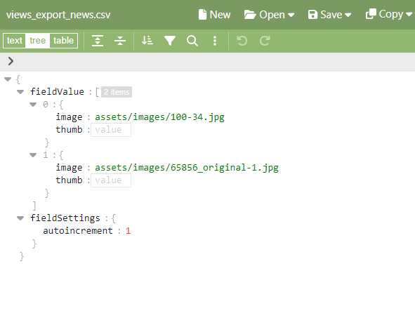

# Шаблон "Работа". Работаем с МультиТВ

В 12-м уроке мы делали ТВ поля для шаблона "Работа". Сам шаблон называется `portfolio_one.blade.php`.

Давайте им займёмся. 


Предлагаю следующую структуру: заголовок из `pagetitle`, дальше небольшой текст из `introtext`, большое фото из ТВ `portfolio_mainphoto`.
А вот дальше - маленькие фотографии. Их будем брать из `portfolio_photos`, которое содержит в себе неограниченное количество фотографий.

После фотографий также есть текст, его я предлагаю брать из поля `content`.

Давайте сразу сделаем всё самое простое, чтобы перейти к галерее и не возвращаться к мелочам:
```html
@extends('layouts.app')
@section('content')
<section class="py-5">
    <div class="container px-5 my-5">
        <div class="row gx-5 justify-content-center">
            <div class="col-lg-6">
                <div class="text-center mb-5">
                    <h1 class="fw-bolder">{{$documentObject['pagetitle']}}</h1>
                    <p class="lead fw-normal text-muted mb-0">{{$documentObject['introtext']}}</p>
                </div>
            </div>
        </div>
        <div class="row gx-5">
            <div class="col-12">
                
            </div>
            <!-- мультифото -->
            <div class="col-lg-6"></div>
            <div class="col-lg-6"></div>
            <!-- /мультифото -->
        </div>
        <div class="row gx-5 justify-content-center">
            <div class="col-lg-6">
                <div class="text-center mb-5">
                    {!! $documentObject['content'] !!}
                </div>
            </div>
        </div>
    </div>
</section>
@endsection
```

На этом этапе страничка работы будет выглядеть примерно так:


Давайте разбираться с Мульти ТВ. Заполните значения любыми фотографиями. Штуки  2 или 4, больше не надо. 

Должно получиться что-то подобное:


Давайте посмотрим, как хранятся эти данные? Откройте трейси и внутри переменной `documentObject` найдите ключ, соответствующий этому ТВ:

```json
'portfolio_photos' => '{"fieldValue":[{"image":"assets/images/100-34.jpg","thumb":""},{"image":"assets/images/65856_original-1.jpg","thumb":""}],"fieldSettings":{"autoincrement":1}}'
```

Досадно, но этот json - всего лишь текстовые данные. Придется нам его конвертировать в нормальный вид. А чтобы вам было проще, я покажу структуру данных для МультиТВ:



Из всего объекта нас интересует только ключ `fieldValue` и внутренние значения, где и лежат пути к фотографиям. Но если мы попробуем сейчас сделать итерацию по ключу `documentObject['portfolio_photos']` то получим ошибку, поскольку значение ТВ -- просто текст.

Значит, нужно его преобразовать в массив. Как? Легко:

```
{{ dd( json_decode($documentObject['portfolio_photos'], true) ) }}
```
Я сделал `dd`, чтобы Трейси вывел нам преобразованное значение:


**Важно**
В любой непонятной ситуации делай `dd`.

Дело за малым -- в файле шаблона надо обработать этот результат и пройтись циклом по `fieldValue`.

```html
@foreach (json_decode($documentObject['portfolio_photos'], true)['fieldValue'] as $photo)
    <div class="col-lg-6"></div>
@endforeach
```

И фотографии даже отобразятся на сайте. Что может пойти не так? В некоторых версиях php при пустом значении ТВ могут быть ошибки уровня notice. Можно предварительно проверять переменные той же блейд директивой `@if`.

На этом этапе вы должны увидеть нечто похожее на странице каждой работы.


### P.S.:

Настоящие самураи могут вынести код из вью в контроллер `PortfolioOneController`:

```php
<?php
namespace EvolutionCMS\Main\Controllers;
class PortfolioOneController extends BaseController
{
    public function setData()
    {
        $value = json_decode(evolutionCMS()->documentObject['portfolio_photos'][1], true) ?? [];
        if (isset($value['fieldValue'])) {
            $value = $value['fieldValue'];
        } else {
            $value = [];
        }
        $this->data['photos'] = $value;
    }
}
```

Таким образом в блейд-шаблоне не будет каких-то монструозных конструкций, а будет что-то вроде

```html
@foreach ($photos as $photo)
    <div class="col-lg-6"></div>
@endforeach
```

Вот и всё. Таким же способом можно выводить любой МультиТВ параметр на страницу.

---
Итого
- Портфолио заработало полностью

---
Есть проблема - если у новости, товара или работы вставить большую фотографию, то она так и будет грузиться на сайте на все свои 5к пикселей. Хотелось бы [сделать автоматический ресайз изображений](/015_Ресайз%20изображений%20в%20EvolutionCMS.md).  