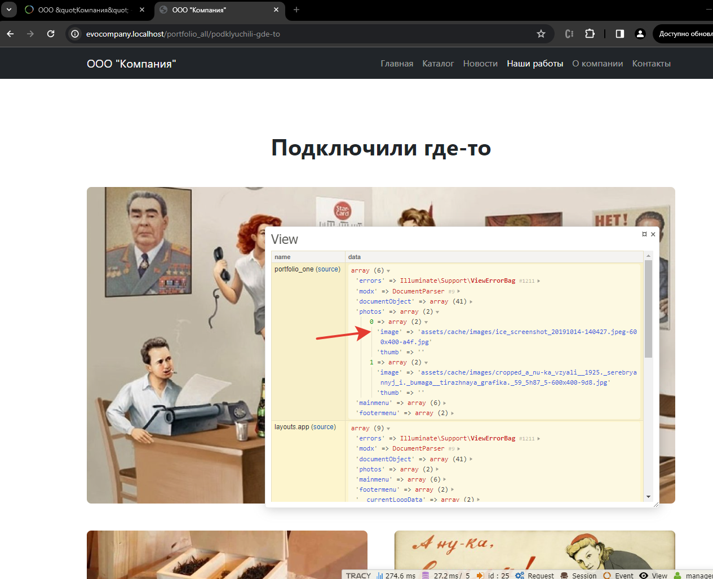

# Ресайз изображений в EvolutionCMS

## Оглавление 

- [Общий принцип](#part1)
- [Реализация](#part2)
- - [В шаблоне](#part2-1)
- - [В контроллере](#part2-2)


Полистайте сайт и найдите, где необходимо автоматически резать изображения. Я нашёл это:

1. Товар
2. Страница каталога
3. Страница "Новости"
4. Новость
5. Страница "Наши работы"
6. Работа
7. Главная страница
8. Блок "Похожие товары"
9. Блок "Ещё новости"
    
## Общий принцип <a name="part1"></a>

Используем мы модели или нет, принцип, по сути один и тот же -- использование готового сниппета под названием `phpthumb`. Заходите в "Модули - Extras" и устанавливайте его.

Сниппет простой, если на закапываться в наложения водяных знаков и прочие непотребства. Для обычного ресайза необходимо буквально пару параметров: путь к файлу и размеры нужного на выходе изображения. В ответ сниппет создаёт файл и отдаёт путь к нему.

## Реализация <a name="part2"></a>

Вам уже знакома функция `runSnippet`, так что дальнейшее не вызовет каких-либо проблем.


### Реализация в шаблоне <a name="part2-1"></a>

 Открываем шаблон "Товар" и пишем на месте фото
```html
runSnippet('phpthumb',[ 
	'input' => $documentObject['item_photo'],
	'options' => 'w=600,h=700,zc=1'
	])
}}">
```
Это обычный вызов сниппета и передача ему в качестве параметров поля фотографии (там путь) и опций. В данном случае мы просто просим его сделать кадрирование по нужным размерам.

Повторите эту операцию самостоятельно со страницей одной новости (w=900,h=400), работой (w=1300,h=700). 

На странице одной новости есть блок "Ещё новости". Там также выводятся фотографии, которым нужно задать ресайз (w=600,h=350).

Не забудьте и про блок "Похожие товары"
```html
runSnippet('phpthumb',[ 
	'input' => $one_product['item_photo'],
	'options' => 'w=450,h=300,zc=1'
	])
}}" />
```

Не исключено, что на каком-то этапе вы увидите неверную обрезку фотографии. Возможно, в вашем случае стоит чуть изменить параметры сниппета. Скажем, на `w=значение,h=значение,far=C`. Я поставил такой вызов на всех страницах товара, т.к. он некорректно резал края у фото. Экспериментируйте.

Таким образом пройдитесь по всем шаблонам, где есть фотографии, и, копируя код, изменяйте input и options. 

> Пропустите в шаблоне "Работа" секцию галереи, его мы оставим напоследок.

**Что может пойти не так?**
Внимательно смотрите, что даёте сниппету в `input`. 

### Реализация в контроллере <a name="part2-2"></a>

А как быть, если вдруг мы захотим унести ресайз изображений в контроллер?
Вот скажем в шаблоне "Работа" я вынес получение изображений в контроллер. Можно ли сделать так, чтобы ресайз произошёл там, и в блейде не пришлось писать больших конструкций этих `runSnippet`?

Да. Пойдёмте в `PortfolioOneController` и вызовем его там:

```php
$value = json_decode(evolutionCMS()->documentObject['portfolio_photos'][1], true) ?? [];
if (isset($value['fieldValue'])) {
	foreach ($value['fieldValue'] as $key => $src) {
		$value['fieldValue'][$key]['image'] = evo()->runSnippet('phpthumb', [
			'input' => $src['image'],
			'options' => 'w=600,h=400,zc=1'
		]);
	}
	$value = $value['fieldValue'];
} else {
	$value = [];
}
$this->data['photos'] = $value;
```

Мы прошлись по массиву значений, подсунули адреса картинок сниппету и перезаписали их на адреса, которые отдал сниппет. Теперь в переменной photos лежит уже изменённое изображение.



Таким же образом мы могли бы поступить с фотографиями товара. Но не всегда стоит усложнять. Тем более в сообществе нет устоявшейся практики по использованию ресайза изображений. Кто-то считает, что ресайз - это дизайн, и поэтому все подобные манипуляции должны находиться в блейде. Кто-то считает, что ресайз - это код, а код должен жить в контроллере.

Кто-то усложняет это до выноса отдельного метода в трейты/базовые контроллеры, пишет свои "хелперы". Однако, это решение сложно для понимания в рамках цикла статей для начинающих.


Мой подход -- если необходимо разок порезать фотографии для новостей, то вполне себе можно использовать `runSnippet` в блейде. 

--- 
Итого:
- Большая часть изображений на сайте режется автоматически строго в размер
---

Если я начинаю заниматься копированием похожих кусков кода туда-сюда, то это означает, что где-то что-то пошло не так, и стоит оптимизировать сайт - скажем, вынести какой-то функционал в отдельный метод а верстку - [в отдельный файл](/016_Немного%20оптимизации.md).
