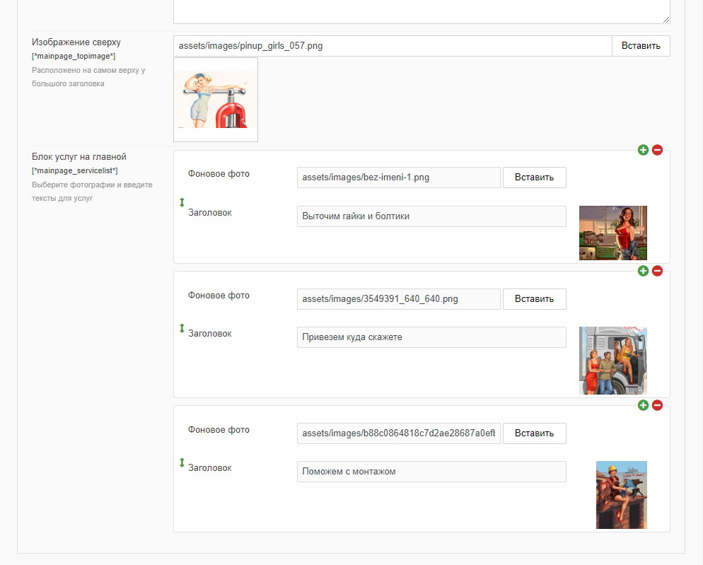

# Доделки на главной странице и странице контактов

## Оглавление 

- [Главная](#part1)
- [Контакты](#part2)


## Главная страница <a name="part1"></a>

На главной у нас не доделаны два блока. 
Я хочу вынести в ТВ-параметры все тексты и фото для первого блока. С огромной долей вероятности клиент захочет менять содержимое именно первого экрана сайта.


Давайте создадим Тв-параметры для этих сущностей: два текстовых и один типа "Image".  
| Имя параметра   | Заголовок        |               Описание | Категория |
| --------------- | ---------------- | ---------------------: | --------- |
| mainpage_header       | Главный заголовок       |  Самый первый большой заголовок на главной странице | Контент       |
| mainpage_intro      | Подпись под главным заголовком     | Текст под большим заголовком | Контент   |
| mainpage_topimage      | Изображение сверху             |            Расположено на самом верху у большого заголовка | Контент   |

У mainpage_topimage выберите тип "Image", у mainpage_intro "Textarea(mini)". Разумеется, все ТВ должны быть привязаны к шаблону главной страницы.

Админка стала выглядеть как-то так:


Теперь выведем это в шаблоне. Тут всё мега-просто, используем знакомый documentObject и в нужным местах ставим ТВ.

Заодно я поправил ссылку "Подробнее" так, чтобы она вела на страницу "О компании(4)".

Запомните директиву `@makeUrl(АЙДИ)`.

```html
<div class="row gx-5 align-items-center justify-content-center">
    <div class="col-lg-8 col-xl-7 col-xxl-6">
        <div class="my-5 text-center text-xl-start">
            <h1 class="display-5 fw-bolder text-white mb-2">{{$documentObject['mainpage_header']}}</h1>
            <p class="lead fw-normal text-white-50 mb-4">
                {{$documentObject['mainpage_intro']}}
            </p>
            <div class="d-grid gap-3 d-sm-flex justify-content-sm-center justify-content-xl-start">
                <a class="btn btn-primary btn-lg px-4 me-sm-3" href="#features">Кратко о нас</a>
                <a class="btn btn-outline-light btn-lg px-4" href="@makeUrl(4)">Подробнее</a>
            </div>
        </div>
    </div>
    <div class="col-xl-5 col-xxl-6 d-none d-xl-block text-center"></div>
</div>
```

Смотрим, сверяемся:


А теперь перейдём к блоку услуг. На предыдущих скринах он выглядел немного по-другому, потому что я изменил вёрстку (в дистрибутие всё так как надо).

В данном случае мы имеем три блока с текстом и фоновыми изображениями. Надо подразумевать, что блоков может быть как три, так и шесть или более, ведь никто не мешает заказчику добавить новую услугу? Значит, это мультиполе.


Создаём ТВ типа mutliTV с названием `mainpage_servicelist`. Описание и заголовок произвольные. 

И для этого ТВ надо создать конфигурацию. Файл формируется исходя из названия ТВ: 
`assets\tvs\multitv\configs\mainpage_servicelist.config.inc.php` 

```php
<?php
$settings['display'] = 'vertical';
$settings['fields'] = [
    'image' => [
        'caption' => 'Фоновое фото',
        'type' => 'image',
    ],
    'thumb' => [
        'caption' => 'Thumbnail',
        'type' => 'thumb',
        'thumbof' => 'image'
    ],
    'title' => [
        'caption' => 'Заголовок',
        'type' => 'text'
    ]
];
$settings['configuration'] = [
    'enablePaste' => false,
    'hideHeader' => true,
    'enableClear' => false,
];
```
Обратите внимание, что теперь у нас уже 2 поля. Одно для фото, другое для текста.

Идём в админку, заполняем ТВ.



Теперь нужно вытащить эту информацию в шаблоне. Идём в контроллер главной страницы и добавляем туда секцию кода в методе `setData`

```php
$value = json_decode(evolutionCMS()->documentObject['mainpage_servicelist'][1], true) ?? [];
if (isset($value['fieldValue'])) {
    foreach ($value['fieldValue'] as $key => $src) {
        $value['fieldValue'][$key]['image'] = evo()->runSnippet('phpthumb', [
            'input' => $src['image'],
            'options' => 'w=400,h=300,zc=1'
        ]);
    }
} else {
    $value = [];
}
$this->data['service_photos'] = $value['fieldValue'];
```

В принципе мы уже это разбирали, но ещё раз: декодируем значение из ТВ параметра, ключ `image` отдаём на растерзание сниппету Phpthumb, чтобы он вырезал изображение 400х300. Всё полученное пишем в переменную `service_photos`.

Проверяемся на корректность данных в Трейси:


Всё ок, шаблонизируем `main.blade.php`
```html
<section class="container py-5 py-5">
    <div class="align-items-stretch g-4 row row-cols-1 row-cols-lg-3">
        @foreach ($service_photos as $service)
        <div class="col">
            <div class="card card-cover h-100 overflow-hidden text-bg-dark rounded-4 shadow">
                <div class="d-flex flex-column h-100 p-5 pb-3 text-white text-shadow-1"
                    style="background-image: url('{{$service['image']}}')">
                    <h3 class="pt-5 mt-5 mb-4 display-6 lh-1 fw-bold">{{$service['title']}}</h3>
                </div>
            </div>
        </div>
        @endforeach
    </div>
</section>
```

Вот так выглядит секция у меня:


С главной страницей на этом всё.

## Контакты <a name="part2"></a>

Страница контактов у меня выглядит вот так:


На что тут нужно обратить внимание? Ну во-первых это форма. Нам нужно её заставить работать. И мы это будем делать на отдельном уроке.

Далее карта Яндекс и текстовая строка адреса сверху. Внизу по всей ширине страницы текстовая область. Это мы можем сделать прямо сейчас и очень быстро.

Создайте 2 ТВ параметра. Оба текстовые, оба привязываются к шаблону "Контакты". Я назвал их `contacts_address`  и `contacts_mapcode` (Адрес и Код карты).

Где взять код карты? Перейти на Яндекс и найти там [Конструктор карт](https://yandex.ru/map-constructor/?from=maps_login).

Формируем карту, заполняем поля:


Теперь выводим их в шаблоне

```html
@extends('layouts.app')
@section('content')
<section class="py-5">
    <div class="container">
        <div class="row">
            <div class="col-12 col-lg-6 mb-4">
                <div class="card mb-4">
                    <div class="card-body">
                        <!-- тут у вас код формы -->
                    </div>
                </div>
            </div>
            <div class="col-12 col-lg-6 mb-4">
                <div class="card mb-4">
                    <div class="card-header py-3">
                        <h5 class="mb-0">Адреса и телефоны</h5>
                    </div>
                    <div class="card-body">
                        <ul class="list-group list-group-flush">
                            <li
                                class="list-group-item d-flex justify-content-between align-items-center border-0 px-0 pb-0">
                                {{ $documentObject['contacts_address'] }}
                            </li>                           
                            <li
                                class="list-group-item d-flex justify-content-between align-items-center border-0 px-0 pb-0">
                            </li>
                             {!! $documentObject['contacts_mapcode'] !!}
                        </ul>
                    </div>
                </div>
            </div>
        </div>
        <div class="row">
            <div class="col-12">
              {!! $documentObject['content'] !!}
            </div>
        </div>
    </div>
</section>
@endsection
```


Ура, страница контактов работает.

## Итого

- Довели до ума главную и контактную страницы
- Научились работать с Мульти ТВ
- Забыли про директиву `@makeUrl`, так вот, напоминаю, она есть

---

Давайте теперь [сделаем отправку контактной формы](/018_Отправка%20формы%20в%20Evolution%20CMS.md).