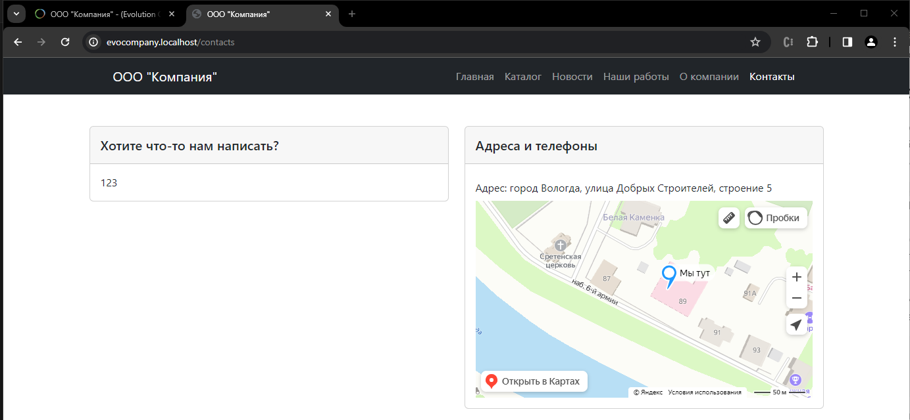
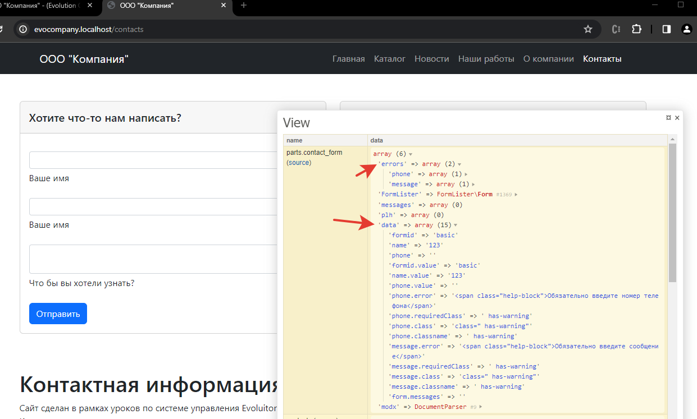
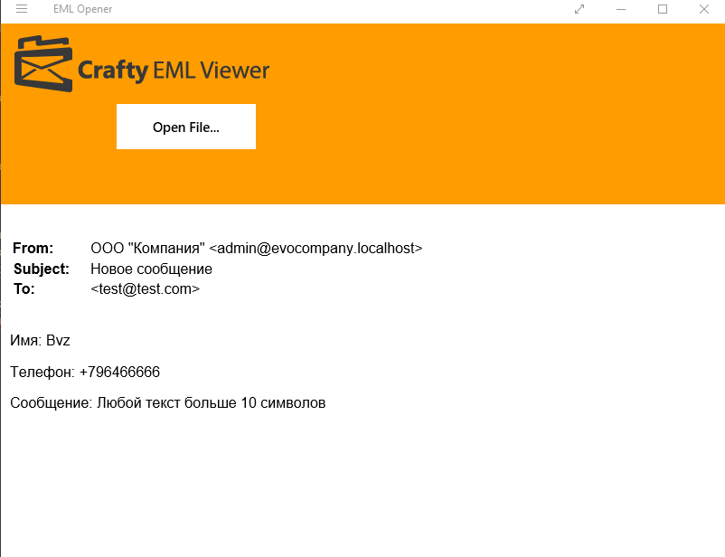
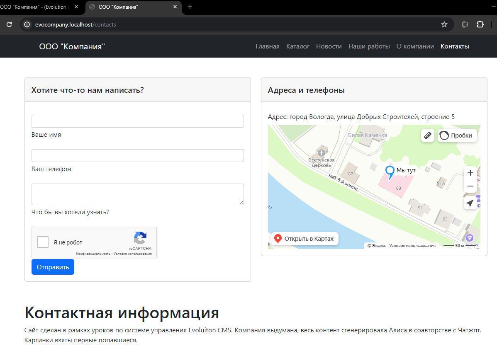

# Отправка форм в Evolution CMS

## Оглавление 

- [Общая информация](#part1)
- [Реализация](#part2)
  - [Гугл reCaptcha](#part2-1)

## Общая информация <a name="part1"></a>

В Evolution CMS есть устоявшаяся практика: для работы с формами используется сниппет под названием [FormLister](https://github.com/Pathologic/FormLister). Это огромный "комбайн", который не ограничивается одной лишь отправкой чего бы то ни было на почту. Там есть регистрация, авторизация, редактирование страниц с фронтенда сайта. Собственно, он покрывает своими возможностями 100% обычных нужд разработчика.

Работа с формой вообще состоит из нескольких частей:
1. Показать форму
2. Отправить форму
3. Проверить ввод пользователя
4. Обработать ввод
5. Сделать что-то

И любая из этих частей имеет целую кучу вариантов реализации. Скажем, в 2024 году отправка формы с перезагрузкой страницы -- редкость. Значит, в реализацию отправки вплетается JavaScript, делается асинхронный запрос на какой-то адрес скрипта, который, в свою очередь, сделает пункты 3,4,5. 

FormLister  "из коробки" предоставляет возможность просто отправить форму без каких-либо изысков. Но при желании позволяет довольно гибко всё это организовать так, как нужно и удобно разработчику.

Всё как всегда - читаем документацию.

## Отправляем форму <a name="part2"></a>

Мы сделаем простую отправку формы. Разобравшись, как сделать простую отправку, вы сможете в дальнейшем обвешать её скриптами по своему вкусу (Урок по формам с использованием аякс есть [на сайте сообщества](https://community.evocms.ru/blog/docs/4693-eshhyo-parochka-sposobov-podruzhit-ajax-i-formlister-v-evo-1.4.x-3.x.html)).


Открывайте файл  `contacts.blade.php` и изучайте вёрстку.

Заодно напомню вам внешний вид формы.


Даваавайте рассуждать. Что из разметки будет статикой, а что динамически будет изменяться?

Очевидно, что будет меняться всё содержимое тега `<form></form>`. Ведь форма будет принимать пользовательский ввод и после отправки должна измениться: либо добавить в разметку ошибки, либо написать, что всё хорошо и письмо ушло.

Значит, вырезаем содержимое тега формы, заменяя его на какую-то переменную, значение которой мы зададим позже.

```html
<div class="card-body">
    {!! $contact_form !!}
</div>
```

> Внимательнее со скобками. Форма содержит теги, `{{ так }}` не подойдёт. Надо именно `{!! вот так !!}`.
 
Теперь нужно задать эту переменную. В ней будет жить и изменяться форма. Создаём контроллер для страницы контактов:

```php
<?php
namespace EvolutionCMS\Main\Controllers;
class ContactsController extends BaseController
{
    public function setData()
    {
        $this->data['contact_form'] = 123;
    }
}

```
Откройте страницу. Вы должны увидеть вместо формы цифры 123.



Переменная выводится, теперь можем вместо цифр закинуть вызов сниппета FormLister.

```php
public function setData()
{
    $this->data['contact_form'] = evolutionCMS()->runSnippet('FormLister',[
        'formid' => 'basic',
        'rules' => [
                "name" => [
                    "required" => "Обязательно введите имя",
                ],
                "phone" => [
                    "required" => "Обязательно введите номер телефона",
                    "phone" => "Введите номер правильно"
                ],
                "comment" => [
                    "required" => "Обязательно введите сообщение",
                    "minLength" => [ 
                        "params" => 10,
                        "message" =>"Сообщение должно быть не менее 10 символов"
                    ]
                ]
        ],
        'formTpl' => '@B_FILE: parts.contact_form',
        'to' => 'test@test.com',
        'reportTpl' => '@CODE:
            <p>Имя: [+name.value+]</p>
            <p>Телефон: [+phone.value+]</p>
            <p>Сообщение: [+comment.value+]</p>
        ',
        'errorClass' => ' is-invalid',
        'requiredClass' => ' is-invalid',
        'subject' => 'Новое сообщение',
        'messagesOuterTpl' => '@CODE:<div class="alert alert-danger" role="alert">[+messages+]</div>',
        'errorTpl' => '@CODE:<span class="help-block">[+message+]</span>',
    ]);
}
```

На что обратить внимание? Ну в первую очередь на документацию в FormLister, поскольку все эти параметры там подробнейшим образом описаны.

От себя прокомментирую `formid` и `formTpl`.

Параметр `formTpl` задаёт шаблон для формы. Как вы помните, мы вырезали вёрстку формы. Теперь пора её вернуть. Путь `parts.contact_form` предполагает, что вы создадите файл `views\parts\contact_form.blade.php`.


Теперь в  `contact_form.blade.php` нужно кое-что дописать.

Во-первых, у формы должен быть явно указан метод отправки `method="POST"`.
Во-вторых, FormLister требует внутри формы указывать скрытое поле типа input  с именем formid. 
```
<input type="hidden" name="formid" value="basic">
```

Значение атрибута `value` из этого инпута используется в дальнейшем, как  идентификатор формы. Делайте его уникальным при наличии нескольких форм.

А сейчас вставьте его в любое место формы (пример ниже).

Также проверьте, что у всех полей задано `name`. Это частая и моя самая любимая ошибка.

```html
<form class="needs-validation" method="POST">
    <input type="hidden" name="formid" value="basic">
    <div class="form-group mb-3 mt-3">
        <input class="form-control form-control-sm" type="text" name="name" id="name" />
        <label class="form-label mt-1 text-shadow" for="name">Ваше имя</label>
        <div class="invalid-feedback"></div>
    </div>
    <div class="form-group mb-3 mt-3">
        <input class="form-control form-control-sm" type="text" name="phone" id="phone" />
        <label class="form-label mt-1 text-shadow" for="phone">Ваше имя</label>
        <div class="invalid-feedback"></div>
    </div>
    <div class="form-group mb-3 mt-3">
        <textarea class="form-control form-control-sm" name="phone" id="comment"></textarea>
        <label class="form-label mt-1 text-shadow" for="comment">Что бы вы хотели
            узнать?</label>
        <div class="invalid-feedback"></div>
    </div>
    <div class="form-group field"><input class="btn btn-primary" type="submit" value="Отправить" /></div>
</form>
```

Вернёмся к контроллеру. Как видите, там присутствует `formid`. И он должен быть равен тому `formid`, который мы задали в вёрстке.

Это также частая ошибка. 

Возвращаемся на сайт. Заполните пару полей ерундой и попробуйте отправить форму. По идее, ничего не должно измениться. Но нам нужно как-то показать ошибки, отобразить старые введённые данные. Как быть?

Открываем Трейси.



Смотрите, какое количество данных нам прокинул FormLister в шаблон. Тут есть и ошибки, и наши введённые данные и многое-многое другое.

Мы можем их использовать как самые обычные переменные в `contact_form.blade.php`. Нужно вставить их в нужные места шаблона. Я вставлю классы ошибок, значения полей и значения ошибок полей. 

Вот что должно получиться

```html
<form class="needs-validation" method="POST">
    {!! $data['form.messages'] ?? '' !!}
    <input type="hidden" name="formid" value="basic">
    <div class="form-group mb-3 mt-3">
        <input class="{{ $data['name.classname'] ?? '' }} form-control form-control-sm" type="text" name="name" id="name" value="{{ $data['name.value'] ?? ''}}">
        <label class="form-label mt-1 text-shadow" for="name">Ваше имя</label>
        <div class="invalid-feedback">{{ $data['name.error'] ?? ''}}</div>
    </div>
    <div class="form-group mb-3 mt-3">
        <input class="{{ $data['phone.classname'] ?? ''}} form-control form-control-sm" type="text" name="phone" id="phone" value="{{ $data['phone.value'] ?? ''}}">
        <label class="form-label mt-1 text-shadow" for="phone">Ваш телефон</label>
        <div class="invalid-feedback">{{ $data['phone.error'] ?? ''}}</div>
    </div>
    <div class="form-group mb-3 mt-3">
        <textarea class="{{ $data['comment.classname'] ?? '' }} form-control form-control-sm" name="comment" id="comment">{{ $data['comment.value'] ?? ''}}</textarea>
        <label class="form-label mt-1 text-shadow" for="comment">Что бы вы хотели
            узнать?</label>
        <div class="invalid-feedback">{{ $data['comment.error'] ?? ''}}</div>
    </div>
    <div class="form-group field"><input class="btn btn-primary" type="submit" value="Отправить" /></div>
</form>
```

Обратите внимание на `{{ $data['что-то'] ?? ''}}`. Двойной вопросительный знак - синтаксис php. По сути я говорю шаблонизатору: вставь тут значение, а если его нет, ничего не делай.

Попробуйте поотправлять форму с заведомо неверно заполненными полями. Если что-то идёт не так, проверяйте, указаны ли name у полей и соответствуют ли они ключам в массиве rules.

> Мелочь, а приятно:
> FormLister по умолчанию защищается от частой отправки формы. Это неудобно при отладке, и вы можете добавить в вызове сниппета параметры `'protectSubmit' => 0` и `'submitLimit' => 0`.

Если вы всё сделали правильно, форма должна отработать и отправить письмо.

В OpenServer все письма лежат в папке `\userdata\temp\email`. Откройте файлы вашим почтовым клиентом и проверьте, что содержимое письма соответствует заданной разметке из `reportTpl`.



Разумеется, вот так форму оставлять нельзя. Сайт завалят спамом в три секунды. Есть масса способов усложнить жизнь спамерам - капча, аякс-форма.

### Давайте сделаем Гугл-капчу <a name="part2-1"></a>

Получите ключи в Гугле.

1. Зайдите [сюда](https://www.google.com/recaptcha/admin)
2. Сделайте новый сайт на Recaptcha **ВЕРСИИ 2**.
3. Укажите название сайта и домены. Название произвольно, домены:  - localhost,127.0.0.1.
4. СНИМИТЕ чекбокс с пункта "Проверить источник решений reCAPTCHA". Для локальных доменов это важно. На боевом сервере этого делать не нужно!
5. Копируйте «Ключ» и «Секретный ключ», выданные Гуглом.

**Важно**

> Это ключ именно для локальной разработки. Для боевого сайта нужны: правильный домен и поставленный чекбокс "Проверить источник решений reCAPTCHA"

Добавьте в контроллере параметры в вызов Formlister:

```
'captcha' => 'reCaptcha',
'captchaParams' => [
    "siteKey" => "КЛЮЧ САЙТА",
    "secretKey" => "СЕКРЕТНЫЙ КЛЮЧ",
    "errorCodeFailed" => "Нажмите галочку \"Я не робот\"",
    "width" => "normal"
],
'captchaField' => 'g-recaptcha-response'

```            

А в шаблоне - вывод капчи и обработку ошибок.

```html
<div class="form-group  {{ $data['g-recaptcha-response.classname'] ?? '' }}">
    {!! $data['captcha'] ?? '' !!}
    {!! $data['g-recaptcha-response.error'] ?? '' !!}
</div>
```

Не забудьте ещё подключить апи гугла (в произвольное место). Я закину в `contacts.blade.php`.

```html
<script src="https://www.google.com/recaptcha/api.js"></script>
```
Капча работает:



## Итого
- форма работает
- есть валидация полей
- есть защита от спамеров
- почта приходит
  
---

Мы практически закончили базовый функционал сайта. Начинаем заниматься украшательствами. Давайте [сделаем лендинг "О компании"](/019_Лендинг%20на%20Evolution%20CMS.md), где клиент сам сможет в админке менять порядок блоков и заполнять их, как душе угодно.
