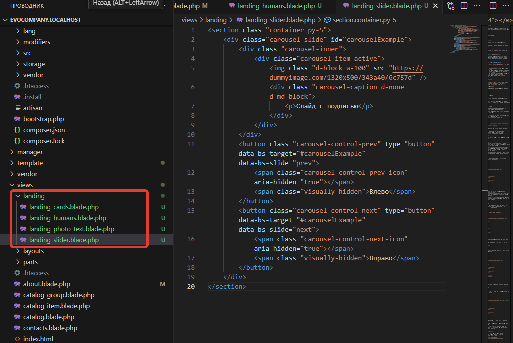

# Как сделать лендинг на Evolution CMS


Нам нужен следующий функционал: страница "О компании" должна состоять из заранее определённых блоков, порядок, заполнение и количество которых будет задавать сам клиент.

## Оглавление 

- [Изучаем дизайн](#part1)
- [Установка и настройка PageBuilder](#part2)
- [Настройка админки](#part3)
- [Настройка страницы](#part4) 
- [Полезные ссылки](#part5) 

## Изучаем дизайн <a name="part1"></a>

В папке верстки у нас завалялся образец того, что мы хотим получить `template\about.html`

Я выделил красным будущие блоки лендинга. В вёрстке каждый из них вынесен в отдельный тег `<section></section>`.


Задача: сделать так, чтобы клиент мог создавать блоки, менять их порядок и содержимое.


## Установка и настройка PageBuilder <a name="part2"></a>

На протяжении 18 уроков вы заполняли сайт, используя для этого редактор TinyMCE. Он вполне справляется с простым функционалом наподобие вставки текста, таблиц и добавления картинок. Однако для сложной вёрстки Тини категорически не подходит.

### Установка 
Переходите в Extras, устанавливайте модуль **PageBuilder**.

После установки переходите в `Элементы - Плагины - PageBuilder` и откройте его конфигурацию.

Давайте разберём значения полей.
* Параметр "Tab name" отвечает за название вкладки, которая будет создана.	Пишем что-то вроде  `Конструктор страниц`
* Параметр "Add type" определяет, как будет визуально выглядеть добавление новых блоков. Я выставлю значение `images` - это позволит нам нарисовать свою миниатюру для каждого блока. Это красивее.
* Параметр "Placement" указывает, где разместить сам конструктор - в первой вкладке "Контент" или же создать свою вкладку. Ставим `content`.
* Параметр Default container ordering нужен не знаю зачем, я его не использую. Он явно что-то сортирует.


## Настройка админки <a name="part3"></a>

### Шаблон
Создайте шаблон "О компании" с псевдонимом `about`. Можно добавить к нему в назначенных параметрах сео-поля, чтобы не отвлекаться в дальнейшем.
Проконтролируйте, чтобы создался файл `/views/about.blade.php`.

Запомните id этого шаблона, он нам пригодится.

Скопируйте наследование и секцию контента, пока что пустую. Либо вставьте туда содержимое из `template\about.html`.
```html
@extends('layouts.app')
@section('content')
<!-- тут -->
@endsection
```

Назначьте этот шаблон странице "О компании".

### ТВ
А теперь сделаем ТВ-параметр, в котором, собственно, и будет происходить конструирование страницы в PageBuilder.

Создайте параметр с именем `landing`, заголовок "Конструктор страницы". И, что важно, "Тип ввода" - `pagabuilder`. Привяжите его к шаблону "О компании".

### Конфигурация

Открываем в админке страницу, смотрим. И... ошибка.
```
File "D:\OSP\domains\evocompany.localhost\assets\tvs\pagebuilder/../../plugins/pagebuilder/config//container.landing.php" not exists!
```
Собственно говоря, это даже не ошибка, а указание на то, что мы не создали файл конфигурации PageBuilder для этого ТВ.

#### Контейнер
Давайте его сделаем. Файл лежит в соответствующей папке, имя конструируется из префикса containger, названия тв и суффикса .php.
Файл `assets\plugins\pagebuilder\config\container.landing.php`:

```php
<?php
return [
    'title' => 'Лендинг',
    'show_in_templates' => [ 12 ],  // тот самый id шаблона "О компании"
    'addType' => 'images',
    'placement' => 'tv',    //  Показывать в ТВшке
];
```
Смотрим в `show_in_templates`, вспоминаем id, который сделали на этапе создания шаблона.

Если оттолкнуться от терминологии PageBuilder, то мы сделали файл контейнера. Можно назвать его родителем. Теперь мы сможем делать конфигурации для блоков (детей) и в этом контейнере их отображать.


Вот такая картина должна быть у вас на этом этапе. Почему ТВ пустой? Потому что нужно создать теперь сами блоки.

#### Конфигурации блоков

Давайте делать конфигурации блоков. 
> Обратите внимание, мы сейчас работаем со стороны админки, и никакая вёрстка нам не нужна - мы делаем всё, чтобы пользователь мог заполнить блоки внутри сайта. А внешний вид отдадим на работу блейду.

Конфигурации блоков создаются в папке `assets\plugins\pagebuilder\config\` как самые обычные файлы php. В этой же папке по умолчанию лежат образцы готовых конфигов. Если их переименовать и покопаться внутри, можно поглядеть, что нам даёт для образца разработчик.

Предлагаю в имя каждого *своего* конфига вставлять какой-то префикс, чтобы нам было легче ориентироваться в наших конфигах. Я буду называть всё как `landing_чтототам.php`.

**Слайдер**

Первый блок - слайдер. Содержит в себе элемент слайд, у которого есть изображение и текст. Количество слайдов неограничено.


Файл `landing_slider.php`
```php
<?
return [
    'title' => 'Слайдер',
    'container' => 'landing',
    'image' => 'assets/plugins/pagebuilder/images/image.jpg',
    'fields' => [
        'slides' => [
            'type' => 'group',
            'caption' => 'Слайды',
            'fields' => [
                'image' => [
                    'caption' => 'Изображение',
                    'type' => 'image'
                ],
                'title' => [
                    'caption' => 'Заголовок',
                    'type' => 'text'
                ],
            ]
        ]
    ],
];

```
Что тут происходит?

Ключ `'container' => 'landing',` говорит, что это поле принадлежит контейнеру `landing`. Мы его создали чуть выше.
Ключ `'image' => 'assets/plugins/pagebuilder/images/image.jpg',` говорит о том, что для этого блока будет миниатюрка изображения по таком-то адресу (про миниатюры чуть позже, вы их увидите).

Далее идут уже опции самого PageBuilder, он хорошо документирован. В секцию `fields`  пишутся поля, их тип, название, какие-то опции поля, если они есть и нужны. Примеров полно в папке самих конфигов.

Прыгаем в админку и смотрим


Возникает закономерный вопрос - а где изображение из ключа `image`? Всё в порядке, просто у нас один единственный блок, а варианты выбора (и соответственно изображения) будут при двух и более. 


**Текст и фото**

Делаем блок "Текст и фото". Файл `landing_photo_text.php`:
```php
<?
return [
    'title' => 'Текст и фото',
    'container' => 'landing',
    'image' => 'assets/plugins/pagebuilder/images/2col-photo-text.jpg',
    'fields' => [
        'title' => [
            'caption' => 'Заголовок',
            'type' => 'text'
        ],
        'content' => [
            'caption' => 'Текст',
            'type'  => 'richtext',
            'options' => [
                'height' => '300px',
            ],
        ],
        'image' => [
            'caption' => 'Изображение',
            'type' => 'image'
        ],
    ]
];

```
Я покопался в папках примеров и натаскал код полей оттуда. Картинку также взял готовую - она подходит.

Вот теперь можно залезть в админку, насладиться превьюшками и проверить функционал:

 


**Карточки**

Блок с несколькими элементами. В каждом картинка, заголовок и текс. По сути - микс из слайдера и предыдущего примера.

Файл `landing_cards.php`

```php
<?
return [
    'title' => 'Карточки',
    'container' => 'landing',
    'image' => 'assets/plugins/pagebuilder/images/gallery.jpg',
    'fields' => [
        'slides' => [
            'type' => 'group',
            'caption' => 'Карточки',
            'fields' => [
                'image' => [
                    'caption' => 'Изображение',
                    'type' => 'image'
                ],
                'title' => [
                    'caption' => 'Заголовок',
                    'type' => 'text'
                ],
                'content' => [
                    'caption' => 'Текст',
                    'type'  => 'textarea',
                ],
            ]
        ]
    ],
];

```
Изображение для превью я взял более-менее подходящее. Вы можете нарисовать своё, кто ж вам запретит.

 


**Люди**
Блок с людьми чуть сложнее всех прочих, т.к. содержит в себе прямо всё, что было до того - и группы, и фото и тексты.

Файл `landing_humans.php`
```php
<?
return [
    'title' => 'Слайдер',
    'container' => 'landing',
    'image' => 'assets/plugins/pagebuilder/images/image.jpg',//Изображения не нашлось
    'fields' => [
        'humans' => [
            'type' => 'group',
            'caption' => 'Слайды',
            'fields' => [
                'image' => [
                    'caption' => 'Изображение',
                    'type' => 'image'
                ],
                'title' => [
                    'caption' => 'Заголовок',
                    'type' => 'text'
                ],
            ]
        ]
    ],
];
```
Здесь использована и группировка полей внутри другого поля, и картинки, и тексты.

Теперь предстоит все эти блоки создать, расположить в нужном вам порядке, заполнить данными и вывести наружу.

> Случайным образом я ловил ошибку, когда после сохранения страницы не показывались изображения. Ошибка была в наличии 5-й версии TinyMCE. Если у вас она, то, к сожалению, визуальный редактор не удастся запустить (на момент конца января 2024 года). Вы можете отключить его использование для этой, конкретной страницы или включить 4-ю версию для всего сайта.


## Настройка страницы <a name="part4"></a>

Данные готовы, давайте их выводить на страницу.
Разумеется, сначала неплохо бы получить данные в контроллере и поглядеть на них либо через `dd` либо через Трейси.

Создайте файл контроллера для шаблона "О компании" `core\custom\packages\main\src\Controllers\AboutController.php`.

```php
<?php

namespace EvolutionCMS\Main\Controllers;

class AboutController extends BaseController
{
    public function setData()
    {
        $data =
        evolutionCMS()->runSnippet('PageBuilder', [
            'container' => 'landing',
            'renderTo' => 'array'
        ]);
        $this->data['pagebuilder'] = $data[0];
    }
}

```

При установке всего PageBuilder был установлен и одноимённый сниппет. Вот его и мы использовали для получения данных, отдав ему в параметры имя контейнера. Ну а заодно попросили отдать данные в виде массива, а не готового html.

Из-за особенностей отдачи данных наш результат будет лежать под ключом 0. Почему? Потому что мы можем запросить данные разных контейнеров, и тогда они будут уже под ключами 1,2,...,n.

Открываем страницу, смотрим Трейси. Наша переменная `pagebuilder`:

 

Я открыл самый первый ключ массива, там у меня лежит, судя по всему, слайдер.

Поизучайте выдачу, обратите внимание, что все поля, которые мы задали в конфигах, имеют такие же ключи внутри массива. А сами массивы имеют на первом уровне ключ типа `'config' => 'landing_slider'` повторяющий имя файла конфигурации.

Это очень полезно, т.к. можно использовать эту особенность для шаблонизации.

Идея следующая:
- создадим для каждого конфига одноимённый блейд-файл, расположенный в папке `views\landing`.
- в цикле переберём переменную `pagebuilder`
- будем подключать вьюшки по имени, отдавая им их переменные
- блейд сам всё сделает
- profit


Редактируйте `views\about.blade.php`
```html
@extends('layouts.app')
@section('content')
    @if(!empty($pagebuilder))
        @foreach($pagebuilder as $item)
            @if(View::exists('landing.'.$item['config']))
                @include('landing.'.$item['config'],$item)
            @endif
        @endforeach
    @endif
@endsection
```
Тут происходит цикл по нашей переменной и проверка на существование вьюшки внутри папки `landing`. Имя вьюшки конструируется из ключа в конфиге и папки. Т.е. для первого элемента (со скриншота) скрипт ищет файл `views\landing\landing_slider.blade.php`.

Создайте все файлы по такой же схеме. Внутрь можно уже копировать вёрстку из шаблона.

 

Четыре файла по имени блоков, внутри сырая вёрстка без переменных.


**Где и как взять переменные?**
Чтобы показать данные внутри каждого блока, нужны переменные. Постоянно переключать туда-сюда файл конфига и файл вёрстки невесело. Есть способ проще.

Ещё раз открывайте Трейси и обновите страницу. Полистайте выдачу - вы увидите слева имена файлов, справа - значения. Просто открываем файлы по очереди и кропотливо вставляем нужные даннные на свои места.

 


**Слайдер**

`landing_slider.blade.php`

  Переменная `slides` массив, поэтому уже знакомым способом итерируем его и вытаскиваем значения нужных ключей. Также я проверяю наличие самого слайдера и переменных в нём. В файле  я использовал phpthumb, чтобы он автоматически подрезал слайды под размер блока.

```html
@if(!empty($item['slides']))
<section class="container py-5">
    <div class="carousel slide" id="carouselExample">
        <div class="carousel-inner">
            @foreach($item['slides'] as $slide)
                <div class="carousel-item @if($loop->first) active @endif">
                    runSnippet('phpthumb',[
                        'input' => $slide['image'],
                        'options' => 'w=1320,h=500,zc=1'
                    ]) }}" />
                    <div class="carousel-caption d-none d-md-block">
                        <p>{{ $slide['title'] ?? ''}}</p>
                    </div>
                </div>
            @endforeach
        </div>
        <!-- тут код кнопок -->
    </div>
</section>
@endif
```

**Текст и фото**

`landing_photo_text.blade.php`

```html
<section class="container py-5">
    <div class="row flex-lg-row-reverse align-items-center g-5 py-5">
        <div class="col-10 col-sm-8 col-lg-6"></div>
        <div class="col-lg-6">
            <h1 class="display-5 fw-bold text-body-emphasis lh-1 mb-3">{{ $title }}</h1>
            <p class="lead">{{ $content }}
            </p>
        </div>
    </div>
</section>
```
Тут всё в разы проще, просто переменные, никаких циклов.

**Карточки**

`landing_cards.blade.php`

Всё то же самое что и в первом случае.

```html
@if(!empty($item['slides']))
<section class="container py-5">
    <div class="row row-cols-1 row-cols-sm-2 row-cols-md-3 g-3">
        @foreach($item['slides'] as $card)
        <div class="col">
            <div class="card shadow-sm">
                runSnippet('phpthumb',[
                    'input' =>  $card['image'],
                    'options' => 'w=320,h=200,zc=1'
                ]) }}" />
                <div class="card-body">
                    <h5 class="card-title">{{$card['title']}}</h5>
                    <p class="card-text">{{$card['content']}}</p>
                </div>
            </div>
        </div>
        @endforeach
    </div>
</section>
@endif
```

**Люди**

`landing_humans.blade.php`

```html
@if(!empty($item['humans']))
<section class="py-5 bg-light">
    <div class="container px-5 my-5">
        <div class="text-center">
            <h2 class="fw-bolder">Люди в компании</h2>
            <p class="lead fw-normal text-muted mb-5">Крестом и пестом уговорили сфоткаться четверых</p>
        </div>
        <div class="row gx-5 row-cols-1 row-cols-sm-2 row-cols-xl-4 justify-content-center">
            @foreach($item['humans'] as $human)
            <div class="col mb-5 mb-5 mb-xl-0">
                <div class="text-center">
                    runSnippet('phpthumb',[
                    'input' =>  $human['image'],
                    'options' => 'w=150,h=150,zc=1'
                ]) }}" alt="..." />
                    <h5 class="fw-bolder">{{ $human['title']}}</h5>
                    <div class="fst-italic text-muted">{{ $human['position']}}</div>
                </div>
            </div>
            @endforeach
        </div>
    </div>
</section>
@endif
```

Кстати для этого блока надо было вынести заголовок и лид в какие-то поля. Но это я оставлю вам. Думаю, если вы дошли до этой строчки, проблем в работе с PageBuilder у вас не будет.

Что же должно получиться в итоге?

 

**Идея**
Представьте, что мы сделали такие лендинги для страниц товаров или услуг, чтобы красиво презентовать их посетителю.

## Полезные ссылки <a name="part5"></a>

* Офигенное видео про [PageBuilder](https://www.youtube.com/watch?v=g6cA-fWVGxg) от SashaBeep, которое иллюстрирует всю эту статью и явилось источником вдохновения.
* Гит [автора PageBuilder](https://github.com/mnoskov/pagebuilder) - могут быть полезные ссылки
* [Документация](https://docs.evo.im/04_extras/pagebuilder.html), конечно

## Итого
- сделан полноценный лендинг на Evolution CMS
- всё отображается и редактируется
-   P.S.: честно говоря, это было сложновато.
---

 Я поздравляю вас, мы закончили с контентной областью сайта. Давайте добавим [немного СЕО на сайт](/020_Базовое%20SEO%20в%20Evolution%20CMS.md).

