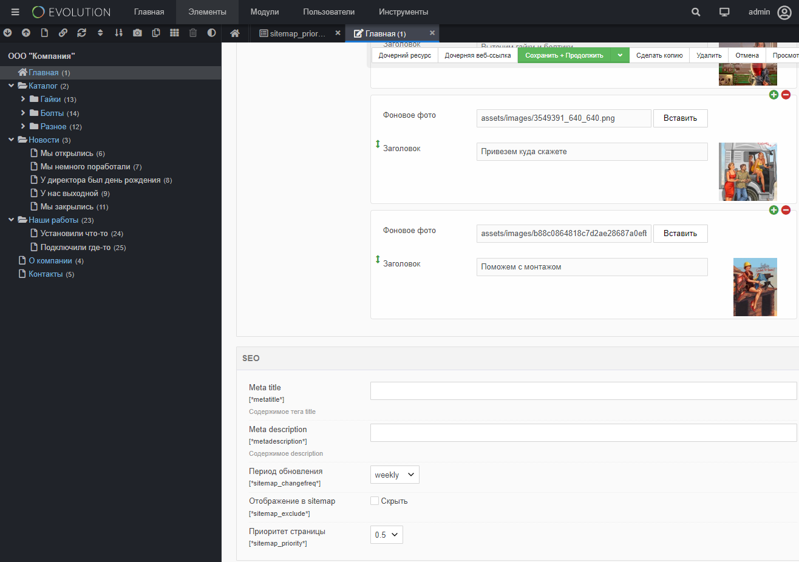
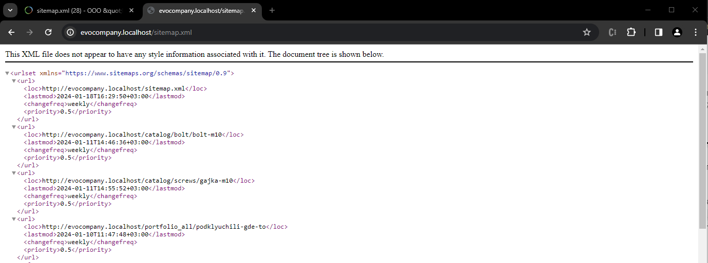

# Базовое SEO в Evolution CMS

## Оглавление 

- [Мета поля](#part1)
- [XML карта](#part2)

## Мета поля <a name="part1"></a>

Если вы обращали внимание, на сайте у нас нет ни корректных тайтлов, ни метатегов. Давайте это исправим.

Нам нужно:

- Вставить в `<title></title>` значение из поля metatitle, если оно заполнено. Если нет, пусть тайтлом будет заголовок.
- Сделать meta description из поля metadescription, если оно заполнено.

Весь тег `<head>` у нас остался в шаблоне `app.blade.php`.

Можно воспользоваться директивой `@if`, а можно чуть короче:

```html
<title>
  {{ $documentObject['metatitle'] ? $documentObject['metatitle'] :
  $documentObject['pagetitle'] }}
</title>
<meta
  name="description"
  content="{{ $documentObject['metadescription'] ? $documentObject['metadescription']  : $documentObject['introtext'] }}"
/>
```

Если логика метатегов у вас будет сложнее, можно вынести это всё в BaseController.
Только не забудьте, что доступ к текущему документу из контроллера это

```php
evo()->documentObject
```

А ТВ-параметры - массивы, где под ключом [1] содержится их значение.

```php
  "metadescription" => [
    0 => "metadescription"
    1 => "Компания X5 Group заключила партнёрское соглашение..."
    2 => ""
    3 => ""
    4 => "textareamini"
  ]
```


## XML карта сайта <a name="part2"></a>

### Подготовка - создайте ТВ

Для карты сайта будут нужны ТВ-параметры, которые позволят задавать приоритет ресурсам, исключать их из карты сайта и задавать частоту обновления.

Создайте 3 ТВ-параметра и назначьте их всем шаблонам.

1. sitemap_changefreq - период обновления

|                название | значение                                                            |
| ----------------------: | ------------------------------------------------------------------- |
|                    Имя: | `sitemap_changefreq`                                                |
|              Заголовок: | `Период обновления`                                                 |
| Существующие категории: | `SEO`                                                               |
|              Тип ввода: | `dropdown`                                                          |
|     Возможные значения: | `always\|\|hourly\|\|daily\|\|weekly\|\|monthly\|\|yearly\|\|never` |
|  Значение по умолчанию: | `weekly`                                                            |

2. sitemap_exclude - отображение в карте сайта

|                название | значение                |
| ----------------------: | ----------------------- |
|                    Имя: | `sitemap_exclude`       |
|              Заголовок: | `Отображение в sitemap` |
| Существующие категории: | `SEO`                   |
|              Тип ввода: | `checkbox`              |
|     Возможные значения: | `Скрыть==1`             |
|  Значение по умолчанию: | `0`                     |

3. sitemap_priority - приоритет страницы

|                название | значение                                                           |
| ----------------------: | ------------------------------------------------------------------ |
|                    Имя: | `sitemap_priority`                                                 |
|              Заголовок: | `Приоритет страницы`                                               |
| Существующие категории: | `SEO`                                                              |
|              Тип ввода: | `dropdown`                                                         |
|     Возможные значения: | `0.1\|\|0.2\|\|0.3\|\|0.4\|\|0.5\|\|0.6\|\|0.7\|\|0.8\|\|0.9\|\|1` |
|  Значение по умолчанию: | `0.5`                                                              |

Секция "SEO" приобретает размах. Можно уже просить бюджеты.



Кстати. Если вам не нравится, что в документе "SEO" выше, чем "Контент", зайдите в `Элементы -> Категории`, найдите там сортировку категорий и расположите её ниже. Я так и сделал.

### Реализация. Делаем карту сайта

Есть простой и сложный способ сделать карту. Сложный разбирался в [курсе по созданию блога](https://github.com/0test/lessons-evolution-blog), так что теперь, для разнообразия, выберем простой.

1. Создаём в админке шаблон "xmlsitemap". Назначаем ему псевдоним `xmlsitemap`.
2. Создаём сразу `/views/xmlsitemap.blade.php` блейд-шаблон.
3. Создаём ресурс "sitemap.xml", выбираем ему шаблон из п.1. Не забудьте снять чекбокс "Показывать в меню", прикрепите ТВ `sitemap_exclude` и проставьте в "Отображение в sitemap" - "Скрыть".
4. У ресурса в поле "Тип содержимого" выберите text/xml
5. Создаём контроллер `XmlSitemapController`.
   
```php
<?php

namespace EvolutionCMS\Main\Controllers;
class XmlSitemapController extends BaseController
{
    public function setData()
    {
        $sitemap = evo()->runSnippet('DLSitemap', [
        ]);
        $this->data['sitemap'] = $sitemap;
    }
}
```
6. В шаблоне `views\xmlsitemap.blade.php` пишем просто `{!! $sitemap !!}`. Никаких наследований, ничего. Просто сырые данные для отображения



---

## Итого
- сделали карту сайта
- сделали метаполя
  
 ---

Мы пришли к финалу. 90% сайтов отдаются клиенту именно в таком виде. Всё что можно, редактируется. Добавляются товары, новости, работы. Конструируются лендинги.

Но если: /есть время/желание/клиент умница/, я иду дальше и занимаюсь необязательными и крайне приятными мелочами, делая сайт для клиента чуть удобнее. Это влияет в том числе и на то, что клиент придёт потом именно ко мне. Советую  также поступать и вам.

Давайте [сделаем удобнее админку, добавим коды метрики/аналитики](/021_Полезные%20мелочи.md).