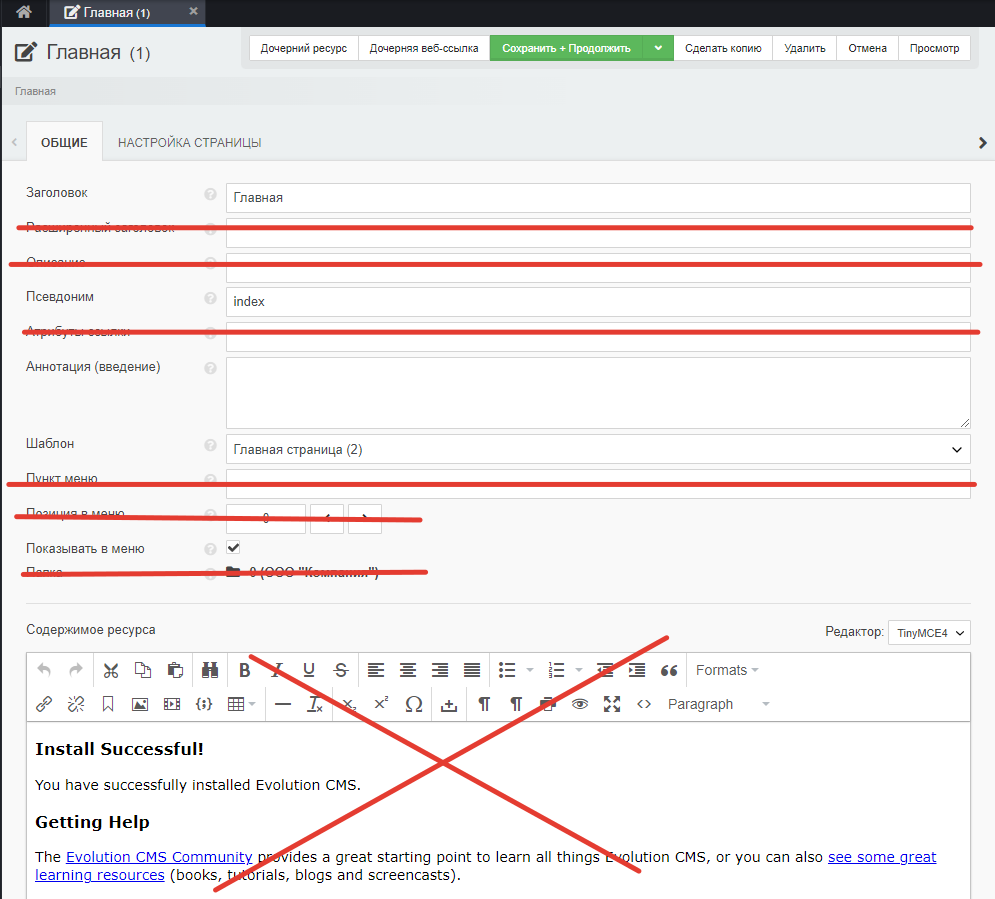
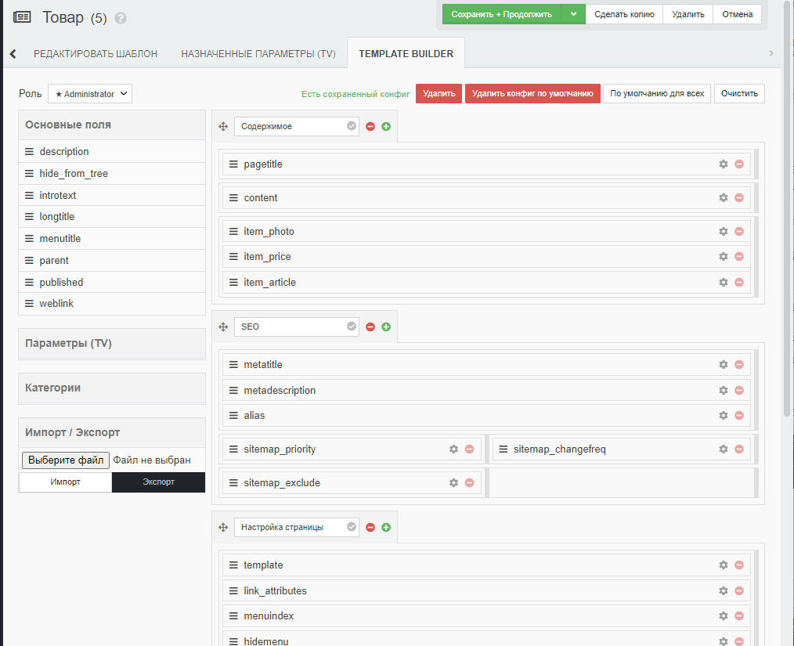
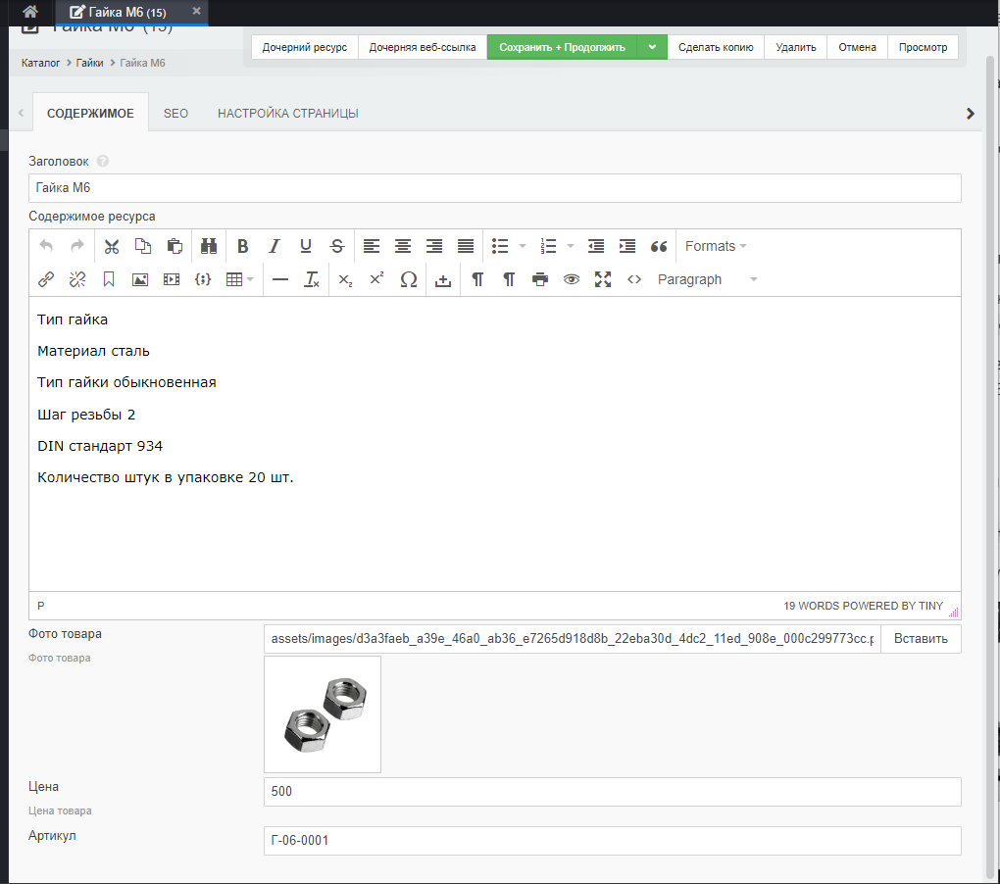
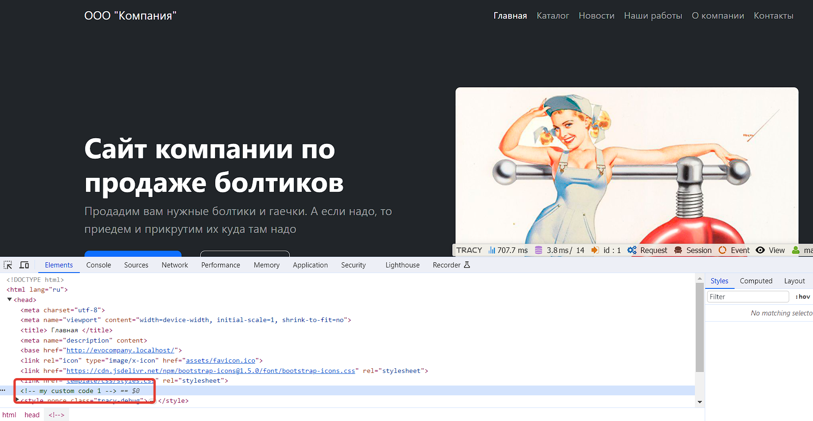

# Полезные мелочи в Evolution CMS

Остался последний рывок, и сайт можно запускать.

- [Убираем ненужные поля из шаблонов админки](#part1)
- [Метрика, аналитика и любые другие коды ](#part3)
- 
## Убираем ненужные поля из шаблонов админки <a name="part1"></a>

При редактировании ресурса вы видите десяток полей, каждое из которых можете использовать. Но в нашем случае нужны штук пять, не более. Кое-где мы даже не используем поле "Содержимое"!



Давайте позаботимся о контент-менеджере и сделаем красиво.

### templatesEdit3

Зайдите в Extras и установите дополнение templatesEdit3. Это дополнение для настройки полей при редактировании документов.

Сразу откройте редактирование любого ресурса - внешний вид уже изменился.

Однако, я настрою te3 под себя.

Откройте в админ-панели любой **шаблон**, с которого хотите начать. Скажем, "Товар" (я открываю обычно тот шаблон, который чаще всего будет использоваться на сайте)

 Обратите внимание на появившуюся вкладку "Template builder". Именно там и происходит магия. Описывать её детально бессмысленно - всё делается мышкой. Тащим поля куда хотим, убираем те, что не нужны, группируем по секциям или вкладкам.

Я накликал себе нечто подобное




Если вы сделали нечто универсальное, то нажмите "По умолчанию для всех". Это позволит распространить внешний вид на все шаблоны.

Дальше уже открывайте и редактируйте конкретные шаблоны под свои нужды. Скажем, у новости есть поле "Аннотация", у товара его нет. У лендинга и "Главной нет "Содержимого". И так далее.

Таким же образом и вы пройдитесь по сайту, редактируя и убирая ненужное.

Я сделал примерно так.




## Метрика, аналитика и любые другие коды <a name="part3"></a>

Давайте позаботимся о тегах различных поисковых систем, трекинга и аналитики.

Заставлять заказчика лазать по шаблонам - плохая идея. Если и справится, то обязательно что-то сломает.

### ClientSettings

Давайте установим решение, которое позволило бы создать "переменные", доступные на всём сайте.
Найдите в Extras `ClientSettings`, установите его.

Зайдите в "Модули" и запустите. Вы увидите нотис от модуля "Configuration not found.".

Дополнение просит вас либо вручную создать файл конфигурации, либо воспользоваться редактором. Жмём на `editor` и создаём два поля.

| Название     | Заголовок     |
| ------------ | ------------- |
| header_codes | Коды в head   |
| footer_codes | Коды в footer |

Тип для обоих полей рекомендую выбрать `Textarea (mini)`.

Сохраняйте всё, жмите "Обновить страницу" в браузере. В самом верхнем меню должна появится опция "Настройки сайта". Вот там заказчик и может вписывать разные коды, аналитики, телефоны и вообще любую информацию, которую нужно менять часто.

**Важно**
> Если все прошло успешно, ничего править не надо. А если вы видите ошибку, связанную с csrf, то вам необходимо поправить файл `assets/modules/clientsettings/core/templates/header.tpl` и внести туда [вот такие](https://github.com/mnoskov/clientsettings/pull/29/files) изменения.

Для отладки впишите в значения какой-нибудь комментарий типа 
```html
<!-- my custom code 1 -->
```

### Вывод ClientSettings в шаблон

Откройте `views\layouts\app.blade.php` и в какое-нибудь место добавьте вызов конфигурации с нужными ключами.

```php
{!! $modx->getConfig('client_header_codes') !!}
```

А в `views\parts\footer_scripts.blade.php` код футера

```php
{!! $modx->getConfig('client_footer_codes') !!}
```

Проверьте исходный код сайта



Теперь клиент безопасно и довольно удобно может управлять различными изменяемыми областями на сайте. Вы можете вынести туда отдельными полями Я.Метрику, Гугл.Аналитику, телефоны и адреса, повторяющиеся везде и всюду, код разных чат-систем. 


---

И это последний из рассказов о Маугли.

Готовый сайт по этому курсу вы можете скачать на [гитхабе](https://github.com/0test/lessons-evolution-company).

Демо-версию сайта посмотреть по адресу [democompany.kazunin.ru](http://democompany.kazunin.ru/).

Вопросы и пожелания задавайте в [чате](https://t.me/evo_cms) сообщества.

Спасибо автору вы можете отправить на Сбер 5469120010280898, или Юмани [410011160949342](https://yoomoney.ru/to/410011160949342).